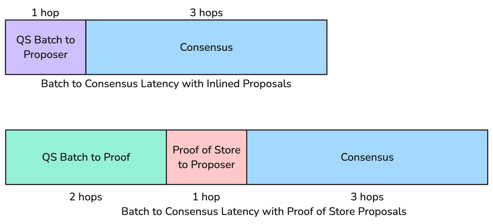
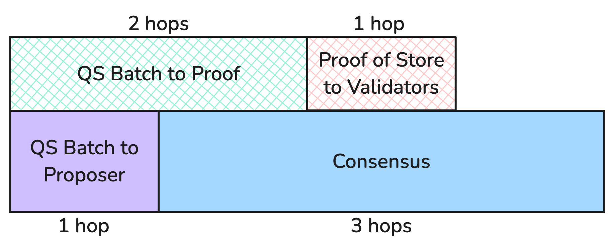
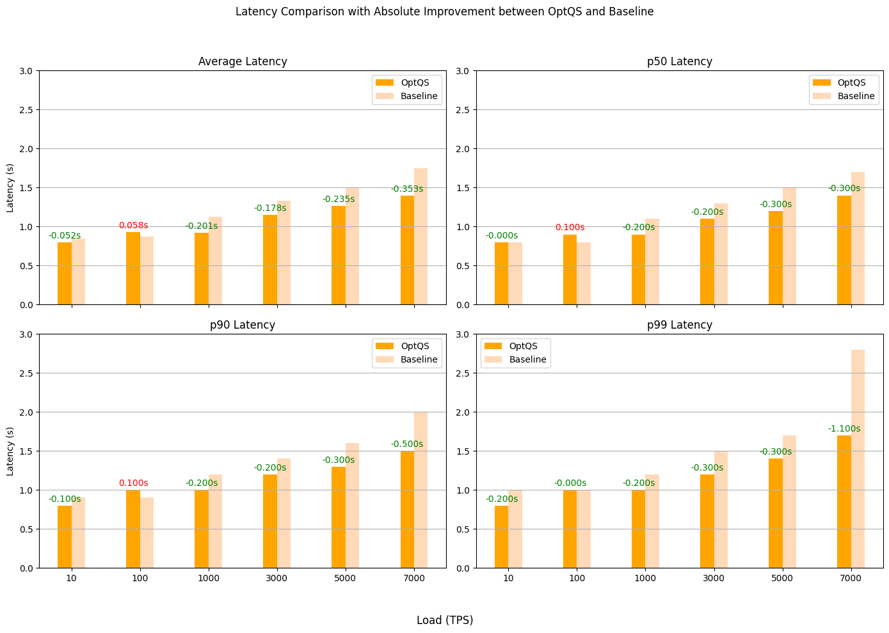
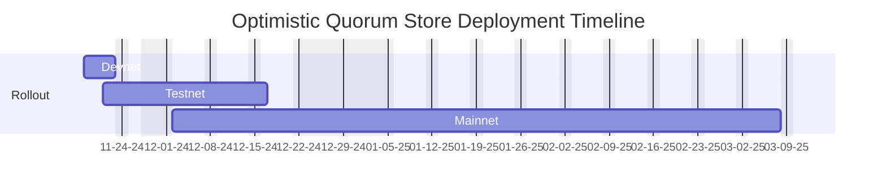

# AIP-106 - Optimistic Quorum Store
  
## Summary

Optimistic Quorum Store is a technique to reduce Quorum Store + Consensus (QS+Consensus) Latency by two network hops (about 180ms in Aptos Mainnet as of October 30, 2024) in the common case. The technique involves proposing quorum store batches in consensus before collecting proof of stores and modifying the consensus voting mechanism to ensure batch availability. While Aptos currently circumvents Quorum Store and inlines transaction payloads into the proposal directly  under low throughput cases (up to 100 transactions per block), Optimistic Quorum Store makes Aptos’ QS+Consensus Latency four network hops under all loads in the common case.

### Out of scope

This work does not focus on Mempool to Consensus latency which includes the mempool queuing time, the amount of time the transaction spends in the mempool before pulled into quorum store batches.

## High-level Overview

The Quorum Store in the validators form batches of transactions from validator mempool and disseminate them to other validators and collect proof of stores. Today, transactions can take one of two paths through consensus from mempool: one optimize for latency and the other optimize for throughput.  

In the first path, consensus proposes batches inlining the transaction payload within the proposal. This inlining of the payload in the proposal obviates the need to collect proof of store  thus reducing consensus latency by two network hops. The latency in this case is four network hops, which while optimal, is only effective until the block proposer is not network bandwidth constrained. In mainnet, this path is configured for blocks that contain less than 100 transactions (approx. 500 TPS as of today).

Under load, the validators prioritize proposing proof of stores to allow for maximum utilization of the block space. This yields a latency of 6 network hops. 



Latency in terms of network hops for two proposal paths: Batch Inlining vs Quorum Store Proof

The goal with Optimistic Quorum Store is to introduce a path for transactions from mempool through consensus with a latency of four network hops while scaling throughput with Quorum Store. Under this technique, consensus proposals contain batches that do not yet have proof of stores available, called Optimistic Batches, similar to the inlined batches but without inlining the payloads. Quorum Store is responsible for disseminating the payload within the batches. This allows Optimistic Quorum Store to scale throughput avoiding the proposer bottleneck but also provide 4-hop latency. 



Latency in terms of network hops with Optimistic Quorum Store

To ensure honest validators will always have the payloads for the batches, the consensus voting rule is extended to vote on a proposal only if all the payloads for optimistic batches are available. It is the responsibility of the proposer to generate a proposal that will be accepted by honest validators. To ensure a successful round, the proposer choose optimistic batches whose payloads are expected to be available at the validators at proposal receipt. To choose optimistic batches, the proposer collects metrics about past proposals and uses this information to select optimistic batches to pack into the proposal.

## Impact

Latency will improve for all transactions submitted to the Aptos Network validators by 150-200ms when the network is experiences loads above 500 TPS. Latency under 500TPS will remain unaffected and optimal.

## Specification and Implementation Details

### Notation

An Optimistic Batch is a batch that is included into the proposal before forming a proof of store.

### Consensus

**Payload**

A new payload variant is added.

```rust
pub struct OptQuorumStorePayloadV1 {
    inline_batches: InlineBatches,
    opt_batches: BatchPointer<BatchInfo>,
    proofs: BatchPointer<ProofOfStore>,
    execution_limits: PayloadExecutionLimit,
}

pub enum OptQuorumStorePayload {
    V1(OptQuorumStorePayloadV1),
}

pub enum Payload {
    // existing variants...
    OptQuorumStore(OptQuorumStorePayload),
}
```

**Voting rule** 

A validator votes for a proposal in a given round with optimistic batches only if it has the payload associated with the batches in quorum store. In case the payload is unavailable, the validator initiates a remote fetch to gather payload for optimistic batches in the proposal.

```rust
fn on_proposal(block: Block) {
	// Existing Checks...
	
	// Check if payload for the optimistic quorum store batches
	// are available in quorum store.
	if !quorum_store.check_payload(block.opt_batches()) {
		// Wait until payload is received or a timeout
		timeout = quorum_store.fetch_payload_or_timeout(block.opt_batches(), TIMEOUT).await;
		if timeout {
			// Follow the local timeout flow
			return;
		}
	}
	
	// Continue processing proposal...
}
```

Consequently, a round may timeout if fewer than a majority voting power receives the payload before the timeout period elapses. In this case, the validators vote to timeout the round similar to the case where a QC cannot be formed and move to the next round.

**Proposal Generation**

Two new parameters are introduced for selecting optimistic batched when generating a proposal. This is computed by the Proposal Status Tracker explained in the next subsection.

```rust
struct OptQSPayloadPullParams {
	pub exclude_authors: HashSet<Author>,
	pub minimum_batch_age_usecs: u64,
}

struct PayloadPullParameters {
	//...    
	pub maybe_optqs_payload_pull_params: Option<OptQSPayloadPullParams>,
}
```

`exclude_authors` contains the set of authors whose optimistic batches should be excluded from the proposal. This is produced based on the metrics collected by the proposal status tracker.

`minimum_batch_age_usecs` is a validator-local config value that specifies the minimum age for a batch. This is grace period for newly created batches to disseminate through the validator network.

`maybe_optqs_payload_pull_params` is optional; when it’s `None` , no optimistic batches will be included in the proposal.

With the newly added params, the proposal generator prioritizes batches with proof of stores before filling the proposal with optimistic batches.

### Proposal Status Tracker

The proposal status tracker tracks a moving window of statuses of the past proposals. This information is used to compute the proposal generation params described above.

**Optimistic Batch Proposal Performance**

 A exponential window based algorithm to decide whether to pick optimistic batches for the next proposal, based on configurable number of past proposal statuses. This decides whether `maybe_optqs_payload_pull_params` is `None` or `Some(_)`.

```rust
Initialize the window at 2.
- For each proposal failure due to missing batch, double the window up to a MAX size
- If there are no failures within the window, then propose optimistic batch
- If there are no failures up to MAX proposals, reset the window to 2.
```

**Batch Author Success Performance**

When timing out a round, validators collect the timeout reason from other validators and form an aggregated reason of one of the following options. If the reason is `PayloadUnavailable`, the reason also includes the list of authors whose batch were missing. To avoid byzantine behavior, each author must be blamed by at least minority voting power.

```rust
enum RoundTimeoutReason {
    Unknown,
    ProposalNotReceived,
    PayloadUnavailable { missing_authors: BitVec },
    NoQC,
}
```

The `exclude_authors` is computed by collecting all the `missing_authors` within the moving window.

**Batch Author Delay Performance (Not Yet Implemented)**

When validators vote for a proposal, they include information on any batches they had to wait for before casting the vote. This information is aggregated by the validators to increase the minimum batch age per batch creator in additional to the global `minimum_batch_age_usecs` config. This ensures that slow batch senders do not contribute to proposal delays.

## Reference Implementation

The following PRs implement various components of the specification. The feature is gated behind a validator local QuorumStoreConfig `enable_optimistic_quorum_store`.

https://github.com/aptos-labs/aptos-core/pull/14070

https://github.com/aptos-labs/aptos-core/pull/14091

https://github.com/aptos-labs/aptos-core/pull/14106

https://github.com/aptos-labs/aptos-core/pull/14346

## Testing

The reference implementation has been tested on an internal test network. 

### Large Scale Forge Load Sweep Test Comparison

**Forge Test Spec**

- 150 Validators + 15 Full Nodes
- `realistic_env_load_sweep_test`
- **Baseline**: Default configs + CO enabled
- **OptQS**: OptQS + CO enabled

**Summary**

- At low loads (≤ 100TPS), OptQS and Baseline perform the same, because inlining and OptQS have similar network hops.
- At medium loads (≤ 3000 TPS): OptQS improves latency by 180-200ms on average, equal to two hops of latency.
- At high loads (≤ 7000 TPS), OptQS improves latency by 200-300ms. Better latency reason to be investigated.



## Timeline

### Suggested deployment timeline

The deployment will be carried out in a slow rollout manner. The feature will be slowly rolled out devnet validators first one at a time, followed by testnet validators, and finally mainnet validators. The rollout will be paused at each stage to monitor the performance of the network and to ensure that the feature is working as expected.

