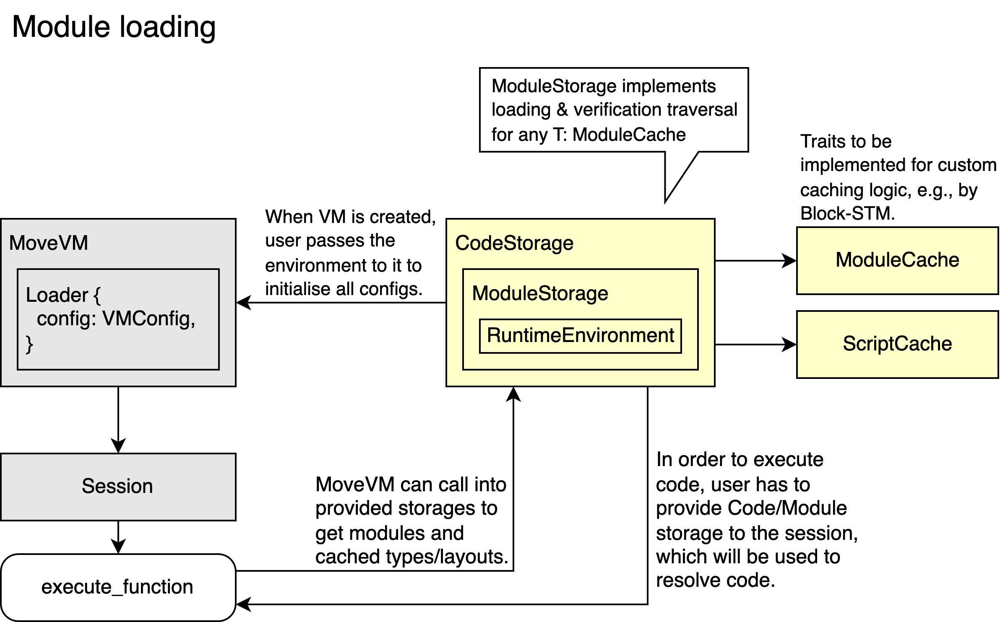
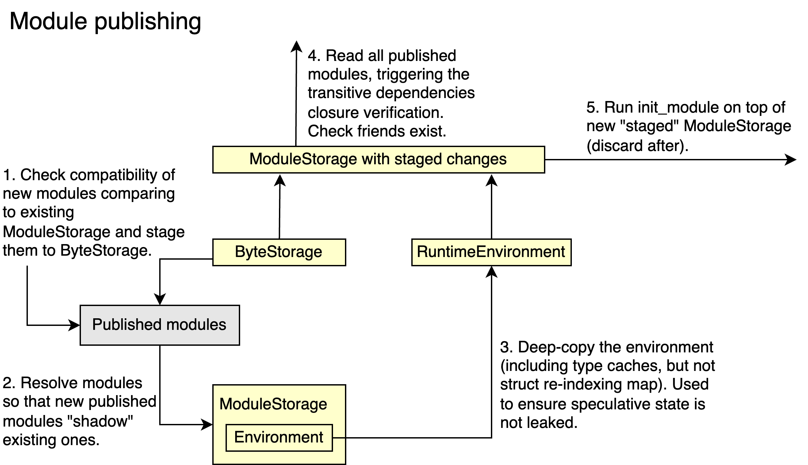
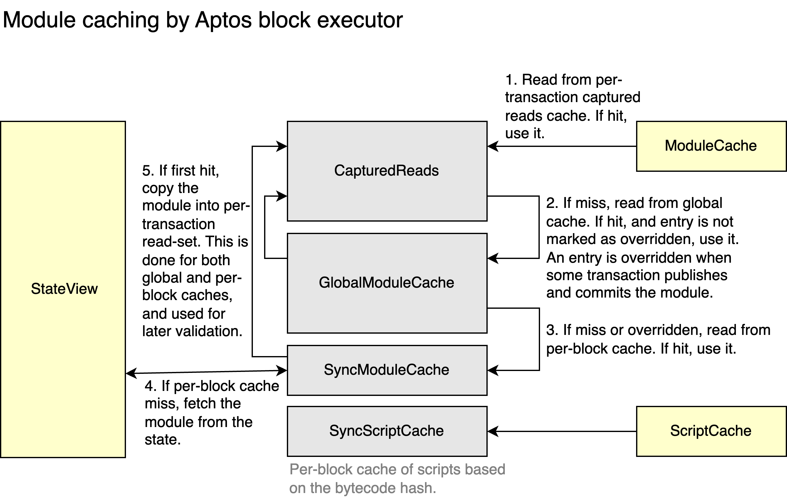

# AIP-107 - New Loader and Code Cache for MoveVM  

## Summary

This AIP proposes new infrastructure for MoveVM and AptosVM to load and cache modules and scripts.
The existing code loading logic has unspecified (and sometimes unexpected) semantics around module publishing and module initialization in the VM.
It is very implementation-specific, nuanced and fragile.
For example, when publishing new modules, they are linked one-by-one.
As a result, depending on the order of modules in the publishing request, code links to the new and sometimes to the old versions, leading to unexpected errors.
Another example is module initialization.
Due to incorrect linking, `init_module` sometimes does not run when a module is published for the first time.

There are also performance issues.
Because MoveVM owns the code cache, Block-STM can cache wrong data during speculative module publishing or module initialization.
To prevent this from happening, the cache is flushed on every module publish and between blocks, hurting performance.
There are also no shared global caches, which means:
  - Each execution thread needs to load modules for itself, and
  - many different modules are loaded every few seconds.

With the new infrastructure, the semantics of module publishing and initialization is clearly defined, enhancing the user experience.
A global shared module cache is added to the execution layer, and Block-STM is changed to handle module upgrades in parallel.
This significantly imporves performance.
For instance, based on existing and new benchmarks: module publishing is 14.1x faster, workloads with many modules are 1.5x-2x faster.


### Out of scope

This AIP does not focus on further optimizations, such as:
  1. accessing Aptos module metadata (`RuntimeModuleMetadataV1`, etc.) more efficiently,
  2. caching the size of the transitive closure to make the gas charging for dependencies faster,
  3. arena-based memory allocations.


## High-level Overview

In short, the solution is:
  - MoveVM becomes stateless, only containing loading logic from the code cache.
    The code cache implementation is provided by the clients using MoveVM.
  - Module publishing is changed to publish modules as a single bundle, instead of publishing them one-by-one.
    This fixes issues around publishing and `init_module`.
  - Block-STM is adapted to work correctly with module publishing ensuring no speculative information is ever cached.
    This is achieved by making new modules only visible at rolling commit time.
  - Global thread-safe and lock-free module cache is introduced to store modules across multiple blocks.

## Impact

**Overview**

This is a big change to MoveVM as it redesigns some APIs. In particular:
  - Clients using MoveVM need to adapt their code to work with the new design.
  - Clients need to double-check the proposed changes to `init_module` handling and the refined definition of friends for Move modules (see [Specification and Implementation Details](#specification-and-implementation-details)).

With the new loader and code cache:
  - The quality of code and abstractions is improved: MoveVM becomes stateless and thread-safe.
    It is should be easier for clients using MoveVM to set up their own code cache infrastructures.
  - Block-STM is capable of executing transactions that publish modules in parallel.

**Backwards compatibility**

New implementation is almost fully backwards compatible with existing implementation (V1).
Divergences are due to:
  1. V1 not running `init_module` when it should have (linking incorrectly to old versions of code),
  2. V1 flushing caches and losing error messages metadata,
  3. V1 not publishing modules due to linker errors (when package modules are not sorted topologically).

**Performance**

New implementation is more performant:
  1. module publishing is faster (14.1x),
  2. loading modules is faster (no friend traversals),
  3. accesses to many different modules in a block are faster (1.5x-2x for workloads with using many different modules).

At the same time, contended module accesses (e.g., blocks with transactions using the same entry function) are slightly worse (around 5-10%) due to synchronization.


## Alternative Solutions

The goal of this AIP is to ensure that temporary module publishing changes do not leak into the cache, MoveVM can be shared across threads, and that modules can be published in parallel within the same block.
With these requirements, there are no alternative solutions other than moving code and script caches outside of MoveVM.


## Specification and Implementation Details

### 1. Overview

The proposed changes to MoveVM and module/script caches interfaces:



The proposed changes to module publishing via MoveVM:



The proposed changes to handle module caching in Aptos block executor (Block-STM):




### 2. New shared runtime environment

In the new design, there is a `RuntimeEnvironment` struct that lives outside of MoveVM and contains long-living information about the current execution environment.

```rust
pub struct RuntimeEnvironment {
    vm_config: VMConfig,
    natives: NativeFunctions,    

    // Long-living caches for struct name interning and other type information such as struct layouts or tags.
    struct_name_index_map: Arc<StructNameIndexMap>,
    ty_cache: StructInfoCache,
    
    // Note:
    //   ty_cache is not arc-ed to ensure clones of environement are always deeep copies.
    //   Fot struct name index map assiging indices speculatively is ok.
}
```

The `RuntimeEnvironment` is to be *shared across multiple threads*.
Since the runtime environment stores configs, it is responsible for deserializing and verifying scripts/modules.
This design allows to implement code loading outside of the MoveVM, while encapsulating all verification logic inside `RuntimeEnvironment`.

Other important components:

- `StructNameIndexMap`: a cache to intern struct names as indices, protected under a simple read-write lock. 
  V1 implementation was not suitable for sharing across multiple threads: it allowed multiple indices to be assigned for the same type, and recursive read-lock accesses.
  The new implementation ensures that 1) read-locks are never acquired recursively, and 2) struct name indices are assigned *once* for each unique struct name.
  The index map provides the API to get its length and flush the cached indices, so that the callers can manage cache size (memory consumption) and synchronize the module cache (because modules store indices pointing to struct names in this cache).    
    
- `StructInfoCache`: thread-safe re-implementation of `TypeCache` from V1 loader.
  There main difference compared to V1 implementation is that depth formulae cache also stores an id of a thread that put it there.
  This allows us to check for recursive types correctly.
    
- `VerifiedModuleCache`: static to cache local successful verification results for modules.
  Important difference to V1 implementation: verification results are not cached in tests, gated by `!cfg!(test) && !cfg!(feature = "testing")`.


### 3. New traits for code caches

New traits for module and script code caches are added, along with `Sync` and non-`Sync` implementations.
Both module and script caches support insertion of deserialized code or verified code.
In addition, module cache is versioned.
Versions in module cache enforce ordering of operations: e.g., for concurrent mutations of module cache, lower versions cannot overwrite higher versions.
For more details, see [the implementation](https://github.com/aptos-labs/aptos-core/tree/main/third_party/move/move-vm/types/src/code/cache).

```rust
pub trait ModuleCache {
    type Key: Eq + Hash + Clone;
    type Deserialized;
    type Verified;
    type Extension;
    type Version: Clone + Default + Ord;

    fn insert_deserialized_module(
        &self,
        key: Self::Key,
        deserialized_code: Self::Deserialized,
        // Extra information that can be stored together with the module.
        extension: Arc<Self::Extension>,
        version: Self::Version,
    ) -> VMResult<()>;

    fn insert_verified_module(
        &self,
        key: Self::Key,
        verified_code: Self::Verified,
        extension: Arc<Self::Extension>,
        version: Self::Version,
    ) -> VMResult<Arc<ModuleCode<Self::Deserialized, Self::Verified, Self::Extension>>>;

    fn get_module_or_build_with(
        &self,
        key: &Self::Key,
        builder: &dyn ModuleCodeBuilder<
            Key = Self::Key,
            Deserialized = Self::Deserialized,
            Verified = Self::Verified,
            Extension = Self::Extension,
        >,
    ) -> VMResult<
        Option<(
            Arc<ModuleCode<Self::Deserialized, Self::Verified, Self::Extension>>,
            Self::Version,
        )>,
    >;
}
```

```rust
pub trait ScriptCache {
    type Key: Eq + Hash + Clone;
    type Deserialized;
    type Verified;
  
    fn insert_deserialized_script(&self, key: Self::Key, deserialized_script: Self::Deserialized) -> Arc<Self::Deserialized>;
    fn insert_verified_script(&self, key: Self::Key, verified_script: Self::Verified) -> Arc<Self::Verified>;
    fn get_script(&self, key: &Self::Key) -> Option<Code<Self::Deserialized, Self::Verified>>;
}
```


### 4. New traits for code storages

MoveVM and AptosVM no longer interact with code cache.
Instead, they "talk" to code storage that can fetch different information about scripts and modules.
However, details on how scripts/modules are cached, etc. are hidden and opaque to MoveVM and AptosVM.

- `ModuleBytesStorage`: the most low-level representation for module storage similar to existing `MoveResolver`.
  In contrast, only allows to query bytes.
  Types like `StateView` can implement it.
  ```rust
  pub trait ModuleBytesStorage {
    fn fetch_module_bytes(&self, addr: &AccountAddress, name: &IdentStr) -> VMResult<Option<Bytes>>;
  }
  ```

- `ModuleStorage`: allows to query different information about modules based on their name and address.
  All return `Ok(None)` if the module does not exist.
  An error is returned if there are storage or code cache errors.
  ```rust
  pub trait ModuleStorage: WithRuntimeEnvironment {
    fn check_module_exists(&self, addr: &AccountAddress, name: &IdentStr) -> VMResult<bool>;
    
    fn fetch_module_bytes(&self, addr: &AccountAddress, name: &IdentStr) -> VMResult<Option<Bytes>>;
    fn fetch_module_size_in_bytes(&self, addr: &AccountAddress, name: &IdentStr) -> VMResult<Option<usize>>;
    fn fetch_module_metadata(&self, addr: &AccountAddress, name: &IdentStr) -> VMResult<Option<Vec<Metadata>>>;
    fn fetch_deserialized_module(&self, addr: &AccountAddress, name: &IdentStr) -> VMResult<Option<Arc<CompiledModule>>>;
    fn fetch_verified_module(&self, addr: &AccountAddress, name: &IdentStr) -> VMResult<Option<Arc<Module>>>;
  }
  ```
  Fetching verified modules loads the transitive closure of module dependencies and checks that friends exist.
  This is implemented generically for any `T: ModuleCache<...>` trait.

- `CodeStorage`: interface to extend module storage to also fetch script information.
  The caching is left up to the implementation.
  ```rust
  pub trait CodeStorage: ModuleStorage {
      fn deserialize_and_cache_script(&self, script: &[u8]) -> VMResult<Arc<CompiledScript>>;
      fn verify_and_cache_script(&self, script: &[u8]) -> VMResult<Arc<Script>>;
  }
  ```
  The trait extends `ModuleStorage`, because in order to process scripts, the storage needs to be able to fetch module dependencies.


### 5. Loader integration

`Loader` struct (previously responsible for loading, verifying and caching modules) is changed to an enum.
This design allows to support both the existing (V1) and the new (V2) code loading logics.

```rust
pub(crate) enum Loader {
  // Existing loader infrastructure.
  V1(LoaderV1),
  // New loader and code cache infrastructures.
  V2(LoaderV2),
}

// New loader is stateless, code storage traits do the hard work!
pub(crate) struct LoaderV2 {
    vm_config: VMConfig,
}
```

`LoaderV2` is completely stateless, and its interfaces take code storage traits to fetch modules and scripts.
For example, loading a module is simply:

```rust
pub(crate) fn load_module(
  &self,
  module_storage: &dyn ModuleStorage,
  address: &AccountAddress,
  module_name: &IdentStr,
) -> VMResult<Arc<Module>> {
  module_storage
    .fetch_verified_module(address, module_name)
    .map_err(expect_no_verification_errors)?
    .ok_or_else(|| module_linker_error!(address, module_name))
}
```


### 6. Changes to MoveVM APIs

Due to `Loader` versioning, MoveVM, runtime and session APIs are impacted.
In particular, all APIs take code storage traits as arguments.
For example:

```rust
pub fn execute_script(
  &mut self,
  ...
  // New!
  code_storage: &impl CodeStorage,
) -> VMResult<()> { ... }
```

APIs related to module publishing, module & metadata loading via MoveVM are being deprecated.
See the sections below how to publish modules using the new infrastructure.


### 7. Changes to the definition of friends in Move

Move has a notion of friends - modules that are trusted by the current module.
For example:
```move
module 0x42::A {
    // B is A's friend, and has access to pub(friend) functions of A.
    friend 0x42::B;
}
```

Previously, MoveVM tried to enforce the following semantics:
> Declaring a friend module adds a dependency upon the current module to the friend module (because the purpose is for the friend to call functions in the current module).
> Friend-dependency relationships cannot create cycles.
Existing loader implementation checks that a transitive dependency cannot be a transitive friend, and returns a load-time error if so.
However, this semantics is unsound, as it is in general not possible to check the property, as example below shows:


New loader does not load friends of modules, instead simply checking their existence.
Existence check is enough for security purposes.  

### 8. Module publishing

Existing module publishing in V1 loader was performed by adding modules from the bundle one-by-one, and running verification and linking checks on them by loading the transitive closure of dependencies and friends.
This approach has two big problems:
  1. Modules are not published as a bundle, hence it is possible to link new module to old dependency which has not yet been processed (as a result, `init_module` is not always running when V1 loader is used).
  2. Friend definition was not precise, resulting in unsound cyclic checks (see [Specification and Implementation Details, section 7](#7-changes-to-the-definition-of-friends-in-move)).

New code cache infrastructure has the following semantics for module publishing:
  1. For all modules in a bundle `M = {M1, M2, ..., Mn}`, run compatibility checks.
  2. Let `G = (V, E)` be the code dependency graph in the code storage (pre-transaction stage).
     When a module bundle `M = {M1, M2, ..., Mn}` is published, a new dependency graph `G' = (V', E')` is created.
     It contains both the existing modules, and the added/changed ones.
     This graph has at least the same number of vertices as the original one, but adds/removes dependency edges.
  3. Run linking checks.
     That is, for every `Mi` in the published bundle `M`:
       - Load `Mi` together with its transitive dependencies from the code storage defined by `G'`.
       - Check friends of `Mi` exist in `G'`.

Steps 2 and 3 allow us to ensure that the bundle is published as a whole.
It does not load friends to avoid inconsistencies mentioned under [Specification and Implementation Details, section 7](#7-changes-to-the-definition-of-friends-in-move). 

In order to implement module publishing this way, we make use of `ModuleBytesStorage`.
We create a new storage that also contains the published bundle and implements `ModuleBytesStorage`.
The goal is to treat this storage as a low-level storage to fetch bytes from the published bundle first.

In order to run verification and linking checks on this new storage, we wrap this low-level storage as `ModuleStorage`.
When we fetch a module from this storage, we will load all its transitive dependencies from the new storage with published module bytes.
For each published module at `(addr, name)`, it is sufficient to call:

```rust
// Here, staged_module_storage contains the bundle that "shadows" existing storage.

// Verify the module and its dependencies, and that they do not form a cycle.
let module = staged_module_storage.fetch_verified_module(addr, name)?.unwrap();

// Also verify that all friends exist.
for (friend_addr, friend_name) in module.module().immediate_friends_iter() {
  if !staged_module_storage.check_module_exists(friend_addr, friend_name)? {
    return Err(module_linker_error!(friend_addr, friend_name));
  }
}
```

Note that we have global caches for struct names and types that live in `RuntimeEnvironment`.
This means that publishing, which is speculative when done in parallel by Block-STM, should never cache anything there before the module publish actually gets committed.
To overcome this issue, we:
  1. Deep-copy runtime environment to make sure that speculative publishing always interacts with a local copy.
  2. Discard any local cached information (copy of runtime environment, verified modules from the bundle).


### 9. New Aptos traits for code storages

On the Aptos side, we extend storage traits:
- `AptosModuleStorage: ModuleStorage` extends module storage with ability to query state value metadata.
  Can be extended in the future to get other information, e.g., `RuntimeMetadataV1`, etc.
- `AptosCodeStorage: CodeStorage`: similar as above.


### 10. AptosVM `Environment` changes

The `Environment` struct previously stored only VM configs.
Now, it is extended to also store gas-related information and native functions, and factored into a new crate.

```rust
pub struct AptosEnvironment(Arc<Environment>);

struct Environment {
    chain_id: ChainId,
    features: Features,
    timed_features: TimedFeatures,
    gas_feature_version: u64,
    gas_params: Result<AptosGasParameters, String>,
    storage_gas_params: Result<StorageGasParameters, String>,
    runtime_environment: RuntimeEnvironment,
    #[deprecated]
    inject_create_signer_for_gov_sim: bool,
} 
```

The goal is to make sure that environment is capable of storing `RuntimeEnvironement`, which requires natives, which in turn requires gas configs.
The environment can live across multipe blocks, since configs do not change often.


### 11. Changes to AptosVM APIs

Since MoveVM APIs take code storage references as arguments, AptosVM has also been modified to do the same.
In particular, almost all APIs now additionally take `&impl AptosCodeStorage` as an additional argument to resolve scripts/modules and other code information.
Note that this means that
- `AptosMoveResolver` is not used to query modules in V2 infrastructure.
- `ModuleView` (implemented by Block-STM and providing modules to `AptosMoveResolver`) is also not used.

For example:
```rust
fn success_transaction_cleanup(
  &self,
  ...
  // New!
  module_storage: &impl AptosModuleStorage,
) -> Result<(VMStatus, VMOutput), VMStatus> { ... }
```

In additon, construction of AptosVM is now only possible based on the environment:

```rust
pub fn new(env: AptosEnvironment, state_view: &impl StateView) -> Self { ... }
```

This ensures the callers set up the environment correctly based on configs, whether it is a government proposal simulation, etc.
Note that `StateView` is still required to handle keyless.


### 12. Module publishing in AptosVM

Module publishing is no longer done by MoveVM (which instead provides a set of APIs to implement it).
AptosVM implements module publishing under `UserSession` in `finish_with_module_publishing_and_initialization`.
The main change here compared to V1 implementation is that we follow the process described in [Specification and Implementation Details, section 5](#8-module-publishing) to run checks on the published bundle, and then run module initializations.

### 13. Global environment and module caches

V2 infrastrcture adds a global module cache.
Entries in the global cache contain verified code, and a boolean flag that specifies if they are valid or not.
Entries are marked as invalid when there is a module publish that "overrides" the entry, which means the cached module is out-dated.
The cache is otherwise immutable throughout the block, making read accesses lock-free and thus fast.
Mutations to the cache such as adding new modules, etc., are done at the block boundaries.

```rust
struct Entry<D, V, E> {
    valid: AtomicBool,
    module: Arc<ModuleCode<D, V, E>>,
}

pub struct GlobalModuleCache<K, D, V, E> {
    module_cache: HashMap<K, Entry<D, V, E>>,
    size_in_bytes: usize,
}
```

Global module cache is managed by `ModuleCacheManager`, which also stores the associated `AptosEnvironment`:

```rust
pub struct ModuleCacheManager<K, D, V, E> {
    transaction_slice_metadata: TransactionSliceMetadata,
    environment: Option<AptosEnvironment>,
    module_cache: GlobalModuleCache<K, D, V, E>,
}
```

At the start of every block, the environment is constructed from the state and checked against the existing one.
If it is different, it is reset and all caches are flushed.
At the start of the block, cache sizes are also checked to ensure that memory consumption stays within reasonable bounds.
Finally, if the module cache is empty, manager prefetches the Aptos framework code used for transaction validation.
This ensures that cold starts are not possible.

The manager also carries `TransactionSliceMetadata` - it represents the metadata associated with the current slice of transactions being executed.
In particular, it specifies the "start" and the "end" of the slice.
For blocks of transactions, these are parent and current block hashes, for state sync - transaction begin and end versions.
At the start of the block manager checks if previously recorded slice is immideately before the current slic of transactions that are to be executed.
If not, it means that slices of transactions are executed out of order: a warning is issued and empty caches are used. 

Global module cache cannot be mutated throughout the block, which means that blocks should not be executed cocnurrently.
To enforce this, we store the manager under ta mutex:

```rust
pub struct AptosModuleCacheManager {
    inner: Mutex<ModuleCacheManager<ModuleId, CompiledModule, Module, AptosModuleExtension>>,
}

pub enum AptosModuleCacheManagerGuard<'a> {
    /// Holds the guard to the [AptosModuleCacheManager], and has exclusive access to it.
    Guard {
        guard: MutexGuard<
            'a,
            ModuleCacheManager<ModuleId, CompiledModule, Module, AptosModuleExtension>,
        >,
    },
    /// Either there is no [AptosModuleCacheManager], or acquiring the lock for it failed.
    None {
        environment: AptosEnvironment,
        module_cache: GlobalModuleCache<ModuleId, CompiledModule, Module, AptosModuleExtension>,
    },
}
```

When acquiring the lock fails (e.g., blocks are executed concurrently) - a special variant of guard is returned that contains empty non-shared caches.
This way global module cache always stays consistent even in presence of concurrent executions.


### 14. Changes to Block-STM

Block-STM uses a new algorithm for module publishing.
Let `G` be the global module cache.
Block-STM maintains a per-block cache `B` which stores modules *not cached in `G`* or *committed* published modules (essentially overriding modules in `G`, if they exist).

**Writing modules:** 
If there is a module publishing transaction, its module writes are not made visible until it gets committed.
This means that all modules still read the same old modules.
At rolling commit time, for all modules published, corresponding entries in `G` are marked as invalid and new module versions are added to `B` at version equal to the index of committed transaction.
The validation index is decreased so that higher-order transactions are revalidated.

**Reading modules:**
Every transaction captures its module reads in the component called *CapturedReads*.
When reading a module, *CapturedReads* is checked first.
If the module exists there, it is returned immediately.

Otherwise, the global module cache `G` is checked first.
If the entry is global cache exists and is still valid, it is copied into *CapturedReads* and returned.
The copy is crucial to ensure that subsequent reads of the same module see the same code.

If the entry does not exist, or is not valid (i.e., module publishing invalidated this entry), per-block cache `B` is checked.
If module is not in `B`, it is fetched from storage (i.e., `StateView`) and an entry is initialized in `B` at storage version.
The read is copied into *CapturedReads* and then returned.
Since it is possible that module may not exist, non-existence is also recorded in *CapturedReads*.
This ensures that transaction observes the same module for all its reads, or the module never exists.

**Validation:**
Validation is done through *CapturedReads*.
They record module reads, and whether they are coming from the global cache `G` or `B`.
Validation re-reads the modules and checks that:
  1. Entries read from `G` are still valid in `G`.
  2. Entries read from `B` at version `V` (or non-existing) are still at version `V` (or still do not exist).

**Additional notes:**
1. When block is executed, verified modules cached in `B` are moved to `G`. 
2. If parallel execution fallbacks to sequential execution, global caches are flushed to enforce the "clean" state.
3. Scripts are cached per-block, and are not validated.
   The validation is not required because the only extra information script stores are types defined in its module dependencies.
   Since dependencies can only be upgraded in a compatible way, previously cached types should be still valid when running the script even if its dependencies have upgraded (recall that public function signatures are the same).


## Reference Implementation

The new loader and code cache are gated by a boolean flag in `VMConfig` and a feature flag (`ENABLE_LOADER_V2`).
Existing APIs to publish modules through MoveVM’s sessions, as well as any other V1-related unused APIs, are marked as deprecated or removed.

Reference implementation:
  1. [#14184](https://github.com/aptos-labs/aptos-core/pull/14184) (core changes)
  2. [#15192](https://github.com/aptos-labs/aptos-core/pull/15192) (global module cache)
  3. [#15256](https://github.com/aptos-labs/aptos-core/pull/15256) (small addition to [#14184](https://github.com/aptos-labs/aptos-core/pull/14184))
  4. [#15167](https://github.com/aptos-labs/aptos-core/pull/15167) (enables the default feature flag, benchmarks)
  5. [#15285](https://github.com/aptos-labs/aptos-core/pull/15285) (fixes a bug [#14184](https://github.com/aptos-labs/aptos-core/pull/14184)/[#15192](https://github.com/aptos-labs/aptos-core/pull/15192))

## Testing 

All existing tests have been adapted, if necessary, to work with the new implementation.
In particular:

  1. `third_party/move/move-vm/integration-tests`: tests are adapted to work with the new infrastructure.
  2. Three tests from `third_party/move/move-vm/transactional-tests/tests/module_publishing` were removed due to new loader not checking friend-dependency cycle relations.
  3. Four tests from `third_party/move/move-bytecode-verifier/transactional-tests/tests/friends` were removed due to new loader not checking friend-dependency cycle relations.
  4. Block executor tests (`aptos-move/block-executor/src/proptest_types`) for module publishing were disabled to accommodate new module publishing flow without sequential fallback and need to be re-visited.

In addition, new tests were added.


## Risks and Drawbacks

This is a major change to MoveVM and code loading components, and thus is associated with certain risks.
The risks are minimized by gating the new implementation by the feature flag, so that it can be turned off if necessary.
Most of the existing loader logic is kept untouched (with only some minor refactoring to reduce code duplication).
The only drawback of the proposed design is the changes to `pub` APIs of MoveVM and MoveVM’s session.
However, adapting to new APIs is not that difficult.


## Security Considerations

1. Refactored components (e.g., `Loader`) in MoveVM and AptosVM, possibly changing the behavior before the new implementation is rolled out.
2. Crashes due to missed feature-gating where new / old implementation goes down old / new path.
3. Crashes due to not preserved invariants.
4. Code paths inside MoveVM that access data structures shared across threads (notably global caches for struct names and types) and Block-STM changes causing deadlocks.
5. Non-determinism around module publishing in Block-STM.


## Future Potential

1. Completely remove the old loader implementation from MoveVM. 
2. Use arena-based allocations for code cache, remove `Arc`s to reduce synchronization overhead.
3. Revisit gas charging for dependencies.


## Timeline

The prototype has been implemented, and the code has been included in 1.23 and 1.24.
For expereiments, the feature will be enabled on devnet starting from 1.24 release. 
Testnet and mainnet timelines: TBD.


## Open Questions (Optional)

None so far.
