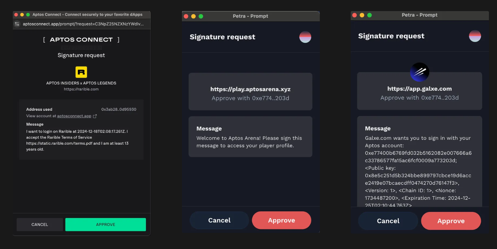
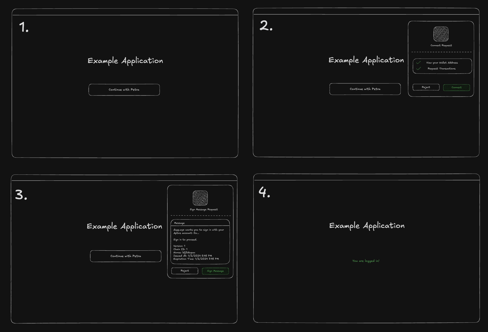
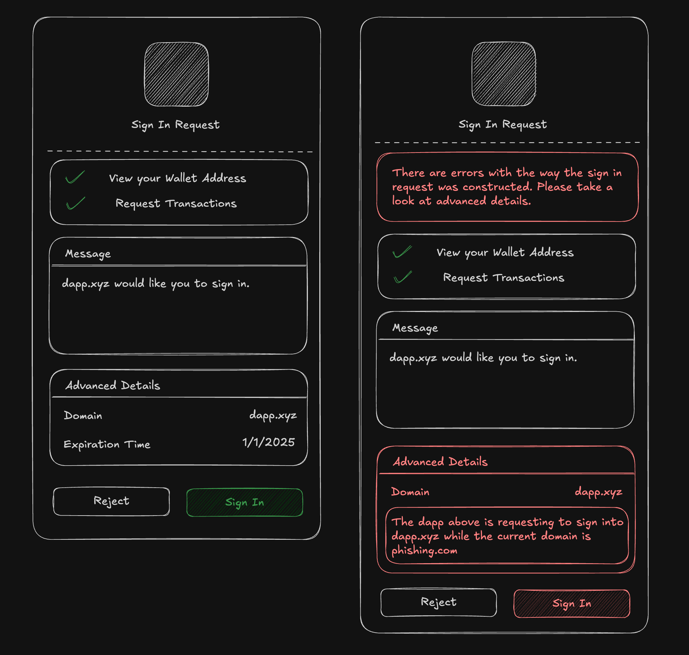
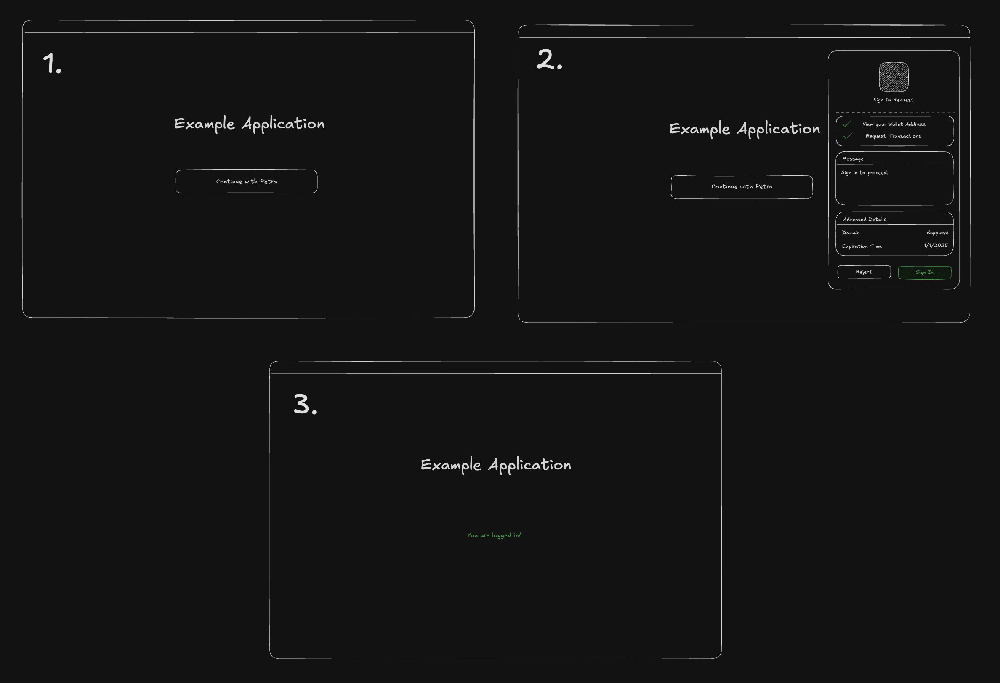

# AIP-116 - Sign in with Aptos

## Summary

The "Sign in with Aptos" (SIWA) standard introduces a secure and user-friendly way for users to authenticate to off-chain resources by proving ownership of their Aptos accounts. It simplifies the authentication process by replacing the traditional `connect` + `signMessage` flow in the wallet standard with a streamlined one-click `signIn` method. SIWA leverages Aptos accounts to avoid reliance on traditional schemes like SSO while incorporating security measures to combat phishing attacks and improve user visibility.

### Out of scope

The standard relies on signature verification. This AIP will not cover specifications or correctness of signature verification.

## Motivation

### Why is this important?

Authenticating with Aptos accounts is a privacy-first solution that empowers individuals to safeguard their information, personalize their experiences, and maintain freedom from censorship.

By authenticating using Aptos accounts, users have full control over their authentication journey. They can decide _what to share_ and _how to log in,_ ensuring a more secure and customizable experience.

For example, a user may choose to use one of the wallet experiences to authenticate into an application:

- **Petra** – _Passwords/Biometric_: - Fully non-custodial. Requires no information to be shared with Petra, ensuring complete privacy and resistance to censorship.
- **Aptos Connect** – _Social Providers_: Fully non-custodial. Shares limited information with Aptos Connect including name, email, `sub` and may be subject to censorship by social providers.

However, while this approach offers significant benefits, the existing `connect` + `signMessage` flow used for authentication presents a few challenges:

The `signMessage` step has...



- **a lack of standardization —** Applications on Aptos lack a unified authentication message format, leading to inconsistencies that confuse users.
- **unreadable messages —** Authentication messages are displayed in plain text, making them difficult for users to comprehend.

<br/>

And the `connect` + `signMessage` flow...



- **presents security risks —** Malicious websites can deceive users into signing messages intended for legitimate dApps.
- **is unintuitive —** The traditional `connect` + `signMessage` workflow involves two separate steps, creating a clunky and unintuitive user experience.

Addressing these challenges is key to unlocking the full potential of Aptos accounts and delivering a seamless, secure, and user-friendly experience.

### What is the proposed solution?

The proposed model builds on established standards, including [EIP-4361](https://eips.ethereum.org/EIPS/eip-4361), [CAIP-122](https://chainagnostic.org/CAIPs/caip-122), and [Sign in with Solana](https://phantom.app/learn/developers/sign-in-with-solana). Drawing inspiration from [Sign in with Solana](https://phantom.app/learn/developers/sign-in-with-solana), this standard aims to shift the responsibility of message construction from dApps to wallets, streamlining the authentication process.

With a **Sign in with Aptos (SIWA)** flow, we address key challenges by enabling wallets to interpret standardized message formats, allowing them to flag potentially illegitimate messages. This approach not only improves security but also builds user trust. Additionally, the wallet standard incorporates critical features such as domain binding, message timestamps, resources, and request IDs, ensuring a more robust authentication experience.



## High-level Overview

The SIWA flow will introduce a new method `signIn` to the wallet standard where it will perform "connect" and "sign message" operations in one step. As part of this flow, a new standardized message format and signing algorithm will be introduced. The wallet will be responsible for constructing messages into this standardized format and presenting an authentication flow using a human-readable UI (as well as flagging potentially malicious messages).



## Impact

This AIP significantly impacts both developers and end-users:

### For Developers

- **Streamlined Integration:** SIWA provides a standardized framework for authentication, removing the need for custom implementations. This reduces development overhead and ensures compatibility across applications.
- **Enhanced Security:** By enabling wallets to validate and flag potentially malicious messages, SIWA minimizes the risk of phishing attacks and other security vulnerabilities.
- **Future-Proof Standards:** Building on existing specifications like [EIP-4361](https://eips.ethereum.org/EIPS/eip-4361) and [CAIP-122](https://chainagnostic.org/CAIPs/caip-122), SIWA ensures that developers work with a modern, robust authentication protocol aligned with industry best practices.

### For Users

- **Improved Experience:** Replacing the cumbersome `connect` + `signMessage` flow with a single-step `signIn` method simplifies the login process, making it more intuitive and user-friendly.
- **Transparency and Trust:** The standardized message format ensures that users can easily understand what they are signing.

## Alternative Solutions

The main alternative is to continue using the `connect` + `signMessage` flow. This flow is not as secure as SIWA, exposing users to the risk of phishing attacks, unreadable messages, and a poor double prompt user experience.

## Specification and Implementation Details

The new standard introduces new interfaces that conform to [CAIP-122](https://chainagnostic.org/CAIPs/caip-122). Two interfaces will be introduced: `**AptosSignInInput**` and `**AptosSignInOutput**`. Applications will be responsible for providing an `AptosSignInInput` to the wallet. Wallets will be responsible for the construction of the **SIWA messages** using the `AptosSignInInput` fields and responding with an `AptosSignInOutput`.

### Definitions

- _binding_: The process of adding or modifying fields to fit requirements, sourcing fields from a trusted data source such as the browser window. This process will typically be done by the wallet.
- _SIWA Message_: A plain text message that is constructed from the `AptosSignInInput` fields by the wallet. This message should follow the format specified in the [Message Construction](#message-construction) section.
- _SIWA Signing Message_: Bytes output from the [Domain Separated Signing Algorithm](#domain-separated-signing-algorithm) using the SIWA message as input.
- _Signing Request_: A request from an application to the wallet to conduct a certain operation such as signing a message.

### AptosSignInInput

The `AptosSignInInput` interface will be included in the **signing request** to construct the SIWA message.

| Name           | Type            | Mandatory | Description                                                                                                                           |
| -------------- | --------------- | --------- | ------------------------------------------------------------------------------------------------------------------------------------- |
| domain         | string          |           | `dnsauthority` that is requesting the signing.                                                                                        |
| address        | string          |           | Blockchain address performing the signing.                                                                                            |
| uri            | string          |           | URI referring to the resource that is the subject of the signing i.e. the subject of the claim.                                       |
| version        | string          |           | Current version of the message.                                                                                                       |
| statement      | string          |           | Human-readable ASCII assertion that the user will sign. It MUST NOT contain `\n`.                                                     |
| nonce          | string          | ✓         | Randomized token to prevent signature replay attacks.                                                                                 |
| chainId        | string          |           | Identifier for the network where the `address` above lives (e.g., for Aptos `mainnet`, the identifier would be `aptos:mainnet`)       |
| issuedAt       | ISO 8601 string |           | `date-time` that indicates the issuance time.                                                                                         |
| expirationTime | ISO 8601 string |           | `date-time` that indicates when the signed authentication message is no longer valid.                                                 |
| notBefore      | ISO 8601 string |           | `date-time` that indicates when the signed authentication message starts being valid.                                                 |
| requestId      | string          |           | System-specific identifier used to uniquely refer to the authentication request.                                                      |
| resources      | string[]        |           | List of information or references to information the user wishes to have resolved as part of the authentication by the relying party. |

The `domain` field may be omitted from the `AptosSignInInput` to prevent the creation of application-specific phishing messages.

### AptosSignInOutput

The wallet will respond with an `AptosSignInOutput` to the application once the user has approved and signed the message.

| Name              | Type               | Mandatory | Description                                                                                                                                                                                                                                           |
| ----------------- | ------------------ | --------- | ----------------------------------------------------------------------------------------------------------------------------------------------------------------------------------------------------------------------------------------------------- |
| account.address   | string             | ✓         | The address of the user that is signing in.                                                                                                                                                                                                           |
| account.publicKey | bytes              | ✓         | The public key of the user that is signing in.                                                                                                                                                                                                        |
| input             | AptosSignInInput\* | ✓         | The AptosSignInInput that contains the fields used to construct the message. \* The following fields must be bound: `address`, `chainId`, `domain`, `uri`, and `version`. If the bound fields are not provided, they must be populated by the wallet. |
| plainText         | string             | ✓         | The constructed message using the standardized message format.                                                                                                                                                                                        |
| signingMessage    | bytes              | ✓         | The signing message that conforms to the domain separated signing algorithm.                                                                                                                                                                          |
| signature         | bytes              | ✓         | The signature of the signing message.                                                                                                                                                                                                                 |
| signatureType     | string             | ✓         | The key scheme used to sign the message (e.g. 'ed25519', 'single_key', 'multi_key', 'multi_ed25519', etc.).                                                                                                                                           |

If there are library representations of the `account.publicKey` and `signature`, they may be used instead of the `bytes` type (e.g. `PublicKey` and `Signature` from the `@aptos-labs/ts-sdk` package).

### SIWA Message Construction

The proposed plain text representation will be an adaptation of the standards specified from [EIP-4361](https://eips.ethereum.org/EIPS/eip-4361) and [CAIP-122](https://chainagnostic.org/CAIPs/caip-122). If certains fields are not present in the `AptosSignInInput`, omit them from the SIWA message.

#### Message Format

```
${domain} wants you to sign in with your Aptos account:
${address}

${statement}

URI: ${uri}
Version: ${version}
Chain ID: ${chain-id}
Nonce: ${nonce}
Issued At: ${issued-at}
Expiration Time: ${expiration-time}
Not Before: ${not-before}
Request ID: ${request-id}
Resources:
- ${resources[0]}
- ${resources[1]}
...
- ${resources[n]}
```

#### Example Messages

_Minimal Example_

```
example.com wants you to sign in with your Aptos account:
0x10d7cf502f8571b5b6e402221cafb142547103da9c2847ffcf708f065a78b8d1

URI: https://example.com
Version: 1
Chain ID: aptos:mainnet
Nonce: abc123
```

This is example occurs when the application does not request any fields in the `AptosSignInInput`. This will be the smallest possible SIWA message.

_Detailed Example_

```
example.com wants you to sign in with your Aptos account:
0x10d7cf502f8571b5b6e402221cafb142547103da9c2847ffcf708f065a78b8d1

Sign in to Example.com

URI: https://example.com
Version: 1
Nonce: abc123
Issued At: 2023-01-01T00:00:00Z
Expiration Time: 2024-01-01T00:00:00Z
Not Before: 2023-01-01T00:00:00Z
Request ID: req123
Chain ID: aptos:mainnet
Resources:
- resource1
- resource2
```

### Augmented Backus-Naur Form (ABNF) Expression

A constructed SIWA message should conform to the following Augmented Backus–Naur Form expression:

```
sign-in-with-aptos =
message-domain %s" wants you to sign in with your Aptos account:" LF
message-address
[ LF LF message-statement ]
[ LF advanced-fields ]

advanced-fields =
[ LF %s"URI: " message-uri ]
[ LF %s"Version: " message-version ]
[ LF %s"Chain ID: " message-chain-id ]
[ LF %s"Nonce: " message-nonce ]
[ LF %s"Issued At: " message-issued-at ]
[ LF %s"Expiration Time: " message-expiration-time ]
[ LF %s"Not Before: " message-not-before ]
[ LF %s"Request ID: " message-request-id ]
[ LF %s"Resources:" message-resources ]

message-domain = authority
message-address = "0x" 64*64HEXDIG
message-statement = 1*( reserved / unreserved / " " )
message-uri = URI
message-version = "1"
message-chain-id = %s"mainnet" / %s"testnet" / %s"devnet" / %s"localnet" / %s"aptos:mainnet" / %s"aptos:testnet" / %s"aptos:devnet" /  %s"aptos:" 1*DIGIT
message-nonce = 8*( ALPHA / DIGIT )
message-issued-at = date-time
message-expiration-time = date-time
message-not-before = date-time
message-request-id = *pchar
message-resources = \\*( LF "- " URI )
```

### Domain Separated Signing Algorithm

A plain text construction of a SIWA message must be prefixed with a `SIGN_IN_WITH_APTOS::` hash before signing to ensure domain separation across other signatures. The SIWA signing messages must conform to the following expression:

```
sha3_256(b"SIGN_IN_WITH_APTOS::") || <siwa_message>
```

where `<siwa_message>` is the plain text construction of a SIWA message explained in the [Message Construction](#message-construction) section.

### Modifications to the Wallet Standard

This AIP also extends the [Wallet Standard](https://github.com/aptos-labs/wallet-standard), which is a chain-agnostic set of interfaces and conventions that aim to improve how applications interact with injected wallets.

#### Suggested Features to the Wallet Standard

The features below will be added to the wallet standard as suggested features. Features will be optional to maintain compatibility with existing wallets.

`aptos:signIn` method to establish a connection and to sign a _SIWA_ signing message constructed by the wallet.

```ts
// `input: AptosSignInInput` - inputs with fields to construct a SIWA signing message
signIn(input: AptosSignInInput): Promise<UserResponse<AptosSignInOutput>>
```

### Implementation Requirements for Wallet Developers

To ensure the safety of our users, we want to take a conservative approach when wallets are presented with invalid signing requests.

#### Verifying Bound Fields

- A wallet MUST NOT allow the approval of signing requests that do not match on the `domain` field.
- The `domain` and `uri` field is expected to be read from a trusted data source such as the browser window. The `address`, `version`, and `chainId` fields are expected to be read from the wallet. **These fields are expected to be bound during the construction of the SIWA message if not present**.
- Wallet implementors MUST verify the following fields to prevent phishing attacks: `domain` , `address` , `uri` , `version` , and `chainId` . If the bound fields do not match the fields presented in the signing request, errors must be displayed to the users detailing them out. It is suggested to add additional steps to the approval process, such as an opt-in checkmark field, that confirms the user’s intent if errors are present.

## Reference Implementation

The following reference implementations are provided in TypeScript.

### Interfaces

#### @aptos-labs/wallet-standard

The following interfaces would be introduced into the [`@aptos-labs/wallet-standard`](https://github.com/aptos-labs/wallet-standard) npm package.

```ts
import { AccountInfo } from "@aptos-labs/wallet-standard";
import { Signature } from "@aptos-labs/ts-sdk";

export type AptosSignInInput = {
  address?: string;
  uri?: string;
  version?: string;
  statement?: string;
  nonce: string;
  chainId?: string;
  issuedAt?: string;
  expirationTime?: string;
  notBefore?: string;
  requestId?: string;
  resources?: string[];
};

export type AptosSignInRequiredFields = {
  domain: string;
  address: string;
  uri: string;
  version: string;
  chainId: string;
};

export type AptosSignInOutput = {
  account: AccountInfo;
  input: AptosSignInInput & AptosSignInRequiredFields;
  plainText: string;
  signingMessage: Uint8Array;
  signature: Signature;
  type: string;
};
```

**Notes**

- In the `AptosSignInOutput`, the `signature` field is a `Signature` object from the `@aptos-labs/ts-sdk` package instead of `bytes` as library representations are allowed.
- In the `AptosSignInOutput`, the `account` field is an `AccountInfo` object from the `@aptos-labs/wallet-standard` package instead of `{ address: string; publicKey: bytes }` as library representations are allowed.
- The `domain` field has been omitted from the `AptosSignInInput` interface to prevent the creation of application-specific phishing messages.

#### @aptos-labs/siwa

A new npm package named `@aptos-labs/siwa` will be created to house utilities for SIWA. These utilities will be responsible for creating messages, verifying messages, and deserializing public key and/or signatures. The initial implementation will be done in TypeScript.

Below are the primary functions that will be provided as part of the `@aptos-labs/siwa` utilities:

```ts
/**
 * Create a SIWA plain text message from the `AptosSignInInput` (including required fields) following the ABNF format defined in the Sign in with Aptos
 * specifications.
 *
 * @param input The input fields to create the SIWA plain text message from.
 *
 * @returns The SIWA plain text message.
 */
function createSignInMessagePlainText(
  input: AptosSignInInput & AptosSignInRequiredFields
): string;

/**
 * Verifies a SIWA plain text message against expected `AptosSignInInput` fields (including required fields).
 *
 * @param message The SIWA plain text message to verify.
 * @param expected The expected fields to verify against the input.
 *
 * @returns The `AptosSignInInput` fields that were verified.
 */
function verifySignInMessage(
  message: string,
  expected: AptosSignInInput & AptosSignInRequiredFields
): VerificationResult<AptosSignInInput & AptosSignInRequiredFields>;

/**
 * Verifies certain components of a `AptosSignInOutput` from a `signIn` method against `AptosSignInInput` fields.
 *
 * @param input The input fields to verify the output against.
 * @param output The output to verify against the input.
 *
 * @returns The `AptosSignInInput` fields that were verified.
 */
function verifySignIn(
  input: AptosSignInInput,
  output: {
    publicKey: PublicKey;
    signature: Signature;
    message: string;
  }
): VerificationResult<AptosSignInInput & AptosSignInRequiredFields>;

/**
 * Generate a SIWA signing message using the SIWA Domain Separated Signing Algorithm.
 * sha3_256( sha3_256(b"SIGN_IN_WITH_APTOS::" ) || <message> )
 *
 * @param message The SIWA message to sign.
 
 * @returns The SIWA signing message.
 */
function generateSignInSigningMessage(message: string): Uint8Array;
```

### Wallet Implementation

The wallet is responsible for taking `AptosSignInInput` fields defined by an application and responding with an `AptosSignInOutput`.

The wallet must bind the `address`, `chainId` , `domain` , `uri` , and `version` fields if they are not present in the `AptosSignInInput`. If there is a mismatch between the bound fields against the `AptosSignInInput`, it is important that it is flagged and shown to the user.

#### Overview

1. The Wallet receives the `signIn` signing request from the application with `AptosSignInInput` fields.

```ts
export class MyWalletAccount implements AptosWalletAccount {
  async signIn(
    input: AptosSignInInput
  ): Promise<UserResponse<AptosSignInOutput>> {
    // ...
  }
}
```

2. The Wallet will construct an `AptosSignInOutput` with the input from the signing request. The `createSignInMessageText` utility from `@aptos-labs/siwa` can be used to create the plain text message. Once the plain text message has been created, we want to generate a signing message using `generateSignInSigningMessage` that conforms to [Domain Separated Signing Algorithm](#domain-separated-signing-algorithm). **It is important to bind the following fields: `address`, `chainId` , `domain`, `uri` , and `version`.**

_Example implementation of a utility using createSignInMessageText to create an AptosSignInMessage_

```ts
import {
  AptosSignInInput,
  AptosSignInRequiredFields,
  AptosSignInOutput,
} from "@aptos-labs/wallet-standard";
import {
  createSignInMessageText,
  generateSignInSigningMessage,
  getSignInPublicKeyScheme,
} from "@aptos-labs/siwa";

const getBoundFields = () =>
  ({
    address: walletAccount.address,
    chainId: network.chainId,
    domain: new URL(window.location.origin).host,
    uri: window.location.origin,
    version: "1",
  } satisfies AptosSignInRequiredFields);

async function constructSignInOutput(input: AptosSignInInput): AptosSignInOutput {
  const fields = {
    ...getBoundFields(),
    ...input,
  } satisfies AptosSignInInput & AptosSignInRequiredFields;

  const plainText = createSignInMessageText(fields);

  const signingMessage = generateSignInSigningMessage(plainText);

  const signature = // ... the wallet signs the message `signingMessage`

  return {
    account: new AccountInfo({
      address: walletAccount.accountAddress,
      publicKey: walletAccount.publicKey,
    }),
    input: fields,
    plainText,
    signingMessage,
    signature: signature.toUint8Array(),
    type: getSignInPublicKeyScheme(/* ... wallet's public key ... */),
  } satisfies AptosSignInOutput;
}
```

_Using the constructSignInMessage utility_

```ts
export class MyWalletAccount implements AptosWalletAccount {
  async signIn(
    input: AptosSignInInput
  ): Promise<UserResponse<AptosSignInOutput>> {
    const output = constructSignInOutput(input);

    // ...
  }
}
```

3. Once the `AptosSignInOutput` is constructed, it is should be displayed to the user. Below is an example of how the information should be displayed.

```tsx
export default function SignInPrompt({
  input,
  output,
}: {
  input: AptosSignInInput;
  output: AptosSignInOutput;
}) {
  const approve = () => {
    // ...
  };

  const reject = () => {
    // ...
  };

  return (
    <div>
      <div>
        <h1>Sign in with Aptos</h1>
        <p>{output.plainText}</p>
      </div>

      <div>
        <h2>Advanced Details</h2>
        {Object.entries(output.fields).map(([key, value]) => (
          <div key={key}>
            <h3>{key}</h3>
            <p>{value}</p>
          </div>
        ))}
      </div>

      <div>
        <button onClick={approve}>Approve</button>
        <button onClick={reject}>Reject</button>
      </div>
    </div>
  );
}
```

4. It is important to validate the `AptosSignInInput` against bound fields (`address`, `chainId` , `domain` , `uri`, and `version`). Using the `verifySignInMessage` utility from `@aptos-labs/siwa`, we can compare the `AptosSignInInput` to expected fields to check for any errors. **Note: If there is a mismatch on the `domain` field, the user MUST NOT allow the approval of the signing request.**

```tsx
export default function SignInPrompt({
  input,
  output,
}: {
  input: AptosSignInInput;
  output: AptosSignInOutput;
}) {
  // ...

  const verification = useMemo(() => {
    return verifySignInMessage(input, {
      ...input,
      ...getBoundFields(),
    });
  }, [input]);

  return (
    <div>
      <div>
        <h1>Sign in with Aptos</h1>
        <p>{output.plainText}</p>
      </div>
      {!verification.valid && (
        <div>
          <h2>Errors</h2>
          {verification.errors.map((error) => (
            <div key={error}>
              <p>{error}</p>
            </div>
          ))}
        </div>
      )}
      // ... details and approve/reject buttons
    </div>
  );
}
```

5. Once the user approves, the wallet should respond to the application with a `AptosSignInOutput`.

```tsx
export class MyWalletAccount implements AptosWalletAccount {
  async signIn(
    input: AptosSignInInput
  ): Promise<UserResponse<AptosSignInOutput>> {
    // ...

    return {
      status: UserResponseStatus.APPROVED,
      args: output,
    };
  }
}
```

### Application Implementation

The application is responsible for sending the `signIn` signing request with `AptosSignInInput` fields to the wallet. The application should create the `AptosSignInInput` in the backend and store them to verified at the end of the flow.

#### Overview

1. The application should provide an endpoint that constructs a `AptosSignInInput`. These `AptosSignInInput` fields should be stored at the beginning of the flow so that it can be used to verify the wallet’s `AptosSignInOutput` at the end of the flow.

```ts
import { AptosSignInInput } from "@aptos-labs/wallet-standard";
import { generateNonce } from "@aptos-labs/siwa";

app.get("/auth/siwa", (c) => {
  const nonce = generateNonce();

  const input = {
    nonce,
    statement: "Sign into to get access to this demo application",
  } satisfies AptosSignInInput;

  setCookie(c, "siwa-input", JSON.stringify(input), {
    httpOnly: true,
    sameSite: "lax",
  });

  return c.json({ data: input });
});
```

**Why is the nonce required?**

The nonce is required to prevent replay attacks. It is important that the nonce is generated randomly and stored at the beginning of each flow. This ensures that the same nonce cannot be used twice.

2. On the frontend, the application should call the `AptosSignInInput` endpoint and send a `signIn` signing request to the wallet.

```tsx
export default function SignInPage() {
  const { signIn } = useWallet();

  const handleSignIn = async () => {
    const input = await fetch("/auth/siwa");

    const response: AptosSignInOutput = await signIn(input);

    // ...
  };

  return (
    <div>
      <button onClick={handleSignIn}>Sign In</button>
    </div>
  );
}
```

3. The application should also create an endpoint to verify the `AptosSignInInput` constructed at the beginning of the flow to the `AptosSignInOutput` from the wallet. The verification typically requires the following from the `AptosSignInOutput`: signature, signature type, plain text message, and account public key. We use the `deserializeSignInPublicKey`, `deserializeSignInSignature`, and `verifySignInMessage` utilities from `@aptos-labs/siwa` to handle the verification logic.

```ts
import {
  deserializeSignInPublicKey,
  deserializeSignInSignature,
  verifySignInMessage,
} from "@aptos-labs/siwa";

const app = new Hono();

app.post("/auth/siwa/verify", (c) => {
  const { type, signature, message, publicKey } = c.req.json();

  const input = JSON.parse(getCookie(c, "siwa-input"));

  const verification = verifySignInMessage(input, {
    publicKey: deserializeSignInPublicKey(type, publicKey),
    signature: deserializeSignInSignature(type, signature),
    message,
  });

  if (!verification.valid) return c.json({ errors: verification.errors }, 400);

  // ... create and store a session for the user

  return c.json({ data: verification });
});
```

4. Once the verification endpoint has been created and the wallet successfully responds to the application with the `AptosSignInOutput`, verify the `AptosSignInOutput` with the new verification endpoint.

```tsx
export default function SignInPage() {
  const { signIn } = useWallet();

  const handleSignIn = async () => {
    const input = await fetch("/auth/siwa");

    const response: AptosSignInOutput = await signIn(input);

    const verification = await fetch("/auth/siwa/verify", {
      method: "POST",
      body: JSON.stringify({
        type: response.type,
        signature: response.signature.bcsToHex().toString(),
        message: response.plainText,
        publicKey: response.account.publicKey.bcsToHex().toString(),
      }),
    });

    if (!verification.ok) throw new Error("Failed to verify message");

    // ... the user is signed in, redirect to application
  };

  // ...
}
```

## Testing

The new `@aptos-labs/siwa` package will have its utilities tested to ensure that validation is done correctly. Coverage is most important here. In addition, signature verification methods will be used from the `@aptos-labs/ts-sdk`, it's important that signature verification methods are supported, correct, and tested.

## Risks and Drawbacks

Applications are responsible for correctly implementing an authentication flow, including session management (e.g. Cookies Based, OAuth, JWT, etc.). If not implemented correctly, applications may suffer vulnerabilities. The risks of these vulnerabilities can lead to data breaches or compromised accounts.

## Security Considerations

It is important that all of the verification methods are implemented correctly for signature verification in the `@aptos-labs/ts-sdk` package and message verification in the `@aptos-labs/siwa` package.

We must be aware and prevent any of the following attack vectors from occurring:

- Phishing attacks — A user MUST NOT be able to accidentally sign a message intended for different application.
- Replay attacks — A hacker MUST NOT be able to reuse a signature outside of its intended usage.
- Forgery attacks — A hacker MUST NOT be able to provide an invalid signature that can bypass verification.

## Future Potential

This AIP formally introduces a standard for authentication via Aptos accounts. In the future, the standard may be extended to provide additional information from the wallet.

With the rise of Keyless on the Aptos Blockchain, wallet connections may want to be extended to provide additional personal information about the user, this would include full names, phone numbers, or emails.

## Timeline

### Suggested implementation timeline

All implementation has been completed for the following packages:

- `@aptos-labs/siwa` (New)
- `@aptos-labs/wallet-standard`
- `@aptos-labs/wallet-adapter-react`
- `@aptos-labs/wallet-adapter-core`

The following applications have been updated to add support for the new standard:

- Petra (Extension)
- Petra (Mobile)
- Aptos Connect

## References

- [RFC 4501](https://www.rfc-editor.org/rfc/rfc4501.html)
- [RFC 3986](https://www.rfc-editor.org/rfc/rfc3986)
- [RFC 3339](https://www.rfc-editor.org/rfc/rfc3339)
- [CAIP-122](https://chainagnostic.org/CAIPs/caip-122)
- [EIP-4361](https://eips.ethereum.org/EIPS/eip-4361)
