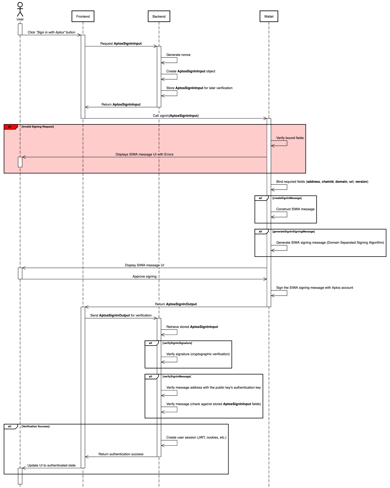

# AIP-116 - Sign in with Aptos

## Summary

The "Sign in with Aptos" (SIWA) standard introduces a secure and user-friendly way for users to authenticate to off-chain resources by proving ownership of their Aptos accounts. It simplifies the authentication process by replacing the traditional `connect` + `signMessage` flow in the wallet standard with a streamlined one-click `signIn` method. SIWA leverages Aptos accounts to avoid reliance on traditional schemes like SSO while incorporating security measures to combat phishing attacks and improve user visibility.

### Out of scope

This standard assumes familiarity with how transaction signatures are verified on Aptos ([Developer Documentation](https://aptos.dev/en/build/smart-contracts/cryptography)) and with digital signatures in general, as a cryptographic primitive.

## Motivation

### Why is this important?

Today, signing in to non-blockchain services typically involves the use of identity providers (IdPs) which are centralized entities with ultimate control over a user's identity. Examples being large internet companies (Google or Apple) and email providers. This centralization poses a risk, as IdPs can be single points of failure, vulnerable to breaches, censorship, or account lockouts. SIWA introduces a new non-custodial solution for users to assume control and responsibility of their own digital identity.

Many existing applications in Aptos ecosystem today support a form of authentication via Aptos accounts through the `connect` + `signMessage` flow. However, while this approach exists, the existing `connect` + `signMessage` presents a few issues:

The `connect` + `signMessage` flow...


- **presents security risks —** Malicious websites can deceive users into signing messages intended for legitimate dApps.
- **is unintuitive —** The traditional `connect` + `signMessage` workflow involves two separate steps, creating a clunky and unintuitive user experience.
- **(mis)trains the user to sign malicious messages —** Users are being trained to sign messages without understanding their contents. Long term, this can lead to users becoming more susceptible to phishing attacks.

And the `signMessage` step has...


- **a lack of standardization —** Applications on Aptos lack a unified authentication message format, leading to inconsistencies that confuse users.
- **unreadable messages —** Authentication messages are displayed in plain text, making them difficult for users to comprehend.

<br/>

### What is the proposed solution?

The proposed model builds on established standards, including [EIP-4361](https://eips.ethereum.org/EIPS/eip-4361), [CAIP-122](https://chainagnostic.org/CAIPs/caip-122), and [Sign in with Solana](https://phantom.app/learn/developers/sign-in-with-solana). Drawing inspiration from [Sign in with Solana](https://phantom.app/learn/developers/sign-in-with-solana), this standard aims to shift the responsibility of message construction from dApps to wallets, streamlining the authentication process.

With a **Sign in with Aptos (SIWA)** flow, we address key challenges by enabling wallets to interpret standardized message formats, allowing them to flag potentially illegitimate messages. This approach not only improves security but also builds user trust. Additionally, the standard incorporates critical features such as domain binding, message timestamps, resources, and request IDs, ensuring a more robust authentication experience.


## Solution Overview

The SIWA flow will introduce a new method `signIn` to the wallet standard where it will perform the `connect` and `signMessage` operations in one step. As part of this flow, a new standardized message format and signing algorithm will be introduced. The wallet will be responsible for constructing messages into this standardized format and presenting an authentication flow using a human-readable UI (as well as flagging potentially malicious messages).


## Impact

This AIP significantly impacts both developers and end-users:

### For Developers

- **Streamlined Integration:** SIWA provides a standardized framework for authentication, removing the need for custom implementations and reducing development overhead.
- **Enhanced Security:** By enabling wallets to validate and flag potentially malicious messages, SIWA eliminates the risk of phishing attacks and other security vulnerabilities present in the `connect` + `signMessage` flow.
- **Future-Proof Standards:** Building on existing specifications like [EIP-4361](https://eips.ethereum.org/EIPS/eip-4361) and [CAIP-122](https://chainagnostic.org/CAIPs/caip-122), SIWA ensures that developers work with a modern, robust authentication protocol aligned with industry best practices.

### For Users

- **Improved Experience:** Replacing the cumbersome `connect` + `signMessage` flow with a single-step `signIn` method simplifies the login process.
- **Transparency and Trust:** The standardized message format ensures that users can easily understand what they are signing, making it more intuitive and user-friendly.

## Alternative Solutions

The main alternative is to continue using the `connect` + `signMessage` flow. This flow is not as secure as SIWA, exposing users to the risk of phishing attacks, unreadable messages, and a poor double prompt user experience.

## Specification and Implementation Details

The new standard introduces new interfaces that conform to [CAIP-122](https://chainagnostic.org/CAIPs/caip-122). Two interfaces will be introduced: **`AptosSignInInput`** and **`AptosSignInOutput`**.

### Definitions

- _SIWA message_: A plain text message that is constructed from the `AptosSignInInput` alongside bound fields by the wallet. This message should follow the format specified in the [Message Construction](#siwa-message-construction) section.
- _SIWA signing message_: Bytes output from the [Domain Separated Signing Algorithm](#domain-separated-signing-algorithm) using the SIWA message as input.
- _Signing Request_: A request from an application to the wallet to conduct a certain operation such as signing a message.
- _Mandatory Fields_: The fields that are required to be present in the `AptosSignInInput` at all points of the SIWA flow.
- _Bound Fields_: The fields that are added by the wallet to the `AptosSignInInput` object when creating the SIWA message and present in the `AptosSignInOutput`. These fields should be sourced from a trusted data source such as the browser window.

### High-Level Overview

The application is responsible for generating a partially filled `AptosSignInInput` object and storing it in the backend. The application makes a `signIn` request to the wallet with the partially filled `AptosSignInInput` object. The wallet then completes the `AptosSignInInput` object with remaining bound fields. With the completed `AptosSignInInput`, the wallet will construct a SIWA message to display and a SIWA signing message which is signed upon user approval. An `AptosSignInOutput` object will be made and is returned to the application as a response to the `signIn` request. The application will then send the `AptosSignInOutput` object to the backend for verification using the originally stored `AptosSignInInput`. If verified, the user is authenticated and granted access to the application.

### AptosSignInInput

The `AptosSignInInput` interface will be included in the **signing request** to construct the SIWA message.

| Name           | Type            | Mandatory | Description                                                                                                                           |
| -------------- | --------------- | --------- | ------------------------------------------------------------------------------------------------------------------------------------- |
| domain         | string          | ✓         | `dnsauthority` that is requesting the signing.                                                                                        |
| address        | string          |           | Blockchain address performing the signing.                                                                                            |
| uri            | string          |           | URI referring to the resource that is the subject of the signing i.e. the subject of the claim.                                       |
| version        | string          |           | Current version of the message.                                                                                                       |
| statement      | string          |           | Human-readable ASCII assertion that the user will sign. It MUST NOT contain `\n`.                                                     |
| nonce          | string          | ✓         | Randomized token to prevent signature replay attacks.                                                                                 |
| chainId        | string          |           | Identifier for the network where the `address` above lives (e.g., for Aptos `mainnet`, the identifier would be `aptos:mainnet`)       |
| issuedAt       | ISO 8601 string |           | `date-time` that indicates the issuance time.                                                                                         |
| expirationTime | ISO 8601 string |           | `date-time` that indicates when the signed authentication message is no longer valid.                                                 |
| notBefore      | ISO 8601 string |           | `date-time` that indicates when the signed authentication message starts being valid.                                                 |
| requestId      | string          |           | System-specific identifier used to uniquely refer to the authentication request.                                                      |
| resources      | string[]        |           | List of information or references to information the user wishes to have resolved as part of the authentication by the relying party. |

#### Bound Fields

When the `AptosSignInInput` is sent to the wallet, the wallet is responsible for adding the following **bound fields**, if not present in the `AptosSignInInput`: `address`, `chainId`, `domain`, `uri`, and `version`. These fields should be derived from a trusted data source, such as the browser window.

As a result, it should be noted that there are two variants of the `AptosSignInInput`:

- **Before adding bound fields:** Used in the signing request to the wallet, where bound fields may be `undefined` or partially filled.
- **After adding bound fields:** Includes bound fields added by the wallet, used for creating the SIWA message, and appears in the `AptosSignInOutput`.

### AptosSignInOutput

The wallet will respond with an `AptosSignInOutput` to the application once the user has approved and signed the message.

| Name              | Type             | Description                                                                                                   |
| ----------------- | ---------------- | ------------------------------------------------------------------------------------------------------------- |
| account.address   | string           | The address of the user that is signing in. This field MUST match the `address` field in the `input`.         |
| account.publicKey | bytes            | The public key of the Aptos user that is signing in.                                                          |
| input             | AptosSignInInput | The `AptosSignInInput` with bound fields added by the wallet.                                                 |
| signature         | bytes            | The signature over the SIWA signing message.                                                                  |
| type              | string           | The digital signature scheme used to sign (e.g. 'ed25519', 'single_key', 'multi_key', 'multi_ed25519', etc.). |

If there are library representations of the `account.publicKey` and `signature`, they may be used instead of the `bytes` type (e.g. `PublicKey` and `Signature` from the `@aptos-labs/ts-sdk` package).

### Using SIWA Interfaces

The following summary offers a high-level overview of how the `AptosSignInInput` and `AptosSignInOutput` interfaces are used within the SIWA flow.

1. User navigates to the application and sees a "Sign in with Aptos" button, the user clicks the button.
2. The application will make a call to the backend to construct an `AptosSignInInput` object. This object can be partially filled, only requiring **mandatory fields**. This partially filled `AptosSignInInput` object should be stored to be verified later in Step 6.
3. Once the application receives the `AptosSignInInput` object, the application will make a signing request to the wallet containing the `AptosSignInInput` object. This will prompt the user to a sign a SIWA message.
4. The wallet will construct a SIWA message from the `AptosSignInInput`, adding bound fields that are not present in the partially filled `AptosSignInInput` object. Once the SIWA message is constructed, the SIWA message will go into the [Domain Separated Signing Algorithm](#domain-separated-signing-algorithm) to create a SIWA signing message. The prompt will display the SIWA message in a UI that can easily be read by the user.
5. When the user approves to sign the message, the wallet will use the Aptos account to sign the SIWA signing message and return an `AptosSignInOutput` object to the application.
6. The application should send the `AptosSignInOutput` object to the backend, where it will verify the `signature` and `message` using [Signature and Message Verification](#signature-and-message-verification). For message verification, the application should use the partially filled `AptosSignInInput` object from Step 2 as the `expected` object.
7. If verified successfully, the backend should proceed to authenticate the user (e.g. issue a JWT token, session cookies, etc) and give them access to resources.
8. The user may continue using the application in an authenticated state.



### SIWA Message Construction

The proposed plain text representation of an `AptosSignInInput` object with bound fields will be an adaptation of the standards specified from [EIP-4361](https://eips.ethereum.org/EIPS/eip-4361) and [CAIP-122](https://chainagnostic.org/CAIPs/caip-122). If fields are not present in the `AptosSignInInput`, omit them from the SIWA message.

As mentioned previously, if the bound fields, `domain`, `address`, `uri`, `version`, and `chainId`, are not present in the `AptosSignInInput`, they must be added by the wallet.

#### Message Format

```
${domain} wants you to sign in with your Aptos account:
${address}

${statement}

URI: ${uri}
Version: ${version}
Chain ID: ${chain-id}
Nonce: ${nonce}
Issued At: ${issued-at}
Expiration Time: ${expiration-time}
Not Before: ${not-before}
Request ID: ${request-id}
Resources:
- ${resources[0]}
- ${resources[1]}
...
- ${resources[n]}
```

#### Example Messages

_Minimal Example_

```
example.com wants you to sign in with your Aptos account:
0x10d7cf502f8571b5b6e402221cafb142547103da9c2847ffcf708f065a78b8d1

URI: https://example.com
Version: 1
Chain ID: aptos:mainnet
Nonce: abc123
```

This example occurs when the application does not request any fields in the `AptosSignInInput`. This will be the smallest possible SIWA message.

_Detailed Example_

```
example.com wants you to sign in with your Aptos account:
0x10d7cf502f8571b5b6e402221cafb142547103da9c2847ffcf708f065a78b8d1

Sign in to Example.com

URI: https://example.com
Version: 1
Nonce: abc123
Issued At: 2023-01-01T00:00:00Z
Expiration Time: 2024-01-01T00:00:00Z
Not Before: 2023-01-01T00:00:00Z
Request ID: req123
Chain ID: aptos:mainnet
Resources:
- resource1
- resource2
```

### Augmented Backus-Naur Form (ABNF) Expression

A constructed SIWA message should conform to the following Augmented Backus–Naur Form expression:

```
sign-in-with-aptos =
message-domain %s" wants you to sign in with your Aptos account:" LF
message-address
[ LF LF message-statement ]
[ LF advanced-fields ]

advanced-fields =
[ LF %s"URI: " message-uri ]
[ LF %s"Version: " message-version ]
[ LF %s"Chain ID: " message-chain-id ]
[ LF %s"Nonce: " message-nonce ]
[ LF %s"Issued At: " message-issued-at ]
[ LF %s"Expiration Time: " message-expiration-time ]
[ LF %s"Not Before: " message-not-before ]
[ LF %s"Request ID: " message-request-id ]
[ LF %s"Resources:" message-resources ]

message-domain = authority
message-address = "0x" 64*64HEXDIG
message-statement = 1*( reserved / unreserved / " " )
message-uri = URI
message-version = "1"
message-chain-id = %s"mainnet" / %s"testnet" / %s"devnet" / %s"localnet" / %s"aptos:mainnet" / %s"aptos:testnet" / %s"aptos:devnet" /  %s"aptos:" 1*DIGIT
message-nonce = 8*( ALPHA / DIGIT )
message-issued-at = date-time
message-expiration-time = date-time
message-not-before = date-time
message-request-id = *pchar
message-resources = \\*( LF "- " URI )
```

### Domain Separated Signing Algorithm

A plain text construction of a SIWA message (as described [here](#siwa-message-construction)) must be prefixed with a `SIGN_IN_WITH_APTOS::` hash before signing to ensure domain separation across other signatures. The SIWA signing message must conform to the following expression:

```
sha3_256(b"SIGN_IN_WITH_APTOS::") || <siwa_message>
```

where `<siwa_message>` is the plain text construction of a SIWA message explained in the [Message Construction](#message-construction) section.

### SIWA Signature and Message Verification

The verification process consists of two equally important components:

1. **Signature verification** - Cryptographically ensures the authenticity of a signature against the `input` fields of an `AptosSignInOutput`.
2. **SIWA Message verification** - Ensures the content of the `AptosSignInOutput`'s `input` field adheres to the `AptosSignInInput` stored in the backend at the beginning of a SIWA flow.

#### Signature Verification

Signature verification takes three parts:

- `publicKey` - The public key of the Aptos user that is signing in.
- `signature` - The signature to verify.
- `input` - The `AptosSignInInput` object with bound fields that was used to construct a SIWA signing message and signed to produce the `signature`.

To verify the `signature`, the `publicKey` should be used to cryptographically verify the `signature` against the SIWA signing message constructed from the `input`. The verification process should output `true` or `false` and should be stateless.

#### Message Verification

Message verification takes three parts:

- `publicKey` - The public key of the user that is signing in. Should be the `publicKey` used in the `signature` verification step above.
- `expected` - The `AptosSignInInput` object containing the fields expected to be present in, and match, the `input` object.
- `input` - The `AptosSignInInput` object with bound fields and the same object used in the signature verification step above.

The verification process must perform the following steps:

1. Check that the `authentication_key` field of the `0x1::account::Account` on-chain resource for the `input.address` is equal to the authentication key of the `publicKey`.
2. Compare the `expected` fields against the `input` fields. Iterate over the `expected` fields and check to see see if fields in the `expected` object are present and are equal to the corresponding fields in the `input` object.
   - There must not be additional fields in the `input` object that are not present in the `expected` object with the exception of bound fields.
3. If the `resources` field is present in the `expected` object, iterate over the `resources` array and check to see if each resource in the `resources` array is present and equal to the corresponding resource in the `input` object.
   - If the `resources` field is not present in the `expected` object, the `resources` field in the `input` must be `undefined`.
   - If the `resources` field in the `input` object has a value that was injected by the wallet ([Resource Injection](#resource-injection)), the value may be skipped over during comparisons as the expected value is not known.
4. Ensure that the `expirationTime` and `notBefore` fields are within the current time if present in the `expected` object.
   - If the `expirationTime` field is present in the `expected` object, it must be after the current time.
   - If the `notBefore` field is present in the `expected` object, it must be before or equal to the current time.
5. If all the above checks pass, return `true`, otherwise return `false`.

Implementation examples for both signature and message verification can be found in the [Verification Reference Implementations](#verification-reference-implementations) section.

### Implementation Requirements for Wallet Developers

To ensure the safety of our users, we want to take a conservative approach when wallets are presented with invalid signing requests.

#### Verifying Bound Fields

- A wallet MUST NOT allow the approval of signing requests that do not match on the `domain` field unless previously configured by the user.
- The `domain` and `uri` field is expected to be read from a trusted data source such as the browser window. The `address`, `version`, and `chainId` fields are expected to be read from the wallet. **These fields are expected to be added during the construction of the SIWA message if not present**.
- Wallet implementors MUST ensure that the bound fields (`address`, `chainId`, `domain`, `uri`, and `version`) match their corresponding fields in the `AptosSignInInput` _if present_. If the bound fields do not match the fields presented in the signing request, errors must be displayed to the users detailing the issues.
- In the case that the signing Aptos account was rotated, the bound `address` field MUST be the originating address of the authentication key.

### Wallet Interactions

- Prior to signing, the wallet MAY consult users for preferences, such as the selection of one `address` out of many or the `network` to use.
- The wallet MAY provide a way for users to configure their wallet to allow or disallow signing requests where there is a mismatch on the `domain` field.

#### Resource Injection

When the wallet received the `AptosSignInInput` from the application, wallets may inject additional information into the `resources` field for **wallet specified resources** and in any **wallet specified formats**.

_Email Example_

A wallet that reserves the resource `aptos.email` where the wallet will inject the user's email address into the resource with the following format format: `aptos.email:<email>`.

```
resources = [
  "aptos.email",
  "resource1",
  "resource2",
]
```

will be transformed into:

```
resources = [
  "aptos.email:example@gmail.com",
  "resource1",
  "resource2",
]
```

### Modifications to the Wallet Standard

This AIP also extends the [Wallet Standard](https://github.com/aptos-labs/wallet-standard), set of interfaces and conventions that aim to improve how applications interact with injected wallets.

#### Suggested Features to the Wallet Standard

The features below will be added to the wallet standard as suggested features. Features will be optional to maintain compatibility with existing wallets.

`aptos:signIn` method to establish a connection and to sign a SIWA signing message constructed by the wallet.

```ts
// `input: AptosSignInInput` - inputs with fields to construct a SIWA signing message
signIn(input: AptosSignInInput): Promise<UserResponse<AptosSignInOutput>>
```

## Reference Implementation

The following reference implementations are provided in TypeScript.

### Interfaces

#### @aptos-labs/wallet-standard

The following interfaces would be introduced into the [`@aptos-labs/wallet-standard`](https://github.com/aptos-labs/wallet-standard) npm package.

```ts
import { AccountInfo } from "@aptos-labs/wallet-standard";
import { Signature } from "@aptos-labs/ts-sdk";

export type AptosSignInInput = {
  domain: string;
  address?: string;
  uri?: string;
  version?: string;
  statement?: string;
  nonce: string;
  chainId?: string;
  issuedAt?: string;
  expirationTime?: string;
  notBefore?: string;
  requestId?: string;
  resources?: string[];
};

export type AptosSignInBoundFields = {
  domain: string;
  address: string;
  uri: string;
  version: string;
  chainId: string;
};

export type AptosSignInOutput = {
  account: AccountInfo;
  input: AptosSignInInput & AptosSignInBoundFields;
  signature: Signature;
  type: string;
};
```

**Notes**

- An additional interface, `AptosSignInBoundFields`, represents the bound fields that are added by the wallet to the `AptosSignInInput`. This interface will be used to create an intersection type with the `AptosSignInInput` to ensure type safety across operations that expect an `AptosSignInInput` with bound fields.
- In the `AptosSignInOutput`, the `signature` field is a `Signature` object from the `@aptos-labs/ts-sdk` package instead of `bytes` as library representations are allowed.
- In the `AptosSignInOutput`, the `account` field is an `AccountInfo` object from the `@aptos-labs/wallet-standard` package instead of `{ address: string; publicKey: bytes }` as library representations are allowed.
- In the `AptosSignInOutput`, the `input` field is an intersection of the `AptosSignInInput` and `AptosSignInBoundFields` interfaces as it is expected to contain both the `AptosSignInInput` fields and the bound fields added by the wallet.

#### @aptos-labs/siwa

A new npm package named `@aptos-labs/siwa` will be created to house utilities for SIWA. These utilities will be responsible for creating messages, verifying messages, and deserializing public key and/or signatures. The initial implementation will be done in TypeScript.

Below are the primary functions that will be provided as part of the `@aptos-labs/siwa` utilities:

```ts
/**
 * A result object that indicates the success or failure of a verification operation. If the verification is a failure, the `errors` field will contain an array of error messages that describe the failure(s).
 */
type VerificationResult = { valid: true } | { valid: false; errors: string[] };

/**
 * Create a SIWA Message from the `AptosSignInInput` with bound fields following the ABNF format defined in the Sign in with Aptos
 * specifications.
 *
 * @param input The `AptosSignInInput` with bound fields to create the SIWA message from.
 *
 * @returns The SIWA message.
 */
function createSignInMessage(
  input: AptosSignInInput & AptosSignInBoundFields
): string;

/**
 * Generate a SIWA signing message using the SIWA Domain Separated Signing Algorithm.
 * ( sha3_256(b"SIGN_IN_WITH_APTOS::" ) || <message> )
 *
 * @param message The SIWA message to sign.
 
 * @returns The SIWA signing message.
 */
function createSignInSigningMessage(message: string): Uint8Array;

/**
 * Using the `publicKey` and `signature`, verify that the `signature` is valid for the `message`.
 *
 * @param output The `AptosSignInOutput` to verify against the input.
 *
 * @returns A `VerificationResult` object indicating the success or failure of the verification.
 */
function verifySignInSignature(output: {
  publicKey: PublicKey;
  signature: Signature;
  input: AptosSignInInput & AptosSignInBoundFields;
}): VerificationResult;

/**
 * Uses the `AptosSignInInput` with bound fields to verify against an `AptosSignInOutput`.
 *
 * @param params.publicKey The public key of the user that is signing in.
 * @param params.expected The expected fields to verify against the input.
 * @param params.input The `AptosSignInInput` object with bound fields to verify against the `expected` fields.
 *
 * @returns A `VerificationResult` object indicating the success or failure of the verification.
 */
function verifySignInMessage(params: {
  publicKey: PublicKey;
  expected: AptosSignInInput;
  input: AptosSignInInput & AptosSignInBoundFields;
}): Promise<VerificationResult>;
```

#### Verification Reference Implementations

Below are example implementations of `verifySignInMessage` and `verifySignInSignature` utilities which conform to the verification specifications defined in the [Signature and Message Verification](#signature-and-message-verification) section:

[`verifySignInMessage` Implementation](https://github.com/aptos-labs/sign-in-with-aptos/blob/45b08896449698515c8db57975d454ab50d27478/packages/siwa/src/core.ts#L160-L262)

[`verifySignInSignature` Implementation](https://github.com/aptos-labs/sign-in-with-aptos/blob/45b08896449698515c8db57975d454ab50d27478/packages/siwa/src/core.ts#L264-L294)

### Wallet Implementation

The wallet is responsible handling signing requests with an `AptosSignInInput` object from an application and responding with an `AptosSignInOutput`. This section assumes that you have an understanding of the [AIP-62](https://github.com/aptos-foundation/AIPs/blob/main/aips/aip-62.md).

#### Overview

1. The wallet should implement the `signIn` method as part of the [Aptos Wallet Standard](https://github.com/aptos-foundation/AIPs/blob/main/aips/aip-62.md). In this example, we will use the `MyWalletAccount` class to implement the `signIn` method.

```ts
import { AptosWalletAccount } from "@aptos-labs/wallet-standard";

export class MyWalletAccount implements AptosWalletAccount {
  async signIn(
    input: AptosSignInInput
  ): Promise<UserResponse<AptosSignInOutput>> {
    // ...
  }
}
```

2. When the wallet receives a `signin` signing request, the wallet should display the `AptosSignInInput` in a human readable format to the user. Below is an example of how the information should be displayed. **As mentioned previously, it is important to add the bound fields, `address`, `chainId` , `domain`, `uri` , and `version`, if they are not already present in the `AptosSignInInput`.**

```tsx
import {
  AptosSignInInput,
  AptosSignInBoundFields,
  AptosSignInOutput,
} from "@aptos-labs/wallet-standard";
import { createSignInMessage } from "@aptos-labs/siwa";

export default function SignInPrompt({ input }: { input: AptosSignInInput }) {
  const getBoundFields = () =>
    ({
      address: walletAccount.accountAddress.toString(),
      chainId: walletNetwork.chainId,
      domain: window.location.host,
      uri: window.location.href,
      version: "1",
    } satisfies AptosSignInBoundFields);

  const inputWithBoundFields = {
    ...getBoundFields(),
    ...input,
  } satisfies AptosSignInInput & AptosSignInBoundFields;

  const reject = () => {
    // ...
  };

  const approve = () => {
    // ...
  };

  return (
    <div>
      <div>
        <h1>Sign in with Aptos</h1>
        <p>{createSignInMessage(inputWithBoundFields)}</p>
      </div>

      <div>
        <h2>Advanced Details</h2>
        {Object.entries(inputWithBoundFields).map(([key, value]) => (
          <div key={key}>
            <h3>{key}</h3>
            <p>{value}</p>
          </div>
        ))}
      </div>

      <div>
        <button onClick={approve}>Approve</button>
        <button onClick={reject}>Reject</button>
      </div>
    </div>
  );
}
```

3. The wallet should also do a check on any pre-filled bound fields in the `AptosSignInInput` object and ensure that they are equal to the bound fields the wallet derives from its trusted data source. Below is an example of how the fields can be checked and displayed to the user. **If any fields do not match, the wallet should NOT allow the user to approve the signing request unless previously configured by the user.**

```tsx
import {
  AptosSignInInput,
  AptosSignInBoundFields,
  AptosSignInOutput,
} from "@aptos-labs/wallet-standard";
import { createSignInMessage, verifySignInMessage } from "@aptos-labs/siwa";

export default function SignInPrompt({ input }: { input: AptosSignInInput }) {
  // ...

  const [verification, setVerification] = useState<VerificationResult>();

  useEffect(() => {
    verifySignInMessage({
      input: { ...getBoundFields(), ...input },
      expected: { ...input, ...getBoundFields() },
      publicKey: /* ... wallet's public key ... */,
    }).then(setVerification);
  }, [verification]);

  return (
    <div>
      <div>
        <h1>Sign in with Aptos</h1>
        <p>{createSignInMessage(inputWithBoundFields)}</p>
      </div>

      {verification && !verification.valid && (
        <div>
          <h2>Errors</h2>
          {verification.errors.map((error) => (
            <div key={error}>
              <p>{error}</p>
            </div>
          ))}
        </div>
      )}

      {/* ... advanced details and approve/reject buttons */}
    </div>
  );
}
```

4. Once the user approves, the wallet should construct an `AptosSignInOutput` using the `AptosSignInInput` with bound fields. When signing, it is important that the user signs the SIWA signing message derived from the [`Domain Separated Signing Algorithm`](#domain-separated-signing-algorithm) and the [`SIWA message`](#siwa-message-construction).

```tsx
import {
  AptosSignInInput,
  AptosSignInBoundFields,
  AptosSignInOutput,
} from "@aptos-labs/wallet-standard";
import {
  createSignInMessage,
  createSignInSigningMessage,
  getSignInPublicKeyScheme,
} from "@aptos-labs/siwa";
import { Signature } from "@aptos-labs/ts-sdk";

export default function SignInPrompt({ input }: { input: AptosSignInInput }) {
  // ...

  const approve = () => {
    // `inputWithBoundFields` was derived from Step 2
    const siwaMessage = createSignInMessage(inputWithBoundFields);

    const signingMessage = createSignInSigningMessage(siwaMessage);

    const signature: Signature = // ... the wallet signs the message `signingMessage`

    const output = {
      account: new AccountInfo({
        address: walletAccount.accountAddress,
        publicKey: walletAccount.publicKey,
      }),
      input: inputWithBoundFields,
      signature: signature,
      type: getSignInPublicKeyScheme(/* ... wallet's public key ... */),
    } satisfies AptosSignInOutput;

    // ... send the `AptosSignInOutput` to the `MyWalletAccount` as mentioned in Step 1
  };

  // ...
}
```

5. Once the user approves, the wallet should respond to the application with a `AptosSignInOutput`.

```tsx
export class MyWalletAccount implements AptosWalletAccount {
  async signIn(
    input: AptosSignInInput
  ): Promise<UserResponse<AptosSignInOutput>> {
    // ...

    return {
      status: UserResponseStatus.APPROVED,
      args: output,
    };
  }
}
```

### Application Implementation

The application is responsible for sending the `signIn` signing request with `AptosSignInInput` object to the wallet. The application should create the `AptosSignInInput` in the backend and store them to verified at the end of the flow.

#### Overview

1. The application's backend should provide an endpoint that constructs a `AptosSignInInput`. The `AptosSignInInput` object should be stored so that it can be used later to verify the `AptosSignInOutput`.

```ts
import { AptosSignInInput } from "@aptos-labs/wallet-standard";
import { generateNonce } from "@aptos-labs/siwa";

app.get("/auth/siwa", (c) => {
  const nonce = generateNonce();

  const input = {
    nonce,
    domain: FRONTEND_URL,
    statement: "Sign into to get access to this demo application",
  } satisfies AptosSignInInput;

  setCookie(c, "siwa-input", JSON.stringify(input), {
    httpOnly: true,
    sameSite: "lax",
  });

  return c.json({ data: input });
});
```

**Why is the nonce required?**

The nonce is required to prevent replay attacks. It is important that the nonce is generated randomly and stored at the beginning of each flow. This ensures that the same nonce and message cannot be used twice.

2. On the frontend, the application should call the newly added endpoint (in this case `/auth/siwa`) and send a `signIn` signing request to the wallet with the `AptosSignInInput` received from that endpoint.

```tsx
export default function SignInPage() {
  const { signIn } = useWallet();

  const handleSignIn = async () => {
    const inputResponse = await fetch("/auth/siwa");

    const input: AptosSignInInput = await inputResponse.json();

    const response: AptosSignInOutput = await signIn(input);

    // ...
  };

  return (
    <div>
      <button onClick={handleSignIn}>Sign In</button>
    </div>
  );
}
```

3. The application's backend should have another endpoint to verify the stored `AptosSignInInput` constructed at the beginning of the flow to the `AptosSignInOutput` from the wallet. The verification logic should use the specifications mentioned in the [SIWA Signature and Message Verification](#signature-and-message-verification) section. For message verification, the stored `AptosSignInInput` should be used as the `expected` fields. If the verification is successful, the application should typically create an authentication session for the user (e.g. cookies, OAuth, JWT, etc.).

```ts
import {
  deserializeSignInPublicKey,
  deserializeSignInSignature,
  deserializeSignInInput,
  verifySignInSignature,
  verifySignInMessage,
} from "@aptos-labs/siwa";

const app = new Hono();

app.post("/auth/siwa/verify", (c) => {
  const { type, signature, input, publicKey } = c.req.json();

  const signatureVerification = verifySignInSignature({
    publicKey: deserializeSignInPublicKey(type, publicKey),
    input: JSON.parse(input),
    signature: deserializeSignInSignature(type, signature),
  });

  if (!signatureVerification.valid)
    return c.json({ errors: signatureVerification.errors }, 400);

  const storedInput = JSON.parse(getCookie(c, "siwa-input"));

  const messageVerification = verifySignInMessage({
    publicKey: deserializeSignInPublicKey(type, publicKey),
    input: JSON.parse(input),
    expected: storedInput,
  });

  if (!messageVerification.valid)
    return c.json({ errors: messageVerification.errors }, 400);

  // ... create and store a session for the user

  return c.json({ data: verification });
});
```

4. Once the verification endpoint has been created and the wallet successfully responds to the application with the `AptosSignInOutput`, verify the `AptosSignInOutput` with the new verification endpoint.

```tsx
export default function SignInPage() {
  const { signIn } = useWallet();

  const handleSignIn = async () => {
    const inputResponse = await fetch("/auth/siwa");

    const input: AptosSignInInput = await inputResponse.json();

    const response: AptosSignInOutput = await signIn(input);

    const verification = await fetch("/auth/siwa/verify", {
      method: "POST",
      body: JSON.stringify({
        type: response.type,
        signature: response.signature.bcsToHex().toString(),
        input: JSON.stringify(response.input),
        publicKey: response.account.publicKey.bcsToHex().toString(),
      }),
    });

    if (!verification.ok) throw new Error("Failed to verify message");

    // ... the user is signed in, redirect to application
  };

  // ...
}
```

## Testing

The new `@aptos-labs/siwa` package will have its utilities tested to ensure that validation is done correctly. Coverage is most important here. In addition, signature verification methods will be used from the `@aptos-labs/ts-sdk`, it's important that signature verification methods are supported, correct, and tested.

## Risks and Drawbacks

Applications are responsible for correctly implementing an authentication flow, including session management (e.g. Cookies Based, OAuth, JWT, etc.). If not implemented correctly, applications may suffer vulnerabilities. The risks of these vulnerabilities can lead to data breaches or compromised accounts.

## Security Considerations

It is important that all of the verification methods are implemented correctly for signature verification in the `@aptos-labs/ts-sdk` package and message verification in the `@aptos-labs/siwa` package.

We must be aware and prevent any of the following attack vectors from occurring:

- Phishing attacks — A user MUST NOT be able to accidentally sign a message intended for different application.
- Replay attacks — A hacker MUST NOT be able to reuse a signature outside of its intended usage.
- Forgery attacks — A hacker MUST NOT be able to provide an invalid signature that can bypass verification.

**Displaying Errors vs Rejecting Requests**

The AIP proposes that wallets should display error messages when bound fields don't match those presented in signing requests instead of automatically rejecting such requests.

This approach serves a critical security purpose: ensuring users are informed of potential issues. When an application sends a signing request with mismatched fields—whether due to malicious intent or technical error—users should be aware of these discrepancies to make informed decisions.

If wallets rejected such requests outright, users might continue using potentially malicious applications without realizing the risks. By displaying errors, wallets empower users with the information needed to identify problematic applications and protect themselves from potential scams or exploits.

## Future Potential

This AIP formally introduces a standard for authentication via Aptos accounts. In the future, the standard may be extended to provide additional information from the wallet.

With the rise of Keyless on the Aptos Blockchain, wallet connections may want to be extended to provide additional personal information about the user, this would include full names, phone numbers, or emails.

## Timeline

### Suggested implementation timeline

All implementation has been completed for the following packages:

- `@aptos-labs/siwa` (New)
- `@aptos-labs/wallet-standard`
- `@aptos-labs/wallet-adapter-react`
- `@aptos-labs/wallet-adapter-core`

The following applications have been updated to add support for the new standard:

- Petra (Extension)
- Petra (Mobile)
- Aptos Connect

## References

- [RFC 4501](https://www.rfc-editor.org/rfc/rfc4501.html)
- [RFC 3986](https://www.rfc-editor.org/rfc/rfc3986)
- [RFC 3339](https://www.rfc-editor.org/rfc/rfc3339)
- [CAIP-122](https://chainagnostic.org/CAIPs/caip-122)
- [EIP-4361](https://eips.ethereum.org/EIPS/eip-4361)
