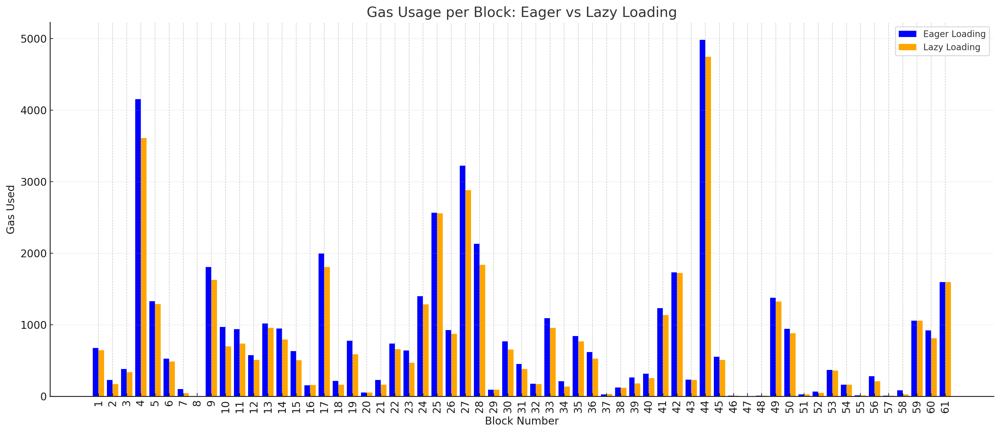
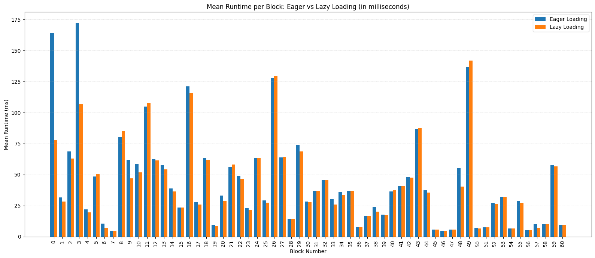

# AIP-127 - Lazy Loading

## Summary

When executing an entry function or a script payload, all their transitive Move module dependencies and friends are traversed first.
During the traversal, the gas is charged for every module in the transitive closure, and the closure's size is checked to be within [limits](https://github.com/aptos-labs/aptos-core/blob/d641f201a1ec26c1f55078e4977931f83cfe3512/aptos-move/aptos-gas-schedule/src/gas_schedule/transaction.rs#L251).
After the traversal, all modules in the closure are verified, and the payload is finally executed.
Similarly, when publishing a Move package, the transitive closure of package's dependencies and friends is traversed first to meter gas and enforce that the closure's size is bounded.
We call this approach to meter, load and publish Move modules *Eager Loading*.

Eager Loading turns out to be overly restrictive for real use cases, and DeFi in patrticular.
For example, DEX aggregators facilitate token swaps across multiple decentralized exchanges using a single contract.
They usally include many DEXes as dependencies and struggle with Eager Loading:

  - An aggregator may not be able to add a DEX as a dependnecy due to limits on the size of the transitive closure.
  - If one of the dependency DEXes upgrades to use more dependencies, the aggregator contract may become unusable (any call to its functions will hit the limit after the dependency upgrade).

As a result, Eager Loading makes writing Move contracts with many dependencies very challenging, if not impossible.

There are also other problems due to Eager Loading.
Even if transaction is only using a few modules at runtime, all its transitive dependencies will be traversed for gas metering purposes.
This increases the gas costs for transactions, and also hurts performance (transaction accesses dependencies not used for execution). 

This AIP proposes *Lazy Loading* - a different approach to metering, loading and publishing of Move modules.
When calling an entry function or a script, *modules are metered and loaded only when they are used*.
When publishing a Move package, only modules in a package and their immediate dependencies and friends are metered and loaded.

Lazy Loading solves the aforementioned challenges associated with Eager Loading:

  1. Move contracts no longer hit limits on the size of the transitive closure of dependencies (e.g., DEX aggregators).
  2. Transaction gas fees are decreased.
  3. Transactions can even be executed faster.

### Out of scope

Lazy Loading is implemented as a part of Move VM infrastructure, and is not directly accessible by developers.
As a result, the following is left out of scope:

- Ability for developers to specify if a Move function call should use lazy or eager loading.
- Ability for developers to specify lazy or eager loading when publishing packages.


## High-level Overview

A new set of APIs is introduced to couple gas metering and module loading, in order to prevent any unmetered accesses.
```rust
/// Dummy trait that can be implemented with custom module metering and loading logic.
pub trait ExampleLoader {
    fn load_something_that_loads_modules(
        &self,
        // Can be used to meter gas for modules.
        gas_meter: &mut impl GasMeter,
        // Can be used to track modules that were already metered.
        traversal_context: &mut TraversalContext,
        // All other arguments to load modules: e.g., module identifier, function name, etc.
        ..
    ) -> Result<Something, SomeError>;
}
```
The APIs are simply traits, and so the implementation can be configured to use different metering and loading schemes (unmetered, eager, lazy, etc.).
Move VM APIs have been adapted to work with the new traits (with an option to maintain backwards-compatibility with Eager Loading).

The table below summarizes when modules are metered and loaded with Eager Loading and Lazy Loading.

|| Eager Loading | Lazy Loading|
|:--|:--|:--|
| Aptos VM calls an entry function or a script. | Traverse and charge gas for all transitive module dependencies and friends. Charge gas for all modules that *may* be loaded when converting transaction type arguments to runtime types. | Charge gas for the module of the entry function. Charge gas for all modules used when converting transaction type arguments to runtime types. Charge gas for modules used in transaction argument construction. |
| Aptos VM calls a view function. | No metering. | Charge gas for the module of the view function. Charge gas for all modules used when converting transaction type arguments to runtime types. Charge gas for modules used in transaction argument construction. |
| Aptos VM processes package publish. | Charge gas for all modules in a bundle, and their old versions (if exist). Traverse and charge gas for all remaining transitive module dependencies and friends of a package. | Charge gas for all modules in a bundle, and their old versions (if exist). Charge gas for all immediate module dependencies and friends of a package. Check friends are in the package. Charge gas for all modules loaded during resource group scope verification. |
| Move VM calls a function. | No metering. | Charge gas for module of the target function. |
| Move VM resolves a closure (function value). | Traverse and charge gas for all transitive module dependencies and friends. Charge gas for all modules that *may* be loaded when converting transaction type arguments to runtime types. | Charge gas for module of the target function. |
| Move VM checks type depth (pack/unpack instructions). | No metering. | Charge gas for every module used during depth formula construction. |
| Move VM constructs type layout | No metering. | Charge gas for every module used during layout construction. |
| Move VM fetches module metadata to load a resource. | No metering. | Charge gas for accessed module. |
| Move VM serializes a function value. | No metering. | No metering. |
| Move VM calls a native function | No metering. | Charge gas for module of the target function. Charge gas for all modules used by the function type arguments (if any). |
| Move VM construct type layout in native context. | No metering. | No metering. |
| Move VM fetches module metadata to load a resource in native context. | No metering. | No metering. |
| Move VM loads a module in native dynamic dispatch [AIP-73](aip-73.md). | Traverse and charge gas for all transitive module dependencies and friends. | Charge gas for the module. |
| Move VM loads a fucntion in native dynamic dispatch [AIP-73](aip-73.md). | No metering. | No metering. |

Importantly, with Lazy Loading certain checks can no longer be enforced statically during module publish.
For example, the check to detect cyclic module dependencies is moved to runtime.
See [Specification and Implementation Details](#specification-and-implementation-details)) for more discussions on such checks. 

## Impact

Developers do not need to change their workflow when writing Move contracts.
If the code is written optimally, it should use all the benefits of lazy loading.

For example, the following code is not optimal even with eager loading:
```rust
let x: u64 = other_module::some_function();
if (some_variable > 10) {
    x = x + 1;
} else {
    // Does not use x, function call to other_module::some_function should be moved into `if` branch!
}
```
Hence, it will also not benefit from lazy loading because `other_module::some_function` will be loaded even if the branch is not taken.

Even though Aptos CLI and Aptos Move Compiler do not allow cyclic dependencies between different modules, with lazy loading, it is possible to attempt to publish such modules on-chain.
However, this is not recommended because the Move VM will detect a cycle at runtime and return an error.

### Backwards Compatibility

Lazy loading is not backwards compatible with eager loading due to difference in gas charging and module loading semantics.

### Gas Costs and Limits

In general, lazy loading should always decrease the gas usage of a single transaction because gas is only charged for modules that are actually used.
It is also less likely to hit limits on the number of dependencies: thanks to not loading the transitive closures of dependnecies.

Replaying historical workloads with lazy loading feature enabled allows to estimate gas savings, example sown below.
This figure shows block gas usage for mainnet transactions for versions [2719042368, 2719042916), with 61 blocks in total.



As we can see in the figure, lazy loading does provide significant gas savings of arounde 10-20%, sometimes jumping to 60% for small blocks with many dependencies.

**Known Cases of Increased Gas Usage**

During reply, we found that it is possible to run into corner cases where gas costs increase with lazy loading.
These are attributed to cases where eager loader was not charging gas (whether this was a bug or a feature).
For example, we can deduce from the figure above that 2/61 blocks have small increase in their gas usages.

For example, there are no charges for module loading when calling a view function.
Note that this is acceptable with Eager Loading.
The metering was done when the view function was published, so there is a strict upper bound on how many modules can the view function load.
With lazy loading, this is no longer the case: limits during module publish are too relaxed making it possible to publish many more modules. 
Hence, module loading in view functions is charged when lazy loading is enabled.


###  Performance

The goal of lazy loading is not to improve performace.
Still, our experimental evaluation shows thar lazy loading performs better or on par with eager loading, as the figure below suggests, replaying for mainnet transactions for versions [2719042368, 2719042916), with 61 blocks in total.



We can see that the first blocks get faster because the number of module accesses (cache misses) is reduced.
Once the cache contains most of used contracts, we observe that lazy loading has on par performance, or provide small improvements thanks to avoiding excessive loading of modules.


## Alternative Solutions

There are no alternatives to lazy loading: it can either be done eagerly (current approach) or lazily (proposed approach). All solutions in-between are still a form of lazy loading, and inherit all its disadvanatges but with only a fraction of its advanatges.

For example, one can consider a "more eager" variation of lazy loading where a Move module is always loaded together with its immediate dependencies (with additional checks that the module can link correctly to them).
However, conceptually this is still lazy loading but:

1. More gas is charged when loading a module (dependencies need to be accounted for).

2. Linking checks to dependencies are redundant because correct linking is guaranteed by module upgrades, compatibility checks and paranoid mode.
   With function values (#AIP-112)[aip-112.md], load-time linking checks are also not performed, due to dynamic nature of calls. 

3. Dependencies are still loaded lazily.


## Specification and Implementation Details

### 1. Changes to `ModuleStorage` and `CodeStorage`.

Exisitng `ModuleStorage` interface is refactored to highlight that module accesses are unmetered. For example:
```rust
/// Returns the deserialized module, or [None] otherwise. An error is returned if:
///   1. the deserialization fails, or
///   2. there is an error from the underlying storage.
///
/// Note: this API is not metered!
fn unmetered_get_deserialized_module(
    &self,
    address: &AccountAddress,
    module_name: &IdentStr,
) -> VMResult<Option<Arc<CompiledModule>>>;
```
The APIs of `ModuleStorage` are limited to module accesses only, and should not be used directly unless it is safe to do so.
The reference implementation uses comments like `// MODULE METERING SAFETY: proof` to specify why the module access is unmetered.

The `CodeStorage` trait is changed to
```rust
pub trait CodeStorage:
    ModuleStorage + ScriptCache<Key = [u8; 32], Deserialized = CompiledScript, Verified = Script>
{
}

impl<
        T: ModuleStorage
            + ScriptCache<Key = [u8; 32], Deserialized = CompiledScript, Verified = Script>,
    > CodeStorage for T
{
}
```
to provide access to script cache. This way loading scripts can be implemented in a custom way for both Eager or Lazy Loading.

### 2. New `..Loader` traits.

Both Eager and Lazy Loading are hidden behind a set of new traits (listed below).
All traits take a `GasMeter` implementation to charge gas, and a traversal context.
Traversal context contains modules that were "visited" so far by a single transaction - i.e., a set of metered modules.

```rust
pub trait StructDefinitionLoader {
    fn load_struct_definition(
        &self,
        gas_meter: &mut impl GasMeter,
        // Note: same as TraversalContext but a trait (to be abple to pass dummy context where needed).
        traversal_context: &mut impl ModuleTraversalContext,
        idx: &StructNameIndex,
    ) -> PartialVMResult<Arc<StructType>>;
}
```
`StructDefinitionLoader` is used when converting runtime types to layouts, or building depth formulas for types.
Eager Loader does not do any metering there.

```rust
pub trait FunctionDefinitionLoader {
    fn load_function_definition(
        &self,
        gas_meter: &mut impl GasMeter,
        traversal_context: &mut dyn ModuleTraversalContext,
        module_id: &ModuleId,
        function_name: &IdentStr,
    ) -> VMResult<(Arc<Module>, Arc<Function>)>;
}
```
`FunctionDefinitionLoader` is used when resolving a function (Move VM call, closure resolution, tests).
Eager Loader does not do any metering there, while Lazy Loader ensures the access to function definition that loads a new module is metered.

```rust
pub trait NativeModuleLoader {
    fn charge_native_result_load_module(
        &self,
        gas_meter: &mut impl GasMeter,
        traversal_context: &mut TraversalContext,
        module_id: &ModuleId,
    ) -> PartialVMResult<()>;
}
```
`NativeModuleLoader` is used to support `NativeResult::LoadModule { .. }`.
Native call returns this result when there is a native dynamic dispatch using (AIP-73)[aip-73.md].

```rust
pub trait ModuleMetadataLoader {
    fn load_module_metadata(
        &self,
        gas_meter: &mut impl GasMeter,
        traversal_context: &mut impl ModuleTraversalContext,
        module_id: &ModuleId,
    ) -> PartialVMResult<Vec<Metadata>>;
}
```
`ModuleMetadataLoader` used to query metadata for the module, when resolving a Move resource in the Move VM or in native context.

```rust
pub struct LegacyLoaderConfig {
    pub charge_for_dependencies: bool,
    pub charge_for_ty_tag_dependencies: bool,
}

pub trait InstantiatedFunctionLoader {
    fn load_instantiated_function(
        &self,
        config: &LegacyLoaderConfig,
        gas_meter: &mut impl GasMeter,
        traversal_context: &mut TraversalContext,
        module_id: &ModuleId,
        function_name: &IdentStr,
        ty_args: &[TypeTag],
    ) -> VMResult<LoadedFunction>;
}
```
`InstantiatedFunctionLoader` is used to load entrypoints: entry or view functions, closures, and even private functions if visibility is bypassed.
Additional `LegacyLoaderConfig` passed as an argument allows to cleanly implement Eager Loading as well.

```rust
pub trait ClosureLoader: InstantiatedFunctionLoader {
    fn load_closure(
        &self,
        gas_meter: &mut impl GasMeter,
        traversal_context: &mut TraversalContext,
        module_id: &ModuleId,
        function_name: &IdentStr,
        ty_args: &[TypeTag],
    ) -> PartialVMResult<Rc<LoadedFunction>>;
}
```
`ClosureLoader` is reponsible to resolve a closure, loading the function and converting its type arguments to runtime types.
Implementation simply calls into `InstantiatedFunctionLoader` to meter and load modules correctly.

```rust
pub trait Loader:
    ClosureLoader
    + FunctionDefinitionLoader
    + ModuleMetadataLoader
    + NativeModuleLoader
    + StructDefinitionLoader
    + InstantiatedFunctionLoader
{
    fn unmetered_module_storage(&self) -> &dyn ModuleStorage;
}
```
`Loader` is the main trait that encapsulates all metering and loading of modules.
Move VM expects a `Loader` to be provided (instead of `ModuleStorage`), which can either be eager or lazy.
Note that the cast to `&dyn ModuleStorage` is needed for native support only and to be able to resolve serialization data of a function value in Move VM.

```rust
pub trait ScriptLoader {
    fn load_script(
        &self,
        config: &LegacyLoaderConfig,
        gas_meter: &mut impl GasMeter,
        traversal_context: &mut TraversalContext,
        serialized_script: &[u8],
        ty_args: &[TypeTag],
    ) -> VMResult<LoadedFunction>;
}
```
Finally, `ScriptLoader` adds ability to meter and load scripts.

### 3. Module Publishing in Aptos VM

With lazy loading, there is a change how Aptos VM charges gas for published modules and verifies them.
On publish of a module bundle `M`, the gas is charge in the following way:

1. All old modules in `M` (those that are upgraded) are metered.
2. All modules in `M` are metered (to account for new code).
3. All immediate dependencies and all immediate friends of modules in `M` that are not in `M` themselves are metered.

The bundle is verified such that:

1. All modules in `M` are locally verified.
2. For all modules in `M` that is upgraded, compatibility checks are performed.
3. For all modules in `M`, a check that the friends it declares are in `M` is made. If this is not the case, an error is returned (`FRIEND_NOT_FOUND_IN_MODULE_BUNDLE = 1135`). This ensures that friend exists and can link to the module which declared it as a friend.
4. For all modules in `M`, a linking check is performed for its immediate dependencies. Note that immediate dependencies are sifficient because modules in storage and not in `M` cannot fail linking checks thanks to compatibility rules.

In this setting, it is now possible to publish larger packages on-chain, without worrying about hitting dependency limits.
We note, however, that Aptos VM no longer enforces that the module dependencies form an acyclic graph at publishing time.
Now, only Aptos CLI or Aptos Move Compiler enforce that there are no cyclic module dependencies.
This is further enforced by the VM at runtime: checks to detect recursive struct / enum definitions, or re-entrancy on function calls have been added.

### 4. Type Depth Checks

Type depth checks are done by Move VM interpreter when packing structs, enums or vectors.
During the checks, struct definitions are loaded.
With lazy loading, the algorithm charges gas for loading the module where a strcut definition is defined (if it is a first access).

The algorithm has been adjusted to detect cyclic dependencies between structs, e.g.,

```move
module 0x1::b {
  struct B { a: A }
}

module 0x1::a {
  enum A {
    Constructed { value: u64 },
    // Even if this variant is never constructed, creating `A::Constructed` will still
    // fail because of the cycle between `B` and `A::NeverConstructed`
    NeverConstructed { b: B },
  }
}
```

This is needed because at publishing time cyclic checks can no longer be perfomed, as Aptos VM checks only immediate dependencies of a package being published.
If there is a cycle detected at runtime, a new status code `RUNTIME_CYCLIC_MODULE_DEPENDENCY = 4040` is returned.

### 5. Serialized Function Data

Serialization function data is needed when 1) functon value is being serialized and 2) when displaying function value (via `0x1::string_utils.move`).
If function is in resolved state (i.e., created by `CallClosure` instruction), then when fetching serialization function data the layouts of captured arguments will be constructed.
The challenge is that at this point there is no access to gas meter, and so modules that are loaded when a layout is constructed cannot be easily charged.

We observe that there is no need to perform this gas charging.
We only need to consider resolved closures because they construct layouts for captured arguments.
We note that resolved state means the closure has been constructed by the current session, and so, the captured arguments are coming from the operand stack.
We now show that the layout of a struct / enum in captured argument must have visited all modules needed to construct this layout.

Captured struct/enums can be either constructed from storage bytes, or from Pack instructions.
If coming from storage, we must have constructed a layout already and so the modules are visited.
If constructed in interpreter:

  1. Generic fields must have been instantiated, and

  2. All modules the fields use the module of the struct/enum must be loaded (otherwise there is no other way to create fields and the struct/enum itself).
     For (2): this is not strictly true for enums. It is possible to construct variant A::V1 { x: 0 } while not all modules from other variant A::V2 { y: ..., } are loaded and added to the traversal context.
     What makes (2) to hold is a type depth check.
     The interpreter constructs depth formulas for structs/enums, which eagerly checks all variants.
     Hence, all modules must have been visited.

The design for lazy loading ensures that when getting the serialization data, all modules have been accessed.
This is done by propagating traversal context throughout the VM all the way down to value (de)serialization.
When constructing layouts there, a check is made to see if the module has been visited and metered, and if not, an invariant violation is returned.

### 6. Layout Construction

Similarly to type depth checks, layout construction is now also charged for any module loads that happen at runtime.
In non-native context, this is as simple as type depth checks.
Likewise, there are checks for recusrive struct / enum definitions, now performed at runtime.

### 7. Layout Construction for Native Context

In native context, layouts can also be constructed, e.g., when calling `0x1::bcs::to_bytes<T>(v: &T)`, layout for `T` is constructed.
Unfortunately, there is no access to `GasMeter` trait, and so for lazy loading we implement metering in the following way.

-  A special native function `native fun load_layout<T>()` is introduced, which returns a native result (only if lazy loading is enabled, otherwise it is a no-op):

```rust
pub enum NativeResult {
    ...
    LoadLayouts {
        tys: Vec<Type>,
        annotated: bool,
    },
}
```

- The VM, when seeing this result will create a layout for the specified types, and add to a local per-session layout cache.
  This cache contains all layouts a native function can use.
  The subsequent native call, e.g., to emit an event or to serialize a value using BCS, will get the layout from cache (if it is not in the cache - an invariant violation is returned).
  This way the layout has been metered and constructed, and the native can safely use it.

### 8. Module Metadata for Native Context

Module metadata accesses are also charged with lazy loading.
Similarly to layouts, native context can try to access module metadata for native `0x1::exists_at<T>(addr: address)` implementation.
However, because layout of `T` is pre-computed for this function, it must load all modules used in `T` and in particular, the module where `T`s instantiation is defined.
As a result, it is safe t not meter this access in native context.
Lazy loader ensures that is is indeed safe by checking at runtime that the module is indeed visited.

### 9. Function Calls and Re-entrancy

Funcion calls are resolved lazily, with only the callee's module being loaded (no transitive closure).

Recall that with lazy loading, cyclic modules can end up on chain.
To prevent possible re-entrancy, VM locks the module when a function is called (unlocking it when the call returns control to the caller's frame).
The locking mechanism re-uses one implemented for (AIP-73)[aip-73.md], returning an error on any (even safe) re-entrancy.


## Reference Implementation

The feature is code complete and is currently being tested.
Lazy loading is gated by a boolean flag in `VMConfig` and a feature flag (`ENABLE_LAZY_LOADING`).

Reference implementation:
1. [#16394](https://github.com/aptos-labs/aptos-core/pull/16394): Refactoring to prepare lazy loading integration.
2. [#16459](https://github.com/aptos-labs/aptos-core/pull/16459): `Loader` trait and support for metering for type depth formula construction.
3. [#16576](https://github.com/aptos-labs/aptos-core/pull/16576): Metering support for captured arguments in function values.
4. [#16461](https://github.com/aptos-labs/aptos-core/pull/16461): New type to layout converter and metering support in non-native context. 
5. [#16588](https://github.com/aptos-labs/aptos-core/pull/16588): Native context support for layout metering.
6. [#16589](https://github.com/aptos-labs/aptos-core/pull/16589): Metering support for native dynamic dispatch (`LoadModule`).
7. [#16590](https://github.com/aptos-labs/aptos-core/pull/16590): Metering support for module metadata (no publishing).
8. [#16462](https://github.com/aptos-labs/aptos-core/pull/16462): Metering support for functions and closures, Move VM to use `Loader` everywhere.
9. [#16464](https://github.com/aptos-labs/aptos-core/pull/16464): Metering support for module publish in Aptos VM.
10. [#16479](https://github.com/aptos-labs/aptos-core/pull/16479): End-to-end integration, implemantation of lazy verification and loading.
11. [#16513](https://github.com/aptos-labs/aptos-core/pull/16513): Enables lazy loading frature as default, adds tests and addresses remaining TODOs.


## Testing 

- [x] Exiting tests to see that `EagerLoader` is a compatible implementation.
- [x] Replay run to check that `EagerLoader` is a compatible implementation.
- [x] Unit tests and mocks for subcomponents (depth checks, layout construction).
- [ ] Unit tests for gas metering with `LazyLoader` enabled.
- [ ] Tests to catch metering invariant violations, module cyclic dependencies.


## Risks and Drawbacks

The main concern of lazy loading is that certain errors, previously detected at load-time, can only be detected at runtime.

### Example 1

Consider a module `A` that depends on modules `B` and `C`.
Suppose that module `B` becomes unverifiable and can no longer be loaded.
With eager loading any access to `A` fails.
With lazy loading, using module `A`, or calling from it into `C` works fine.

It might be the case that developers want their code to fail if there is an unverifiable module in the dependency tree.
However, given that modules that become unverifiable are most likely malicious, it is only a minor drawback.

### Example 2

Consider a module `A` that depends on module `B`.
Suppose that `B` is republished with `A` as a dependency, creating a cycle between modules.
With eager loading, publishing such a module fails: cycles between dependencies are disallowed in original Move.
With lazy loading, publishing such a module succeeds.
Because only links to immediate dependencies are checked, it is not possible to check if `B`'s dependency `A` creates a cycle.
Only at runtime, if there is a cycle in used modules (e.g., `A` calls into `B`, `B` calls into `A`) an error is reported.

This does not seem like a significant drawback either.
With dispatchable token standard (#AIP-73)[aip-73.md] and function values (#AIP-112)[aip-112.md], re-entrancy is already possible.
For example, module `A` can call into module `B` which dispatches a dynamic call to a function value which happens to call into `A`.
Given that, enforcing acyclic dependency graph at runtime for regular static calls in Move seems acceptable.


## Security Considerations

1. While `EagerLoader` is carefully implemented to mimic existing behavior, it is possible that there are cases where it does not.
   In particular, the eager implementation does not check that modules that supposed to be charge gas for are actually charged for that exact reason.
   In case eager loader was undercharging, we still want to preserve backwards-compatible behavior.

2. `LazyLoader` relies on linking and compatibility checks performed during module publish.
   As a security precaution, Move VM checks function signature and struct abilities as part of its paranoid mode.
   Additionally, with lazy loading friends are restricted to be published in the same package.
   This way, if `B` is `A`'s friend and uses `A`, linking between `B` and `A` is enforced during module publish.

3. Move VM has multiple recursive traversal over types: to check depth and to construct layout of a type.
   Without cyclic checks, it is (hypothetically) possible that there is a cycle between types, and recursive traversals may run into an infinite loop.
   In our implementation, runtime cyclic checks were added to prevent this from happening.

4. With lazy loading, it is possible to create cycles between modules by multiple regular static calls.
   This behavior is disallowed at runtime using Move VM's re-entrency checker.


## Timeline

Devent: 1.32 release.
Testnet and mainnet: TBD.
