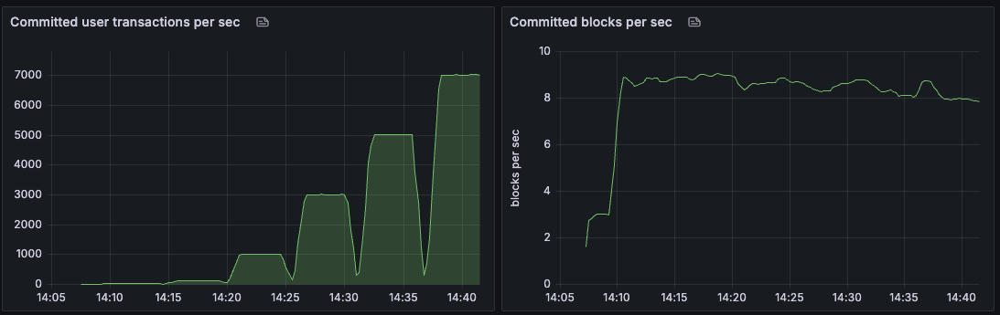

# AIP-131 - Single-Hop Block Time

<!-- (Please give a temporary file name to your AIP when first drafting it, such as `aip-x.md`. The AIP manager will assign a number to it after reviewing.) -->

<!-- (Please remove the questions in the "quote box". Provide complete context to the questions being asked in the content that you provide.) -->

## Summary

 <!-- > Summarize in 3-5 sentences.
 > Define the problem we're solving.
 > How does this document propose solving it.
 > What are the goals and what is in scope? Any metrics? -->

This AIP reduces the block time from two network hops to a single hop.
**Block time** refers to the time interval between two consecutive block proposals (or equivalently, block finalizations in consensus under common conditions).

By reducing the block time, this change is expected to:

- Increase the **block rate** (i.e., the number of blocks produced per second) up to 2x on a symmetrical network.
- Reduce **transaction end-to-end latency** by:
  - **Shorter queuing delays**, as blocks are proposed more frequently
  - **Faster execution**, since blocks are smaller and can be processed more efficiently

The core mechanism enabling this improvement is **Optimistic Proposal**. Under this approach, consensus leaders can propose new blocks without first gathering a quorum certificate (QC) for the parent block. Instead, they optimistically build upon the previous proposal without waiting for its QC, effectively reducing the block time by one network hop.

<!-- ### Out of scope -->

 <!-- > What are we committing to not doing and why are they scoped out? -->

<!-- ... -->

## High-level Overview

 <!-- > Define the straw man solution with enough details to make it clear why this is the preferred solution.
 > Please write a 2-3 paragraph high-level overview here and defer writing a more detailed description in [the specification section](#specification-and-implementation-details). -->

At a high level, this proposal enhances the consensus protocol by introducing **optimistic proposals**, which enable **single-hop block time** in the common case.
In the current Aptos consensus protocol, each leader must first collect a quorum of votes (also known as a **Quorum Certificate or QC**), for the previous round's proposal before making a new one. This requirement adds an additional network hop, delaying block proposals. We refer to such proposals that include the QC of their parent block as **regular proposals**.
With the proposed change, consensus leaders can **optimistically propose** a new block that extends the previous round's proposal **without waiting** to collect its parent QC. When validators receive an optimistic proposal, they will:

- Wait for the parent QC to become available,
- Convert the optimistic proposal into a regular proposal, and
- Process it using the existing consensus logic.

This approach preserves the core safety guarantees of the protocol, since the block ultimately processed still adheres to the existing safety rules.
To simplify implementation, each leader is still only allowed to propose **only one block per round**.
More details are provided in the [Specification and Implementation Details](#specification-and-implementation-details) section.


The figure above illustrates the behavior of optimistic proposals in contrast with the current protocol.
In this example, three validators—**V1**, **V2**, and **V3**—participate in the consensus:

- **Before the AIP**:

  - In round 1, V1 proposes _Block 1_.
  - In round 2, validators vote for _Block 1_.
  - In round 3, V2 collects the QC for _Block 1_ and proposes _Block 2_.
  - Thus, proposals occur every **two network hops**.

- **After the AIP**:
  - In round 1, V1 proposes _Block 1_.
  - In round 2, validators vote for _Block 1_.
  - Meanwhile, V2 can already **optimistically propose Block 2**, based on the reception of _Block 1_ (before the QC is formed).
  - In round 3, validators receive _Block 2_ and the QC for _Block 1_, allowing them to convert _Block 2_ into a **regular proposal** and process it normally.

## Impact

 <!-- > Which audiences are impacted by this change? What type of action does the audience need to take?
 > What might occur if we do not accept this proposal?
 > List out other AIPs this AIP is dependent on -->

This proposal introduces an internal change to the blockchain's consensus protocol. The primary impact is as follows:

#### 1. **Higher Block Rates**

Let:

- `T₁` = average latency for a single validator to send a message to a quorum of validators (by stake)
- `T₂` = average latency for a quorum to send messages to another quorum

In typical networks, **T₂ > T₁** due to network staggering and node variance.

- **Before this AIP**: One block is proposed every `T₁ + T₂` (a leader proposing round and an all-to-all voting round), resulting in a block rate of `≈ 1/(T₁ + T₂)`.

- **After this AIP**: Optimistic proposals allow new blocks every `T₂`, improving block rate to `≈ 1/T₂`

- **Improvement Factor** `= (T₁ + T₂)/T₂ = 1 + T₁/T₂`

#### 2. **Smaller Block Sizes at Constant TPS**

With a higher block frequency, and assuming a constant TPS:

- **Block sizes** (in bytes or gas) are naturally reduced
- **Transaction latency** (queuing + execution) decreases

As a result, the existing block constraints—such as **gas limits and size thresholds**—should be **re-examined and tuned** to match the faster block interval.

## Alternative Solutions

 <!-- > Explain why you submitted this proposal specifically over alternative solutions. Why is this the best possible outcome? -->

This solution is inspired by the **Moonshot consensus protocol**[^1], which introduces **optimistic block proposals**—allowing leaders to propose blocks without waiting for a parent QC.

However, Moonshot allows leaders to **re-propose a regular proposal** (including a QC or timeout certificate) _after_ an optimistic proposal. This re-proposal must contain the **same payload** as the original optimistic proposal to ensure safety.

For Aptos blockchain, this design significantly increases the **complexity of implementation and deployment**, as it **violates a key invariant** in the current Aptos consensus implementation:

> _Only one proposal and one vote per round is permitted._

In contrast, our simplified solution achieves the same performance improvement with significantly reduced engineering complexity, but with one tradeoff discussed below.

### Tradeoff

This simplification comes at the cost of slightly **weaker liveness guarantees**. Specifically:

- In **Moonshot**, a single honest leader during a synchronous period is sufficient to order a block.
- In our protocol, **two consecutive honest leaders** are required to do so.

We believe this tradeoff is reasonable, as consecutive honest leaders are **common in practice** particularly due to Aptos'
Leader Reputation mechanism that makes it more likely for honest leaders to be elected consecutively.
Furthermore, the reduction in implementation complexity **significantly outweighs** the liveness degradation in realistic network conditions.

[^1]: Isaac Doidge, Raghavendra Ramesh, Nibesh Shrestha, and Joshua Tobkin. 2024. Moonshot: Optimizing chain-based rotating leader BFT via optimistic proposals. In International Conference on Dependable Systems and Networks.

## Specification and Implementation Details

 <!-- > How will we solve the problem? Describe in detail precisely how this proposal should be implemented. Include proposed design principles that should be followed in implementing this feature. Make the proposal specific enough to allow others to build upon it and perhaps even derive competing implementations. -->

### Protocol Logic

Let `B(r)` denote a block of round `r`, and `QC(r)` denote the quorum certificate of `B(r)`.

#### Leader Behavior for Round `r`

If a validator is the leader in round `r`, upon receiving a proposal `B(r-1)`, it should:

- Check the following:
  - `B(r-1)` contains a valid `QC(r-2)`, where `B(r-1)` is either a regular proposal or an optimistic proposal converted to regular proposal
  - The validator voted for `B(r-1)`
- If conditions are satisfied:
  - **Propose an optimistic block** `B(r)`

#### Validator Behavior on Receiving a Proposal `B(r)`

- **If `B(r)` is a regular proposal** (i.e., includes `QC(r-1)` or `TC(r-1)`):

  - Vote if the **existing safety rules** are met

- **If `B(r)` is an optimistic proposal**:
  - Buffer it until the `QC(r-1)` becomes available
  - Once `QC(r-1)` is available:
    - Convert `B(r)` to a regular proposal with `QC(r-1)`
    - Vote if the **existing safety rules** are met

### Timeout Optimization

Under network asynchrony or faulty leaders, up to two consecutive optimistic proposals may timeout, leading to validators timing out two rounds and stall consensus for approximately `2 * (round_timeout + one_hop_latency) ≈ 2s`.
To prevent such scenario, we introduce an **early timeout optimization**. This keeps timeout latency roughly equivalent to the current behavior (`~1s`).

#### Early Timeout Rule

When in round `r+1`, if the following conditions are met:

- The **highest timeout certificate** seen has `round == r`
- The **highest optimistically voted proposal** is from `round == r+1`

Then:

- **Timeout round `r+1` immediately**, without waiting for the full round timeout

### Backpressure Optimization

Under consensus backpressure, the leader should not propose optimistic blocks. Since the proposal will be delayed under the backpressure (for gas priority under high load), having optimistic proposal will likely result in two rounds of timeout due to `ProposalNotReceived`.

### Correctness

We briefly argue the safety and liveness of the proposed solution.

#### Safety

The **safety** argument remains identical to that of the existing consensus protocol. This is because optimistic proposals are not processed directly; they are first converted into regular proposals by attaching the parent block’s Quorum Certificate (QC) before being subjected to the safety rule checks.

#### Liveness After GST

We now prove **liveness** after **Global Stabilization Time (GST)**. Specifically, we show that **two consecutive honest leaders** are sufficient to order a block.

Let `L(r+1)` and `L(r+2)` be honest leaders in consecutive rounds. We analyze the two cases:

##### Case 1: `L(r+1)` proposes a **regular block**

- The block will be ordered following the existing liveness proof.

##### Case 2: `L(r+1)` proposes an **optimistic block**

By protocol design, `B(r+1)` extends a parent `B(r)` that contains `QC(r-1)`.

Now consider two sub-cases based on what `L(r+2)` proposes:

- **Sub-case 2.1:** `L(r+2)` proposes a **regular block** `B(r+2)`

  - The block `B(r+2)` will be ordered following the existing liveness proof.

- **Sub-case 2.2:** `L(r+2)` proposes an **optimistic block** `B(r+2)`
  - According to the protocol, `B(r+1)` contains `QC(r)`, and `B(r-1)` is ordered by the 2-chain rule.

### Core Structures

The following core structures are introduced to support optimistic proposals:

```rust
/// An optimistic proposal message that contains the block data and sync information.
pub struct OptProposalMsg {
    block_data: OptBlockData,
    sync_info: SyncInfo,
}
```

```rust
/// Same as BlockData, without QC and with parent id
pub struct OptBlockData {
    pub epoch: u64,
    pub round: Round,
    pub timestamp_usecs: u64,
    pub parent: BlockInfo,
    pub block_body: OptBlockBody,
}
```

```rust
pub enum OptBlockBody {
    V0 {
        validator_txns: Vec<ValidatorTransaction>,
        // T of the block (e.g. one or more transaction(s)
        payload: Payload,
        // Author of the block that can be validated by the author's public key and the signature
        author: Author,
        // QC of the grandparent block
        grandparent_qc: QuorumCert,
    },
}
```

## Reference Implementation

 <!-- > This is an optional yet highly encouraged section where you may include an example of what you are seeking in this proposal. This can be in the form of code, diagrams, or even plain text. Ideally, we have a link to a living repository of code exemplifying the standard, or, for simpler cases, inline code.
 > What is the feature flag(s)? If there is no feature flag, how will this be enabled?
 -->

The reference implementation of this proposal is available at the following Pull Requests:

- https://github.com/aptos-labs/aptos-core/pull/16126
- https://github.com/aptos-labs/aptos-core/pull/16772

The change is gated by two local consensus configuration:

- `enable_optimistic_proposal_rx`: Enables optimistic proposal handling in the consensus protocol.
- `enable_optimistic_proposal_tx`: Enables optimistic proposal generation and sending in the consensus protocol.

## Testing

<!--
> - What is the testing plan? (other than load testing, all tests should be part of the implementation details and won’t need to be called out. Some examples include user stories, network health metrics, system metrics, E2E tests, unit tests, etc.)
> - When can we expect the results?
> - What are the test results and are they what we expected? If not, explain the gap.
-->

### Forge test

The implementation was evaluated on Forge, the internal testing environment, under various network conditions and workloads. The results showed a significant improvement in block production times and overall throughput, meeting our expectations.

#### Load vs. Performance Test


**Optimistic Proposal:** Committed block rate at different user throughputs.


**Baseline Performance:** Committed block rate at different user throughputs.

Our experiments show that Optimistic Proposals improve the block rate by up to 60% across various throughput levels.

<!--
## Risks and Drawbacks

 > - Express here the potential risks of taking on this proposal. What are the hazards? What can go wrong?
 > - Can this proposal impact backward compatibility?
 > - What is the mitigation plan for each risk or drawback?

## Security Considerations

 > - How can this AIP potentially impact the security of the network and its users? How is this impact mitigated?
 > - Are there specific parts of the code that could introduce a security issue if not implemented properly?
 > - Link tests (e.g. unit, end-to-end, property, fuzz) in the reference implementation that validate both expected and unexpected behavior of this proposal
 > - Include any security-relevant documentation related to this proposal (e.g. protocols or cryptography specifications)

...

## Future Potential

 > Think through the evolution of this proposal well into the future. How do you see this playing out? What would this proposal result in one year? In five years?

... -->

## Timeline

<!-- ### Suggested implementation timeline

 > Describe how long you expect the implementation effort to take, perhaps splitting it up into stages or milestones.

... -->

<!-- ### Suggested developer platform support timeline
 > **Optional:** Describe the plan to have SDK, API, CLI, Indexer support for this feature, if applicable.
... -->

### Suggested deployment timeline

 <!-- > **Optional:** Indicate a future release version as a *rough* estimate for when the community should expect to see this deployed on our three networks (e.g., release 1.7).
 > You are responsible for updating this AIP with a better estimate, if any, after the AIP passes the gatekeeper’s design review.
 >
 > - On devnet?
 > - On testnet?
 > - On mainnet?

... -->

<!-- ## Open Questions (Optional)

 > Q&A here, some of them can have answers some of those questions can be things we have not figured out, but we should

... -->

The deployment will be carried out in a slow rollout manner. The feature will be slowly rolled out devnet validators first one at a time, followed by testnet validators, and finally mainnet validators. The rollout will be paused at each stage to monitor the performance of the network and to ensure that the feature is working as expected.


