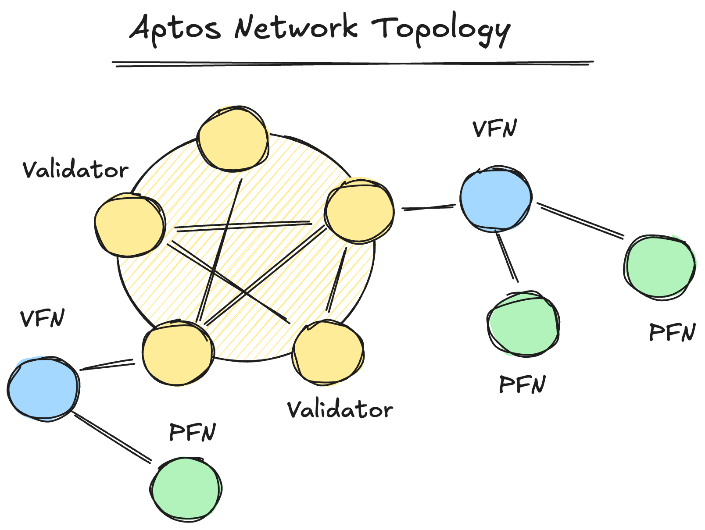
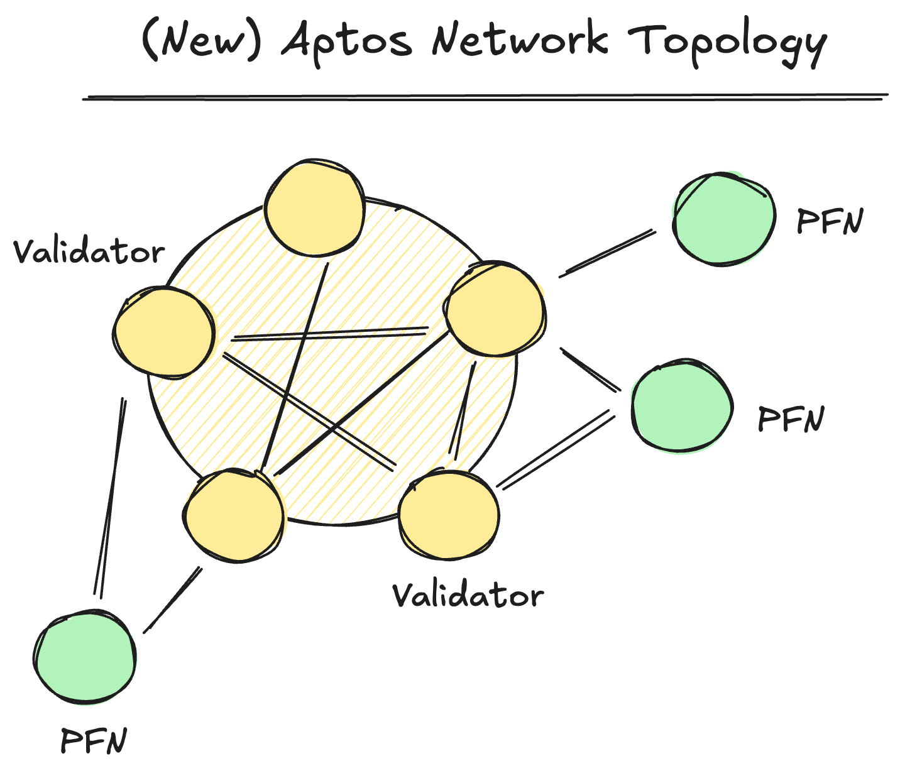

# AIP-139 Deprecating Validator Full Nodes (VFNs)

This AIP proposes removing validator fullnodes (VFNs) from the Aptos network and allowing public fullnodes (PFNs) to connect directly to validators. Although VFNs were originally introduced as a security mechanism to isolate validators from public traffic, they provide only few security benefits in practice. Moreover, they significantly increase operating costs, hinder network performance, and introduce software and deployment complexities. By deprecating VFNs and adopting alternate security safeguards, we can reduce costs and complexity, while maintaining network security and improving performance.

## Overview

The Aptos blockchain currently supports three types of nodes: (i) validator nodes; (ii) validator fullnodes (VFNs); and (iii) public fullnodes (PFNs). Validator nodes process transactions and extend the blockchain ledger through consensus. VFNs and PFNs replicate the state of the blockchain, allowing users and clients to access blockchain data (e.g., through the REST API). VFNs are operated exclusively by validator entities, while PFNs can be operated by anyone.

Historically, VFNs were introduced as a security and load-balancing mechanism to isolate validator nodes from the outside world. Validators only accept network connections from other validators, or a single VFN (run by the same entity); PFNs are unable to connect to validators. This reduces the validator attack surface.

While this design offers some security benefits, it has several downsides. For example: (i) it significantly increases validator operation and maintenance costs (~2x); (ii) it introduces notable software and production-engineering complexities; (iii) it reduces overall network performance, due to the additional hops between clients and validators; and (iv) it complicates the network topology, reducing runtime observability and monitoring.

Given these downsides, we propose that: (i) VFNs be deprecated and removed from the Aptos network; (ii) PFNs be allowed to connect directly to a subset of validators in the network (e.g., those with stake below a certain threshold, or those who explicitly opt-in); and (iii) separate application-level and deployment-level safeguards be used to protect validators from adversarial public traffic.

## Motivation

The existing Aptos network topology isolates validators from PFNs through VFNs, i.e., validators only accept network connections from other validators, or a single VFN. The diagram below shows the existing network topology.

This topology introduces significant downsides. For example:

1. **High Operating Costs**: VFNs require the same hardware resources as validators, effectively doubling the costs of running a validator.
2. **Deployment Complexity**: VFNs require operators to manage and maintain additional machines, configuration files, private keys, and deployment infrastructure. This increases operational complexity and overheads.
3. **Performance Overhead**: VFNs introduce an additional network hop between validators and clients, increasing end-to-end latencies for transaction submission, processing, and PFN synchronization.
4. **Reliability Challenges**: VFNs add another component to the critical path. If they are misconfigured, under-provisioned, unstable, or otherwise unhealthy, they impact downstream PFNs and transaction processing.
5. **Software Complexity**: Supporting VFNs requires additional networking logic, configuration paths, test permutations, and safeguards throughout the codebase. This increases the long-term software maintenance burden.

## Removing the VFNs

To address this, we propose removing VFNs from the Aptos network and allowing PFNs to connect directly to a subset of validators. The proposed network topology can be seen in the diagram below.

This topology provides several significant benefits. For example:

1. **Reduced Costs**: Eliminating the hardware and cloud infrastructure costs for VFNs will significantly reduce operating expenses for validator operators. This will make it easier for operators to run validators on lower margins.
2. **Reduced Complexity**: Validator operators will no longer need to manage, monitor and maintain VFNs. This simplifies the operational burden and overheads.
3. **Reduced Network Latency**: Removing the additional network hop between PFNs and validators will improve end-to-end client transaction latencies. As a result, latency-sensitive applications will benefit.
4. **Improved Reliability**: Removing VFNs eliminates an entire class of failure modes from the network. This simplifies the critical path and reduces potential points of failure.
5. **Improved Observability**: The simplified topology enables more efficient runtime observability, e.g., more accurate attribution of latency, errors, and performance characteristics.

## Security Considerations

Removing the VFNs introduces security trade-offs, as validators will be directly exposed to PFN traffic. To mitigate this, we propose that: (i) validators should reject PFN connections by default, and require explicit opt-in to support PFNs; and (ii) additional application-level and deployment-level safeguards can be introduced to protect validators from adversarial traffic.

### Validator Opt-In

Validators will reject PFN connections by default. This protects them from public traffic unless they opt-in and implement appropriate safeguards. In order to ensure sufficient network connectivity for PFNs, the Aptos Foundation will encourage delegation validators (e.g., those with low stake) to opt-in to support PFNs. This will allow PFNs to remain connected and performant, while still protecting other validators in the network.

One of the benefits of this approach is that if the total stake of validators that opt-in is kept below the consensus quorum threshold, then any potential security issues that arise from PFN traffic will not impact consensus safety or liveness. For example, if a subset of validators that support PFN connections are compromised, they will not be able to halt consensus or cause a network fork. This is an attractive property to maintain, as it balances the need for security with the desire to allow PFNs to establish high-quality network connectivity.

Note: All validators in Devnet and Testnet will accept PFN connections by default. It is only in Mainnet that validators will need to explicitly opt-in.

### Additional Safeguards

Application-level and deployment-level safeguards will also be introduced to protect validators from adversarial public traffic. For example: (i) application-level rate limiting, connection management, and request prioritization will be added to the Aptos validator software to ensure that validators can handle PFN traffic effectively, without impacting consensus performance; and (ii) further recommendations will be provided to validator operators to deploy firewalls, load balancers, traffic filers, external rate limiters, and other DDoS protection mechanisms.

## Risks and Drawbacks

Aside from the security considerations above, there are several additional risks and drawbacks to consider when removing the VFNs. These include:

1. **Increased Resource Usage**: VFNs currently service traffic from PFNs (e.g., state sync requests, and mempool transactions). Without VFNs, validators that support PFN connections will need to handle these operations, potentially increasing resource usage under load.
   - **Mitigation**: To mitigate this, validators should ensure sufficient hardware provisioning (i.e., meet the minimum recommended hardware specifications). Moreover, application-based rate limiting, connection management, and request prioritization will further ensure that validators can handle the additional load without impacting consensus performance.
2. **Reduced Fault Isolation**: VFNs currently act as an intermediary for traffic spikes, peer churn, and networking irregularities before they reach the validator. Removing VFNs may cause these events to impact the validators in the network.
   - **Mitigation**: Traffic and request separation (e.g., dedicated networking interfaces, process-level resource limits, and strict prioritization of consensus-critical tasks) can protect against these types of events.
3. **Migration and Rollout Complexity**: Transitioning away from VFNs requires backward-compatible changes across software, tooling, configurations, documentation, and test infrastructure. This introduces additional complexity and risk to the network.
   - **Mitigation**: A phased rollout with extensive testing at each stage will minimize these risks. Once the rollout is complete, VFN-related tech debt can be removed, resulting in a cleaner and simpler codebase in the long term.

## Backward Compatibility and Rollout Plan

To safely remove VFNs from the Aptos network, and minimize any disruptions, the rollout must be backward compatible. This means that the network must support both the legacy and new PFN connection models simultaneously for some time, i.e., validators must accept connections from both VFNs and PFNs during the transition period, and VFNs must continue to operate until all PFNs have migrated to the new topology.

Supporting both connection models ensures that: (i) legacy PFNs can continue operating, even if they are still configured to connect via VFNs; (ii) new PFNs can connect directly to validators; (iii) if any issues arise during the rollout, PFN operators can rollback to connecting via VFNs until the issues are resolved; and (iv) validator operators can migrate at their own pace, without being forced to take VFNs offline immediately.

### Phased Deployment

To ensure a safe and smooth transition, the rollout will proceed in phases, through multiple environments:

1. **Devnet**:
   - **Initial Deployment**: The first deployment to Devnet will be in the form of a rolling upgrade, where validators will be updated to accept PFN connections while keeping VFNs online. New PFNs will then be deployed to ensure they can connect directly to validators, while existing PFN connections via VFNs will continue to operate.
   - **Compatible Deployments**: Once the first deployment is complete, subsequent Devnet deployments will automatically enable PFN connections for all validators, while keeping VFNs online for legacy nodes. This allows for testing of the new topology while maintaining backward compatibility.
   - **Future Deployments**: After a sufficient testing period, VFNs will be shut down in Devnet, and all PFNs will be required to connect directly to validators. This allows for final validation before rolling forward to Testnet. 

2. **Testnet**: 
   - **Validators and VFNs**: The Testnet rollout will follow a similar approach to Devnet. Initially, Aptos Labs nodes will be updated to enable validator-PFN connections while keeping VFNs online. Partner validators will then be upgraded to enable validator-PFN connections, while also continuing to keep VFNs online.
   - **VFN Shutdown**: Next, all PFNs will be monitored as they upgrade and establish direct connections with validators. Once a sufficient number of PFNs have migrated, VFNs will be gradually shut down. A temporary monitoring period will follow to ensure no regressions occur before rolling forward to Mainnet.

3. **Mainnet**:
    - **Validators and VFNs**: The Mainnet rollout will follow a similar approach to Testnet, but with the additional safeguard of only allowing a subset of validators (e.g., those with low stake) to accept PFN connections. To achieve this, validators will explicitly opt-in to accept PFN connections when they upgrade, while also continuing to operate VFNs during the transition period.
    - **VFN Shutdown**: Once a sufficient number of PFNs have migrated, and the new topology has been validated, VFNs will be shut down for the validators that have opted in. The remaining validators will continue to operate VFNs. After a temporary monitoring period, the remaining VFNs will then be fully removed from the network, and all PFNs will connect directly to validators. At this point, the rollout will be complete.
