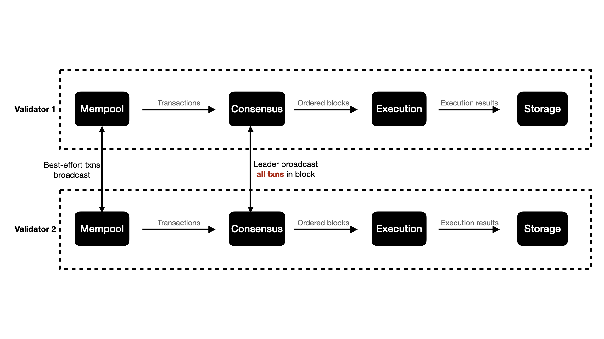
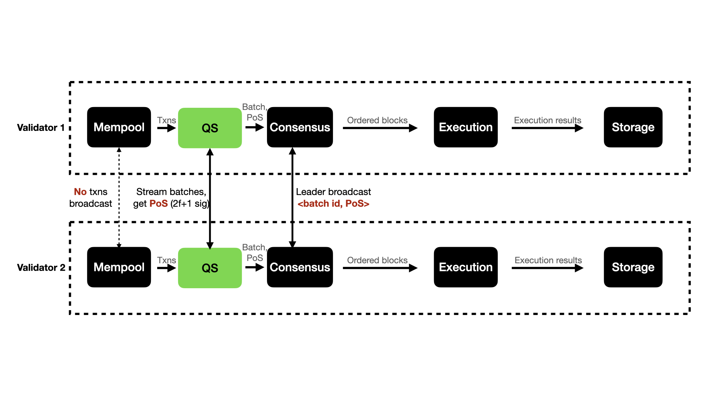

# AIP-26 - Quorum Store
  
## Summary

Quorum Store is a production-optimized implementation of Narwhal [1], that improves consensus throughput. Quorum Store was tested in previewnet, a mainnet-like 100+ node network, where it increased TPS by 3x. It will remove consensus as the primary bottleneck for throughput in mainnet. It has a wide surface area that changes details of how validators disseminate, order, and execute transactions.

## Motivation

Quorum Store improves consensus TPS in mainnet and mainnet-like networks which are geographically decentralized. Leader-based consensus TPS is restricted by the time it takes the single proposer in a round to send data and receive votes from a quorum; decentralized networks require votes that take 100+ms round trip times. Quorum store works well in this environment by disseminating the data concurrently.

## Rationale

Quorum Store is based on Narwhal, a peer-reviewed and award-winning approach to achieving better throughput in leader-based BFT consensus. Our tests show significant throughput improvements: in previewnet, a mainnet-like 100+ node network showed a 3x improvement in throughput, while pure consensus benchmarks showed a 12x improvement in a 3-region simulated setup.

Quorum Store does not require fundamental changes to the well studied and battle tested existing Aptos components — e.g., BFT consensus (aka Jolteon [2]), mempool, and pipelined execution. So we expect its deployment and operation to be relatively straightforward, despite the risks highlighted below in “Risks and Drawbacks”.

## Specification

### Existing Blockchain Architecture

We first illustrate the existing architecture of Aptos validators in mainnet, from transaction dissemination to commit, in the figure below. The architecture consists of a pipeline of components. We will focus on the consensus components (mempool + consensus).

- **Mempool** phase receives transactions from fullnodes and **broadcasts all transactions with best-effort** to synchronize with other validators. Mempool provides an API for consensus to pull transactions from the mempool.
- **Consensus** (AptosBFT / [Jolteon](https://arxiv.org/abs/2106.10362), a latency-optimized version of Hotstuff) phase proceeds in rounds, and in each round r elects **one leader to propose a block of transactions to all nodes**. And all nodes vote for the block, send the votes to the leader of the next round, and the next leader proposes after receiving enough votes, and so on.
  More specifically, non-leader nodes vote for the proposed block by signing the block metadata, and send their votes to the next leader of round r+1. The next leader gathers 2f+1 vote/signatures to form the quorum certificate (QC) of the round-r block, and propose the new round-(r+1) block with the QC to all nodes. All nodes vote and send to the next leader and so on. Validators can commit a block when a certain block satisfies the commit rule, which says the first block of two certified blocks (blocks with QCs) with consecutive round numbers can be committed.
- **Execution** phase executes the ordered blocks deterministically via BlockSTM and outputs the execution results. Validators sign their execution results and exchange, and consider one execution result valid once it is signed by 2f+1 validators.
- **Storage** phase finally persists the valid execution result with the corresponding proofs.

### Bottlenecks in Existing Architecture

- **Bottlenecks in leader broadcasting.** Leaders in Jolteon broadcast all transactions to all nodes, while non-leaders only send small messages such as votes. Effectively the throughput of the system is upper bounded by the bandwidth of the leader, in the meantime, the bandwidth of all other nodes is wasted. Moreover, the latency of the consensus is relatively high due to the leader broadcast bottleneck.
- **Duplication in transaction dissemination.** During the best-effort broadcast in the mempool, a transaction is sent to all nodes. The transaction is again broadcasted to all nodes during the Jolteon protocol since the leader broadcasts its proposed block. Such duplication in the raw transaction dissemination underutilizes the system’s bandwidth.

### Architecture with Quorum Store

Quorum Store (QS) resolves the bottlenecks mentioned above, by (1) separating data dissemination from ordering, (2) making the transaction batch broadcast provable, and (3) consensus lightweight.

Below, we explain more details about the architecture with Quorum Store.

- The broadcast in the mempool layer is removed since the QS will do it in a provable way.
- The QS layer is added between the existing (local) mempool and consensus, which constantly pulls the transactions from the mempool, forms a batch, and streams the batch to all other nodes. When a node receives a complete batch from the other node, it signs the batch metadata and returns the signature to the batch creator. When the batch creator receives 2f+1 signatures on the batch id, it forms the Proof-of-Store (PoS). **The existence of PoS for a batch id guarantees the uniqueness and availability of the corresponding batch** ([why?](https://decentralizedthoughts.github.io/2022-09-10-provable-broadcast/)). Note that, all nodes are broadcasting transaction batches and getting batches certified by PoS, concurrently. Therefore, **the bandwidth utilization of the system can be maximized**, in comparison to the current architecture where the leader hits its bandwidth limit while other nodes perform little networking work.
- The consensus layer remains the same, but **the leader now pulls certified batches from the QS layer, and includes only the batch metadata (batch id, etc) with the corresponding PoS in the proposed blocks (instead of the raw transactions)**. Consensus will agree on the block order, thus also the transaction ordering since each certified batch in the block uniquely corresponds to a list of ordered transactions.
- In the common case, all validators should have the transactions of all batches, but If a validator does not have a batch (this is possible due to network delay) at the time of ordering, it will pre-fetch the batch from other nodes (based on the signatures in the corresponding  PoS).

## Reference Implementation

An implementation is code complete in main. It is gated by an onchain config, so it will not be live until a governance proposal is executed on the network. Some of the key PRs are:

- [https://github.com/aptos-labs/aptos-core/pull/5464](https://github.com/aptos-labs/aptos-core/pull/5464)
- [https://github.com/aptos-labs/aptos-core/pull/5400](https://github.com/aptos-labs/aptos-core/pull/5400)
- [https://github.com/aptos-labs/aptos-core/pull/5779](https://github.com/aptos-labs/aptos-core/pull/5779)
- [https://github.com/aptos-labs/aptos-core/pull/5613](https://github.com/aptos-labs/aptos-core/pull/5613)
- [https://github.com/aptos-labs/aptos-core/pull/6055](https://github.com/aptos-labs/aptos-core/pull/6055)
- [https://github.com/aptos-labs/aptos-core/pull/6710](https://github.com/aptos-labs/aptos-core/pull/6710)
- [https://github.com/aptos-labs/aptos-core/pull/6785](https://github.com/aptos-labs/aptos-core/pull/6785)
- [https://github.com/aptos-labs/aptos-core/pull/7045](https://github.com/aptos-labs/aptos-core/pull/7045)
- [https://github.com/aptos-labs/aptos-core/pull/7114](https://github.com/aptos-labs/aptos-core/pull/7114)
- [https://github.com/aptos-labs/aptos-core/pull/7194](https://github.com/aptos-labs/aptos-core/pull/7194)
- [https://github.com/aptos-labs/aptos-core/pull/7190](https://github.com/aptos-labs/aptos-core/pull/7190)
- [https://github.com/aptos-labs/aptos-core/pull/7639](https://github.com/aptos-labs/aptos-core/pull/7639)
- [https://github.com/aptos-labs/aptos-core/pull/7315](https://github.com/aptos-labs/aptos-core/pull/7315)

## Risks and Drawbacks

- **Risk 1: Changes in system behavior.** Although Quorum Store does not fundamentally change the existing mempool, consensus and execution components, there are many subtle interactions that can change behavior. For example, we invested time to tune configs to allow fee markets to function efficiently.
- **Risk 2: Code surface.** This requires rigorous testing, which we have done via unit tests, smoke tests, forge tests, and through stress testing in previewnet. Before the onchain config is enabled in mainnet, it will also be enabled in devnet and testnet.
- **Risk 3: Validator incentives.** Quorum Store requires significant work from validators, which is separate from proposing blocks. In order to properly incentivize this work, we plan to distribute a sizable fraction of transaction fees for work done on Quorum Store. We do not believe this is currently a blocker for enabling Quorum Store. More details on the planned validator incentives will be added in a future AIP.
- **Drawback 1: Latency at low loads.** Quorum Store introduces an additional round trip when compared to mempool broadcast; this is an increase of ~250 ms in the best case latency, e.g., at low loads. Note for high loads, the increase in throughput provided by Quorum Store reduces latency due to queuing times significantly.

## Future Potential

Quorum Store is the start of the next-generation of consensus improvements.

- Quorum Store can be enhanced to support intra-validator horizontal scaling, by adding dedicated Quorum Store nodes as part of a logical validator. This was explored in Narwhal.
- Quorum Store is a stepping stone to DAG-based consensus (as explored in Tusk [1] and Bullshark [3]) and general DAG-based agreement.

## Suggested implementation timeline

- Milestone 1 (completed): Code complete with unit and e2e tests
- Milestone 2 (completed): Previewnet performance verification and iterations
- Milestone 3 (ongoing): Internal security audit

## Suggested deployment timeline

- Milestone 1 (planned): Cut into release v1.4
- Milestone 2 (planned): Onchain config change in devnet
- Milestone 3 (planned): Onchain config change in testnet
- Milestone 4 (planned): Onchain config change in mainnet via governance proposal

## References

[1] Narwhal and Tusk: A DAG-based Mempool and Efficient BFT Consensus [https://arxiv.org/abs/2105.11827](https://arxiv.org/abs/2105.11827)

[2] Jolteon and Ditto: Network-Adaptive Efficient Consensus with Asynchronous Fallback [https://arxiv.org/abs/2106.10362](https://arxiv.org/abs/2106.10362)

[3] Bullshark: DAG BFT Protocols Made Practical [https://arxiv.org/abs/2201.05677](https://arxiv.org/abs/2201.05677)
