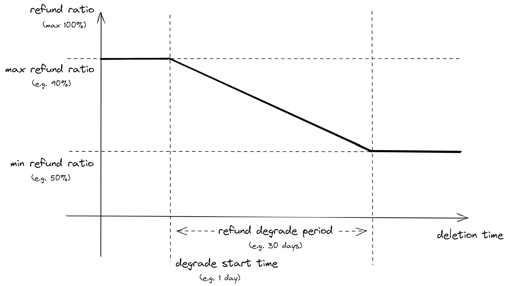

# AIP 32 - Storage Deposit and Refund

# Summary

Proposed is to refund part of storage fee (introduce in [API-17](https://github.com/aptos-foundation/AIPs/blob/main/aips/aip-17.md)) paid for storage slot allocation to the original payer when a slot is freed by deletion.

# Motivation

To reflect that freed storage slots no longer impose costs to the blockchain.

Now that [AIP-17](https://github.com/aptos-foundation/AIPs/blob/main/aips/aip-17.md) has been implemented and deployed, storage allocation is charged on a per slot basis and according to native currency based pricing without being affected by the gas price. On top of that, we propose to track the original payer of storage slots, so that we will be able to refund on slot deallocation. This makes the storage fee charged for slot allocation become "storage deposit".

Storage refund incentivizes cleaning up unused storage slots. The ratio of refund can be high or even 100% when the deletion happens soon after the creation and degrades over time to a certain ratio, further incentivizing timely cleaning up.

## Alternative - Ephemeral Slots

We can provide interfaces for a Move contract to allow a storage slot to go away automatically in the short future, in exchange for lowering fees. A slot can be allocated for cheap if it's "promised" to be deleted (user can delete it explicitly before set TTL for a bit additional refund, or the system will reclaim it after it expires).

Because the allowed life span can't be too short due to practicality and cost associated, it's fairly possible for one to fill up the storage for cheap if the upfront charge is too low, defeating the purpose. At the same time items that goes away automatically and permanently can result in user confusion and fraud.

None the less this can be a user experience improvement but is a more intrusive semantic change for a developer and a user. Could be something to consider in the future.

## Alternative - Rent

All or most storage slots except small whitelist of state item types, are forced to have a TTL since last access. Expiring (TTL reached) causes the slot to be "mark deleted" to free most of the on-chain cost, but the user is given the ability to resurrect the slot for a cost. The allocation will be charged for its permanent existence, which one can argue is always undercharged - because the charge is finite while the time span it can exist is infinite. Counterarguments against Rent/TTL:

1. Storage gets cheaper over time. If charged properly on creation, the cost a permanent slot imposes, although permanently, might not matter in the long run.
2. The idea of a storage slot can go away by itself forcibly without a user declared TTL is frustrating.
3. In the world of smart contract, especially one that only has a very loose account-based model like ours, the rent interface can be very intrusive on the ecosystem level - a small piece of data expiring can cost the liveness a whole bunch of contracts.
4. "Resurrect-able" is the bottom line I can imagine we must provide - things won't go away "permanently", people can at least get it back by paying. However, not only implementing resurrection and the auxiliary system that serves the expired data (with proof) implies much resource cost, but it also means permanent on-chain data that can't be cleaned up (tombstones).

# Specification

## Language and framework

No visible change to how one writes Move. But the economics changes:

## Economics

- Storage fee charged for slot allocation is now "storage deposit" and added to a global aggregator tracking the total storage deposit balance (much like how we track the global total supply).
- The transaction sender's address, the current on-chain timestamp and the deposit paid for slot allocation (not that paid for excess bytes, see below) will be tracked as metadata attached to the slot.
- For a deleted slot, a refund is deducted from said global aggregator and deposit to the original creator's account. The refund is calculated based on the original amount charged for the slot allocation, not including the excess bytes penalty, with a degrading refund ratio according to the original creation timestamp.
- The global storage deposit, if not redistributed, will be always non-negative because a refund is never greater than the deposit. This adds a deflationary force to the economy and should be revisited when necessary in the future.

## Configuration

The following parameters will be added to the gas schedule (although this is not technically gas, this is to avoid yet another configuration that needs to be loaded separately):

- `max_storage_slot_refund_ratio` (base points) Proportion of the refund given if a transaction in the same block deletes a slot created previously in the block. `10000` means 100%.
- `min_storage_slot_refund_ratio` (base points) Proportion of the refund given if a slot to be deleted has lived longer than the following parameter, according to on-chain timestamp. `10000` means 100%.
- `storage_refund_degrade_start` (microseconds) If a slot is deleted when younger than this, the maximum ratio is used for refund.
- `storage_refund_degrade_period` (microseconds) Refund degrading period. Within the period the refund degrades linearly from the max ratio to the min ratio defined above;  after the period the min refund ratio is used.

# Reference Implementation

https://github.com/aptos-labs/aptos-core/pull/6514

# Risks and Drawbacks

- Cost from refunding to multiple accounts: a transaction releasing a lot of slots can potentially involve a lot of storage writes; this is protected by ensuring those writes are charged according to the normal gas schedule and write set size limits.

# Future Potential

## Billing accounts

Extra semantics can be implemented so that a party other than the transaction sender can pay for selective storage allocations involved in the transaction. This allows the contract developer to pay for shared storage slots. Because deletions are refunded, maintaining a small active set of shared slots, despite allocations and deallocations happen frequently, imposes minimal cost but smoothens user experience. It also enables various economic activities like subsidizing the cost between different contracts.

This is worth a separate AIP as a follow up.

# Suggested Implementation Timeline

June to the testnet.
