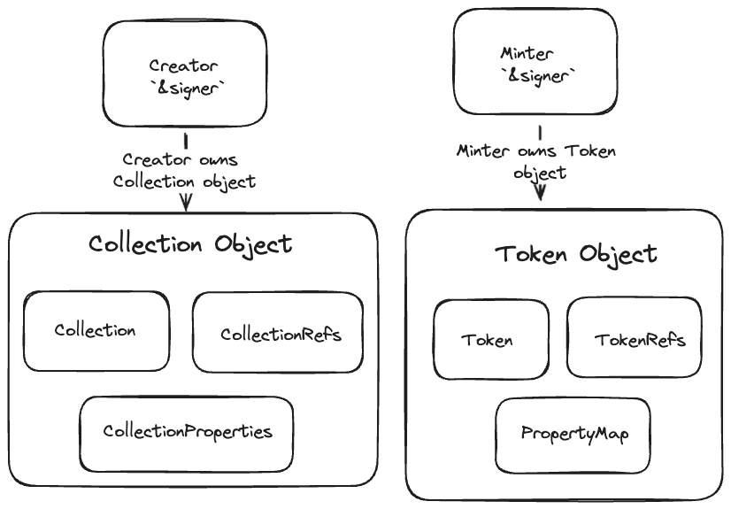

# AIP-72 - Minting Standard for Digital Assets

## Summary

This AIP focuses on introducing a non-framework standard for creating collections and tokens. Currently there is a simplistic, non-extensible no-code token solution `aptos_token`. This provides the basic use case of creating tokens and collections, but no customizations of how this is done, such as whitelists, coin payments with dynamic types. Several highlights of this AIP are:

1. Use objects to create collections and manage mints.
2. Generic standard which makes it amenable easily being indexed.
3. Take a modular approach where each module, including the mint functions, are completely standalone and can be used in conjunction with each other in the custom module.

## Motivation

We aim to provide a non-framework standard to show the “right” way of doing complicated things. Here are some examples:

- Correctly and successfully manage a whitelist with minimal operational overhead.
- A framework for managing refs that focus more on developer or user intent as opposed to the refs capabilities.
    - An example scenario where things can go wrong is when `Refs` are not configured or stored correctly for collections/tokens. Not configuring this correctly can lead to loss of control over the collections and tokens. We want to provide industry standard code where developers can use, whilst not having the developer worrying about configuring things the correct way.
- As a standard, indexing needs to be built once and can easily be reused across extensions of this library.
- Increase code reusability.
  - **[Example](https://github.com/aptos-labs/token-minter/blob/main/launchpad/sources/launchpad.move#L126)** where we built a custom mint under 50 lines of code! (same thing would’ve taken at least 300+ lines)

## Specifications

An NFT minter creates the core minting contract that consists of a selection of modules from the NFT minting standard library. This methodology allows the minter to writer to develop a single file minting package that contains on order of 100 lines of code or less due to the ability to reuse the expansive minting module libraries. These modules include `token_components`, `collection_components`, `coin_payment`, `collection_properties`.

This standard will not be part of framework so that we could iterate fast and be more agile with extending it. To remove security risks, we decided to make the modules **non upgradable** and will deploy these using resource accounts and remove access to the signer capability. (**there are no private keys we can access**).

Furthermore the contracts will be deployed immutably, meaning they cannot be upgraded once deployed. The reason for this is to remove all risks associated with upgradeable contracts, such as legal, key management. The modular approach we choose to take means that we can continuously publish new modules or upgrades to existing ones but maintain all versions on chain with different module names and in different packages. The benefit of choosing which modules to use is this gives developers full control over how the overall application will be designed.

### Core Logic



### Collections

When creating collections, the signer passed into the module's create collection function becomes the owner. **The developer determines this owner.** The creator directly owns the collection object, giving developers the flexibility to create a custom object or an account to handle the minting of tokens and the ownership and management of the collection.

1. `CollectionComponents` module is responsible for creating the collection refs and properties. The developer will have a configuration to pass in, from which the refs will be generated based off of. This consists of being allowed to transfer tokens, burn tokens, changing collection and token description.
2. This module will contain all entry functions to mutate the collection, as long as the refs were stored from the collection property configuration.
3. `InitCollectionProperties` event is emitted once the collection has been created. We index events such as this and more, creating incentive for developers to use our standard as they benefit from indexed events.

```move
#[resource_group_member(group = aptos_framework::object::ObjectGroup)]
struct CollectionRefs has key {
    /// Used to mutate collection fields
    mutator_ref: Option<collection::MutatorRef>,
    /// Used to mutate royalties
    royalty_mutator_ref: Option<royalty::MutatorRef>,
    /// Used to generate signer, needed for extending object if needed in the future.
    extend_ref: Option<object::ExtendRef>,
}

struct CollectionProperty has copy, drop, store {
    value: bool,
    initialized: bool,
}

#[event]
/// Event emitted when CollectionProperties are created.
struct InitCollectionProperties has drop, store {
    mutable_description: CollectionProperty,
    mutable_uri: CollectionProperty,
    mutable_token_description: CollectionProperty,
    mutable_token_name: CollectionProperty,
    mutable_token_properties: CollectionProperty,
    mutable_token_uri: CollectionProperty,
    mutable_royalty: CollectionProperty,
    tokens_burnable_by_collection_owner: CollectionProperty,
    tokens_transferable_by_collection_owner: CollectionProperty,
}

#[resource_group_member(group = aptos_framework::object::ObjectGroup)]
struct CollectionProperties has copy, drop, key {
    /// Determines if the collection owner can mutate the collection_properties's description
    mutable_description: CollectionProperty,
    /// Determines if the collection owner can mutate the collection_properties's uri
    mutable_uri: CollectionProperty,
    /// Determines if the collection owner can mutate token descriptions
    mutable_token_description: CollectionProperty,
    /// Determines if the collection owner can mutate token names
    mutable_token_name: CollectionProperty,
    /// Determines if the collection owner can mutate token properties
    mutable_token_properties: CollectionProperty,
    /// Determines if the collection owner can mutate token uris
    mutable_token_uri: CollectionProperty,
    /// Determines if the collection owner can change royalties
    mutable_royalty: CollectionProperty,
    /// Determines if the collection owner can burn tokens
    tokens_burnable_by_collection_owner: CollectionProperty,
    /// Determines if the collection owner can transfer tokens
    tokens_transferable_by_collection_owner: CollectionProperty,
}

/// Creates `CollectionRefs` and `CollectionProperties` resource in a single collection object.
/// Emits `InitCollectionProperties`.
public fun create_refs_and_properties(constructor_ref: &ConstructorRef): Object<CollectionRefs> {}
```

### Tokens

The token module will provide functions to update/mutate the token’s property map. `property_map.move` will be updated with a function to initialize the property map for a token with the `ExtendRef` in a separate AIP.
Currently there is no function to support this, only at construction time of a token with a `ConstructorRef`.

1. `TokenComponents` module is responsible for creating the token refs associated with the collection properties originally configured for the collection.
2. This module will contain functions to mutate the token, as long as the refs were stored from the collection property configuration.

```move
#[resource_group_member(group = aptos_framework::object::ObjectGroup)]
struct TokenRefs has key {
    /// Used to generate signer for the token. Can be used for extending the
    /// token or transferring out objects from the token
    extend_ref: Option<object::ExtendRef>,
    /// Used to burn.
    burn_ref: Option<token::BurnRef>,
    /// Used to control freeze.
    transfer_ref: Option<object::TransferRef>,
    /// Used to mutate fields
    mutator_ref: Option<token::MutatorRef>,
    /// Used to mutate properties
    property_mutator_ref: Option<property_map::MutatorRef>,
}

public fun create_refs(constructor_ref: &ConstructorRef): Object<TokenRefs> {}
```

### Additional Feature Extensions

i.e. CoinPayment is a module which is used for creating objects which act as fees. For example, this can be used for creating minting fees, launchpad fees.

1. This is used to create `CoinPayment<T>` resources which `T` represents the coin type to use payment for. This is a module which users can choose to use or not. The goal of this is to simplify fee generation
2. `CoinPaymentEvent` is emitted once the payment has been executed and index these events. This is particularly useful as it emits all the fees associated with each transaction, which the developers can use for auditing purposes.

```move
struct CoinPayment<phantom T> has copy, drop, store {
    /// The amount of coin to be paid.
    amount: u64,
    /// The address to which the coin is to be paid to.
    destination: address,
    /// The category of this payment, e.g. mint fee, launchpad fee
    category: String,
}

#[event]
/// Event emitted when a coin payment of type `T` is made.
struct CoinPaymentEvent<phantom T> has drop, store {
    from: address,
    amount: u64,
    destination: address,
    category: String,
}

public fun create<T>(amount: u64, destination: address, category: String): CoinPayment<T> {
    assert!(amount > 0, error::invalid_argument(EINVALID_AMOUNT));
    CoinPayment<T> { amount, destination, category }
}

public fun execute<T>(minter: &signer, coin_payment: &CoinPayment<T>) {
    let amount = amount(coin_payment);
    let from = signer::address_of(minter);
    assert!(
        coin::balance<T>(from) >= amount,
        error::invalid_state(EINSUFFICIENT_BALANCE),
    );

    let destination = destination(coin_payment);
    coin::transfer<T>(minter, destination, amount);

    event::emit(CoinPaymentEvent<T> {
        from,
        amount,
        destination,
        category: category(coin_payment),
    });
}
```

## Risks and Drawbacks

We plan to deploy these contracts as immutable with resource accounts. The signer capability will not be stored, implying that no keys will be associated with the deployed contract. As a result, modules deployed at different times can be done independently and can be deployed at separate addresses. When new modules are created, they will be deployed to a unique resource account on each deployment.

If there are bugs in our modules and projects are using them, they will be susceptible to this. The modules are not upgradeable, and we would need to create a new module with the bug fixes, then deploy to a new address. This does not need to go through governance proposal, therefore the fix can be in mainnet much faster.

### Reference Implementation

**[Launchpad Example](https://github.com/aptos-labs/token-minter/blob/main/launchpad/sources/launchpad.move)**

### Future Outlook

In the process of building this standard, we realized there were other considerations to be made, such as defining a Semi Fungible Token (**SFT**) standard, as there is no current standard in Aptos as of yet. Currently, Aptos example SFT is a token which belongs to a collection, but it also has features of a fungible store where it can be fractionalized into assets and be transferred as fungible assets. Conceptually speaking, it’s a fungible asset with additional on-chain metadata.
