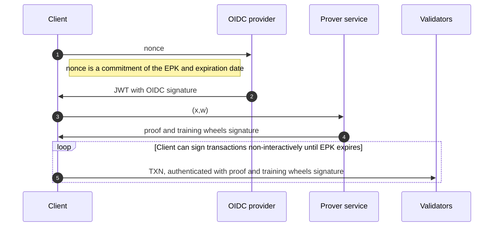

# AIP-75 - Prover service for keyless accounts

## Summary

This AIP is an extension of [AIP-61: Keyless Accounts](https://github.com/aptos-foundation/AIPs/blob/main/aips/aip-61.md), which allow users to have an Aptos account that is tied to an OpenID account, and to sign transactions for the blockchain via their OIDC provider, instead of via a secret key. As summarized in AIP-61, _“your blockchain account = your OIDC account”_. 

However, OpenID Connect authenticates users based on personally-identifying information (e.g., an email address or a Twitter handle). In this sense, are two privacy goals:

- The OpenID provider must **not** learn which account addresses are linked to which OpenID users.
- The validators (and other outside observers) also must **not** learn the link between account addresses and OpenID users.

To achieve privacy, a **zero-knowledge proof (ZKP)** is given by users to validators to authenticate transactions. Generating such a proof must be done each time a user logs in, and then each time the user's ephemeral public key expires[^spec], and is computationally intensive. 
To allow for users to log in quickly and on low-powered hardware, the proof computation must be offloaded to a **prover service**.

This AIP's focus will be the motivation, design and risks around this prover service.

### Goals

The goals of the prover are as follows:

1. Enable keyless users to log in quickly and without friction.
2. Preserve privacy of users with respect to the OIDC provider and the blockchain.
3. Implement a **training wheels** mode which protects against bugs in the zero-knowledge system.

### Out of Scope

Initially, there will **not** be any privacy for the user with respect to the prover service itself.
The privacy guarantees will only be with respect to the OIDC provider and the blockchain. 

That is, the prover service will **temporarily** learn the user's private information, while computing the ZKP, including:

* The user's OIDC handle. For example, if logging in with Google, the prover service will learn the user's email.
* The user's privacy-preserving pepper[^spec].

The fact that the prover service learns this information creates some privacy and centralization risks, which are discussed [below](#risks-and-drawbacks).


## Motivation

The prover service will allow for the most computationally intensive step during login to be offloaded to a powerful cloud VM instead of being done locally. 
This drastically reduces the time between when a user logs in with their keyless account to when that user is able to transact, from ~25 seconds to 3 seconds. 
In turn, this greatly improves the user experience of keyless accounts.

## Impact

The direct impact of this AIP will be on users of keyless accounts. 
The impact will be threefold:
1. Users will have a much faster login experience than they would if proofs were generated client-side.
   + From preliminary benchmarks, generating proofs in-browser takes such a long time that is completely unusable. (i.e., > 25 seconds to generate the proof.)
   + In contrast, the time to generate the proof server-side is less than 3 seconds.
3. As long as the **training wheels** are activated, if a bug is found in the ZKP toolchain (e.g., in `circom`[^circom]), users' funds are safe.
4. Users's private information will be sent to the prover service. This induces a trust assumption: users must trust that the prover service will not leak this information. This is addressed in ["Risks and Drawbacks"](#risks-and-drawbacks).

## Alternative solutions

The most obvious alternative is requiring the user to generate a proof client-side. As discussed above, this solution is untenable, at least with the current Groth16-based ZKP system described in AIP-61[^spec].

## Specification

As explained in AIP-61[^spec], to authenticate a transaction, a user needs a Groth16 ZKP for the relation $\mathcal{R}$, which encodes the logic of linking an **ephemeral public key (EPK)** to a keyless account, via a signed JWT with a nonce that encodes this EPK and an expiration date. Specifically, $\mathcal{R}$ has the following inputs:

```math
\mathcal{R}\begin{pmatrix}
	\textbf{x} = [
        (\mathsf{iss\_val}, \mathsf{jwk}, \mathsf{header}), 
        (\mathsf{epk}, \mathsf{exp\_date}), 
        \mathsf{addr\_idc}, \mathsf{exp\_horizon}
    ],\\ 
    \textbf{w} = [
        (\mathsf{aud\_val}, \mathsf{uid\_key}, \mathsf{uid\_val}, r),
        (\sigma_\mathsf{oidc}, \mathsf{jwt}), 
    \rho]
\end{pmatrix},
```
and has verification logic as defined in[^spec]. 

### Protecting Against ZKP Bugs

Recall that one of the goals of the prover service is to provide preliminary protection against bugs in the ZKP toolchain. This is done by enabling a so-called **training wheels** mode for the first few months of the deployment. In this mode, the prover will have a **training wheels signing key**, and the validators will have knowledge of the corresponding **training wheels public key**. Validators will then refuse to accept any keyless transaction unless the proof and statement have been signed under this PK.

### Prover Behavior and Authentication Flow

At a high level, the prover will have the following behavior. As configuration, it will take in a Groth16 prover key which encodes the relation $\mathcal{R}$, as well as the training wheels signing key.

In the following, we refer to a **client**, which is assumed to be either a wallet app or a dApp. The client logic is implemented via our typescript SDK. The flow between the client, the OIDC provider, and the prover service is shown in the diagram below. The client will interact with the prover service after receiving a signed JWT from the OIDC provider (step ❶ and ❷ below). It will send a request of the format $(\textbf{x}, \textbf{w})$ to the prover service, where $\textbf{x}$ and $\textbf{w}$ are as described above in $\mathcal{R}$ (step ❸). The prover service will then:
1. Compute a Groth16 proof $\pi$ for $(\textbf{x}, \textbf{w})$
2. Compute a **training wheels signature** $\sigma$ for the message $m = H(\textbf{x}) || \pi$
3. Return $(\pi, \sigma)$ as the response (step ❹).

Once the client has $\pi$ and $\sigma$, it may use these to authenticate transactions for its keyless account (step ❺).



### API

The prover service is accessed via the following endpoint: 
* **devnet:** [https://prover.keyless.devnet.aptoslabs.com/v0/prove](https://prover.keyless.devnet.aptoslabs.com/v0/prove)
* **testnet:** [https://prover.keyless.testnet.aptoslabs.com/v0/prove](https://prover.testnet.devnet.aptoslabs.com/v0/prove)
* **mainnet:** [https://prover.keyless.mainnet.aptoslabs.com/v0/prove](https://prover.mainnet.devnet.aptoslabs.com/v0/prove)

Next, we describe the format of a proving request and its associated response below.

#### Request format

The request body for the route `/v0/prove` is required to be a JSON object with structure specified via the Rust `RequestInput` struct below. This struct encodes both the public input $\mathbf{x}$ and the private input $\mathbf{w}$ in the relation $\mathcal{R}$ above.

The specific structure of the request JSON object is determined by:
* `RequestInput` struct below, taken from [src/api.rs](https://github.com/aptos-labs/prover-service/blob/master/src/api.rs) in the prover service code
* The `serde_json` library's JSON deserialization behavior
* Custom serialization logic for the [EphemeralPublicKey](https://github.com/aptos-labs/aptos-core/blob/main/types/src/transaction/authenticator.rs#L1121) and [Pepper](https://github.com/aptos-labs/aptos-core/blob/main/types/src/keyless/mod.rs#L163) types, defined in `aptos-types`

```rust
#[derive(Debug, Serialize, Deserialize)]
pub struct RequestInput {
    pub jwt_b64: String,
    pub epk: EphemeralPublicKey,
    #[serde(with = "hex")]
    pub epk_blinder: EphemeralPublicKeyBlinder,
    pub exp_date_secs: u64,
    pub exp_horizon_secs: u64,
    pub pepper: Pepper,
    pub uid_key: String,
    pub extra_field: Option<String>,
    pub aud_override: Option<String>,
}
```

#### Response format

The response from the prover for route `/v0/prove` is a JSON object with structure specified via the Rust `ProverServiceResponse` enum below. On successful proof generation, this enum encodes the proof, the Poseidon hash of the public inputs, and the training wheels signature. In case of an error during proof generation, the enum encodes an explanatory error message to display to the client.

The specific structure of the response JSON object is determined by:
* The `ProverServiceResponse` enum below, taken from [src/api.rs](https://github.com/aptos-labs/prover-service/blob/master/src/api.rs) in the prover service code
* The [Groth16Proof](https://github.com/aptos-labs/aptos-core/blob/49354812f75b6a9e7832b031df45ac626e33c9dc/types/src/keyless/groth16_sig.rs#L23C1-L30C2) struct defined in `aptos-types`
* The `serde_json` library's JSON deserialization behavior
* Custom serialization logic for the [Ed25519Signature](https://github.com/aptos-labs/aptos-core/blob/e492ecd8db1daf2197f8199e65e601aad5c84b6f/crates/aptos-crypto/src/ed25519/ed25519_sigs.rs#L19C12-L19C28), [G1Bytes](https://github.com/aptos-labs/aptos-core/blob/e492ecd8db1daf2197f8199e65e601aad5c84b6f/types/src/keyless/bn254_circom.rs#L51) and [G2Bytes](https://github.com/aptos-labs/aptos-core/blob/e492ecd8db1daf2197f8199e65e601aad5c84b6f/types/src/keyless/bn254_circom.rs#L51) structs, defined in `aptos-crypto` and `aptos-types`.

```rust
pub type PoseidonHash = [u8; 32];

#[derive(Debug, Serialize, Deserialize)]
#[serde(untagged)]
pub enum ProverServiceResponse {
    Success {
        proof: Groth16Proof,
        #[serde(with = "hex")]
        public_inputs_hash: PoseidonHash,
        training_wheels_signature: Ed25519Signature,
    },
    Error {
        message: String,
    },
}
```

```rust
#[derive(
    Copy, Clone, Debug, Deserialize, PartialEq, Eq, Hash, Serialize, CryptoHasher, BCSCryptoHash,
)]
pub struct Groth16Proof {
    a: G1Bytes,
    b: G2Bytes,
    c: G1Bytes,
}
```

## Reference Implementation

The code repository for the prover service can be found in [https://github.com/aptos-labs/prover-service](https://github.com/aptos-labs/prover-service).

## Risks and Drawbacks
 
The main risks of the prover service fall into these categories:

- **Liveness risks.** If the training wheels are **on** and the prover service is down, then some keyless users will not be able to transact.
  - This is because the blockchain validators expect a training wheels signature over the ZKP, which users will not be able to obtain with the prover service down.
  - Note that users who still have an unexpired ZKP with a valid training wheel signature will continue to be able to transact.
  - Once the prover service comes back up, all users will be able to transact.
- **Privacy risks.** The prover service learns sensitive information (i.e., the user's pepper and OIDC handle). This would allow us to de-anonymize keyless users.
  - Note that this sensitive information does **not** allow us to authorize transactions on behalf of users, since the prover service does **not** learn the user's ephemeral secret key.[^spec]
  - For now, this privacy risk is mitigated by making the prover *stateless*: it stores nothing about a user after completing that user's request.
  - Ultimately, this risk will be eliminated either via (1) multi-party computation proving techniques or (2) by reducing the proving time in our ZKP toolchain so as to obviate the need for a prover service. (See ["Open questions"](#Open-Questions).)
- **Cost risks.** The prover service could potentially become expensive to host as adoption of keyless accounts increases.
- **Centralization risks.**
  1. Because users must trust the prover service not to leak their identifying information, this will make it more difficult for new operators to launch new proving services, since most users might have already developed strong trust in the initial proving service.
  2. As long as the training wheels are on, there can only be a single prover service (i.e., the one who controls the associated training wheels signing key)
     + Even with the training wheels disabled, since the prover service handles sensitive user information, users will be more inclined to use a service with an established reputation.

## Suggested implementation/deployment timeline

The prover service is implemented and will be deployed as part of mainnet release v1.10.

## Future Potential/Open Questions

To mitigate the privacy, cost and centralization risks described above, the following questions are key:

* Can we design a new ZKP with fast proving time so as to allow for client-side proving, and thus eliminate the prover service altogether?
* If not, can we design a prover service which is "blind", i.e., it does not learn any sensitive information about users? In principle, this is achievable via multi-party computation, but the implementation (and deployment) complexity could be very high.

## References

[^circom]: https://docs.circom.io/circom-language/signals/
[^spec]: https://github.com/rex1fernando/AIPs/blob/main/aips/aip-61.md#specification
