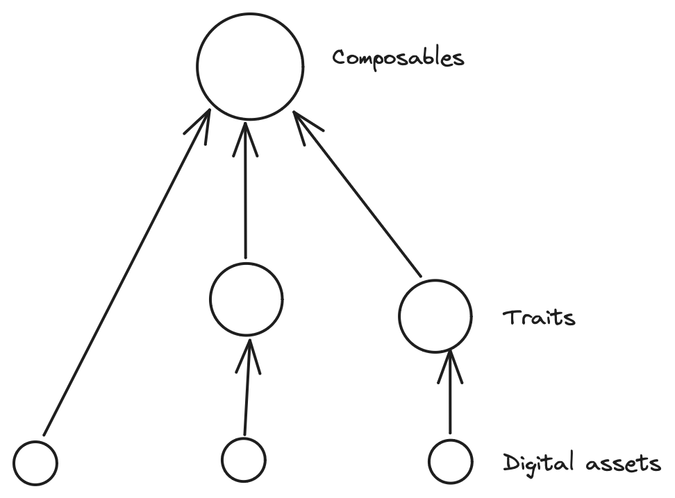

# AIP-X - Composable Digital Assets standard

## Summary

This AIP puts forward a framework for Token Objects, allowing developers to create composable tokens and collections without the need for writing Move code. It achieves this by handling decisions related to business logic, data layout, and providing entry functions.

## Motivation

Digital asset creators encounter challenges due to the absence of a standardized approach to composability. This results in either manual implementation with restricted customization and potential security risks or overlooking the true advantages of the digital and fungible asset standards.

This standard takes serves as an enhancement to the `aptos-token` framework in addition to the following:

* Collections have symbols.
* Tokens can be created as named or numbered.
* Tokens can hold fungible assets.
* Entry functions to perform composition.
* public functions for extensibility support.
* View functions to read state.
* A two-steps ownership transfer.
* An migartion mechanism to migrate tokens from different standards.
* A property map for storing data associated with a token, limited to the Move primitives, `vector<u8>`, and `0x1::string::String`.
* A support for storing data associated with a token via custom resources.
* Events are emitted with every function executed.

## Rationale

This is intended to be a first attempt at defining no-code solutions for composability. The object model allows for new no-code solutions to be created without resulting in any discernable difference to the users, except for those seeking the new features. In fact, the solutions can live in parallel. For example, if fungibility or semi-fungibility becomes important, a new no-code solution on fungibility should be proposed and adopted into the Aptos framework.

The alternative is to not place it in the framework and to make an immutable contract. The greatest concern in that space is the potential risk for bugs or for additional functionality that may be desirable in this variant of no-code tokens.

## Alternatives

A potential competitor would be `aptos-token`. But it lacks the following features:

|   | aptos-token | studio
| -- | -- | --
| Freezing/unfreezing transfers | ✅ | ✅
| Creator management functionality | ✅ | ✅
| Custom metadata (via PropertyMap) | ✅ | ✅
| Custom metadata (via Resources) | ❌ | ✅
| Embedded composability | ❌ | ✅
| Embedded migration | ❌ | ✅
| Indexed digital assets mint | ❌ | ✅
| two-step ownership transfer | ❌ | ✅
| Events emitted | ❌ | ✅

Additionally, `aptos-token` poses a security risk by allowing creators to mutate `uri`, enabling the alteration of a token's `uri` to falsely claim ownership of a different digital asset.

Moreover, `aptos-token` lacks storage for `ExtendRef` and returns the Object instead of the `ConstructorRef` of the wrapper object upon creation, preventing the addition of new resources after its initialization.

## Specification

### Overview

The no-code solution consists of three components:

1. *Collection* - a wrapper around collections.
2. *DA* - a wrapper that serves as metadata for traits and composability, storing the list of fungible assets it holds.
3. *Trait* - a wrapper acting as metadata for composability, storing the list of digital and fungible assets it holds.
4. *Composable* - a token wrapper storing lists of traits, digital assets, and fungible assets it holds.

### Core Logic

The framework consists of collections, tokens, and a composition mechanism

#### Collections

Collections can have symbols, and support supply tracking.

#### Tokens

There are three subtypes of tokens, and they will serve as layers to the overall token structure.

Each token will have its reference wrapped within the main wrapper to allow for a successful token composition without breaking the rules of the contract.

##### DAs

digital assets are native tokens from the object token standard. Currently, a digital asset can hold fungible assets

##### Traits

traits can hold a list of DAs and fungible assets

##### Composables

Composables can hold a list of traits, a list of digital_assets and fungible assets

Overall, a visual represenation can look something like this:



#### Composition

The mechanism of composing and decomposing is embedded within the module, so creators won't need to worry about writing the code for that.

A composition will involve transfering the token to compose to the token to-compose-to, disables its transfer ability so it won't violate the composition rule, and ultimately update the `uri` of the token to-compose-to

### Data Structure

This standard specifies data strucutes for token subtypes, and collection.

#### Collection Data Structure

```move
#[resource_group_member(group = aptos_framework::object::ObjectGroup)]
    // Storage state for collections
    struct Collection has key {
        // Name of the collection
        name: String,
        // Symbol of the collection
        symbol: String,
        // Supply type of the collection; can be fixed, unlimited or concurrent
        supply_type: String,
        // Used to mutate collection fields
        mutator_ref: Option<collection::MutatorRef>,
        // Used to mutate royalties
        royalty_mutator_ref: Option<royalty::MutatorRef>,
        // Determines if the creator can mutate the collection's description
        mutable_description: bool,
        // Determines if the creator can mutate the collection's uri
        mutable_uri: bool,
        // Determines if the creator can mutate token descriptions
        mutable_token_description: bool,
        // Determines if the creator can mutate token names
        mutable_token_name: bool,
        // Determines if the creator can mutate token properties
        mutable_token_properties: bool,
        // Determines if the creator can mutate token uris
        mutable_token_uri: bool,
        // Determines if the creator can burn tokens
        tokens_burnable_by_creator: bool,
        // Determines if the creator can freeze tokens
        tokens_freezable_by_creator: bool
    }
```

#### DAs Data Structure

```move
#[resource_group_member(group = aptos_framework::object::ObjectGroup)]
    // Storage state for digital assets
    struct DigitalAsset has key {
        // Storage state for the property map
        property_map: property_map::PropertyMap,
        // Storage state for the token
        token: Object<Token>,
        // Storage state for the fungible assets
        fungible_assets: vector<Object<FungibleAsset>>
    }
```

#### Traits Data Structure

```move
#[resource_group_member(group = aptos_framework::object::ObjectGroup)]
// Storage state for traits
struct Trait has key {
    index: u64, // index of the trait in the traits vector from composables
    digital_assets: vector<Object<DA>> // digital assets that the trait holds
}
```

#### Composables Data Structure

```move
#[resource_group_member(group = aptos_framework::object::ObjectGroup)]
// Storage state for composables; aka, the atom/primary of the token
struct Composable has key {
    traits: vector<Object<Trait>>,
    digital_assets: vector<Object<DA>>
}
```

#### Token subtypes common Data Structure

```move
#[resource_group_member(group = aptos_framework::object::ObjectGroup)]
    // Storage state for token references, sticked to the token object
    struct References has key {
        burn_ref: Option<token::BurnRef>,
        extend_ref: object::ExtendRef,
        mutator_ref: Option<token::MutatorRef>,
        transfer_ref: object::TransferRef,
        property_mutator_ref: property_map::MutatorRef
    }
```

#### Misc Data Structures

```move
// Used to determine the naming style of the token
    struct Indexed has key {}
    struct Named has key {}
```

### Apis

The standard contains all viable APIs for accessing, transferring, composing, mutating, deleting tokens, and managing collections, and royalties. There are no entry functions as the composability standard leaves that to more specific implementations.

#### Collection Data Apis

#### DA Data Apis

#### Trait Data Apis

#### Composable Data Apis

## Reference Implementation

* live branch: `devnet`
* sdk: needs to be updated based on the latest version of the module

## Risks and Drawbacks

* Things can go wrong if updating the uri is done wrongly, then it could result in a scam. but i think we can mitigate this by enforcing that the uri is generated on chain.

* The proposed standard will be added on top of existing standards and without making any changes to them. This means that the proposed standard will not break any existing functionality.

## Future Potential

Enhancing digital asset standards with composability can revolutionize industries like gaming, ticketing, and real estate.
Composable digital assets allow for unique character creation in gaming, streamlined ticketing processes, and fractional ownership in real estate. This potentially offers creators innovative solutions across sectors.

## Suggested implementation timeline

* An exploratory version has lived within **`devnet`** branch in `TowneSpace-contract/examples` since January of 2024.

supposing the AIP passes the gatekeeper’s design review.

...

* On devnet: by February 2024
* On testnet: by March 2024
* On mainnet: by April 2024
