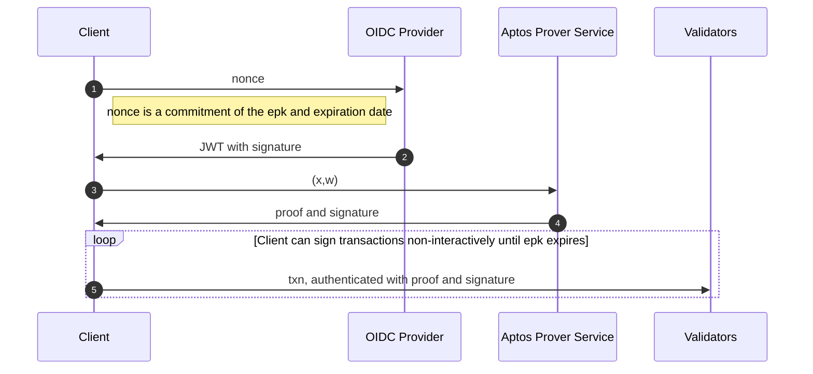

# AIP-X - Prover Service for Aptos Keyless Accounts

## Summary

This AIP is an extension of [AIP-61](https://github.com/aptos-foundation/AIPs/blob/main/aips/aip-61.md): Keyless Accounts, which allow users to have a wallet that is tied to an OpenID account, and to authenticate with the blockchain via their OIDC provider. As summarized in AIP-61, “your blockchain account = your OIDC account”. OpenID authenticates users based on personally-identifying information, e.g. an email address or a twitter handle. We want to guarantee:

- The OpenID provider does not learn which wallets are linked to which users.
- The validators (and other outside observers) also cannot learn the link between wallets and OpenID users.

In order to do this, we are using a zero-knowledge proof which each user must provide to validators to authenticate transactions. Generating such a proof must be done each time a user logs in, and then each time the user's ephemeral public key[^spec], and is computationally intensive. To allow for users to login quickly and on low-powered hardware, we plan to offload this proof computation to a proving service.

### Goals

The specific goals of the Aptos Keyless Prover Service are as follows:
1. Enable Keyless account users to login quickly and without friction. 
2. Preserve privacy of users.
3. Build a service that is relatively inexpensive to host.
4. Implement a **training wheels** mode which protects against bugs in the zero-knowledge system.

### Out of Scope

We are not trying to solve the issue of privacy between the user and the prover service. That is, we are *allowing* the prover service to learn the user's private information, including:
* The user's OIDC handle. For example, if logging in with Google, the prover service will learn the user's email.
* The user's privacy-preserving pepper[^spec].

The fact that the prover service learns this information means new privacy and centralization risks. These risks are discussed [below](#risks-and-drawbacks).


## Motivation

The motivation of this AIP follows directly from the motivation of [AIP-61](https://github.com/aptos-foundation/AIPs/blob/main/aips/aip-61.md). The purpose of Aptos Keyless is to greatly reduce friction in onboarding and key management for users. Specifically, the Keyless Proving Service will allow for the most computationally intensive step during login to be offloaded to a powerful cloud VM instead of being done locally, thus greatly improving the user experience of Aptos Keyless.
 


## Impact

The direct impact of this AIP will be on users of Aptos Keyless accounts. The impact will be threefold:
* Users will have a much faster login experience than they would if we were generating proofs client-side. From preliminary benchmarks, generating proofs in-browser takes such a long time that is completely unusable. (i.e., > 25 seconds to generate the proof.)
* As long as the **training wheels** are activated, if a bug is found in the ZKP toolchain (i.e., in circom), users' funds are safe.
* On the other hand, users's private information will be sent to the prover service. This induces a trust assumption: users must trust that the prover service will not leak this information.

## Alternative solutions

The most obvious alternative is requiring the user to generate a proof client-side. As discussed above, this solution is untenable, at least with the current ZKP system that is implemented in Aptos Keyless.

## Specification

This spec is an extension of the spec in AIP-61[^spec]. As explained in AIP-61, to authenticate a transaction, a user needs a Groth16 ZK proof for the relation $\mathcal{R}$, with the following inputs:

```math
\mathcal{R}\begin{pmatrix}
	\textbf{x} = [
        (\mathsf{iss\_val}, \mathsf{jwk}, \mathsf{header}), 
        (\mathsf{epk}, \mathsf{exp\_date}), 
        \mathsf{addr\_idc}, \mathsf{exp\_horizon}
    ],\\ 
    \textbf{w} = [
        (\mathsf{aud\_val}, \mathsf{uid\_key}, \mathsf{uid\_val}, r),
        (\sigma_\mathsf{oidc}, \mathsf{jwt}), 
    \rho]
\end{pmatrix},
```
and with verification logic as defined in[^spec]. TODO: provide more context

At a high level, the prover will have the following behavior. As configuration, it will take in a Groth16 prover key which encodes the relation $\mathcal{R}$, as well as a **training wheels signing key**. TODO: explain training wheels better

The flow between the client, the OIDC Provider, and the Aptos Prover Service is shown in the diagram below. The client will interact with the prover service after receiving a signed JWT from the OIDC provider (step ❶ and ❷ below). It will send a request of the format $(\textbf{x}, \textbf{w})$ to the prover service, where $\textbf{x}$ and $\textbf{w}$ are as described above in $\mathcal{R}$ (step ❸). The prover service will then:
1. Compute a Groth16 proof $\pi$ for $(\textbf{x}, \textbf{w})$
2. Compute a **training wheels signature** $\sigma$ for the message $m = H(\textbf{x}) || \pi$
3. Return $(\pi, \sigma)$ as the response (step ❹).

Once the client has $\pi$ and $\sigma$, it may use these to authenticate transactions with respect to its Aptos Keyless account (step ❺).





### API:

We now give a more detailed description of the API. The prover service is accessed via the following endpoint:

* https://prover.keyless.devnet.aptoslabs.com/v0/prove

The prover service API consists of the required format for requests along with the format which responses take, described in the next sections.

#### Request Format:

The request body for the route `/v0/prove` is required to be a json object with structure specified via the `RequestInput` struct below. This struct encodes both the public input $\mathbf{x}$ and the private input $\mathbf{w}$ in the relation $\mathcal{R}$ above.

The specific structure of the request JSON object is determined by:
* `RequestInput` struct below, taken from [src/api.rs](https://github.com/aptos-labs/prover-service/blob/master/src/api.rs) in the prover service code
* The `serde_json` library's JSON deserialization behavior
* Custom serialization logic for the [EphemeralPublicKey](https://github.com/aptos-labs/aptos-core/blob/main/types/src/transaction/authenticator.rs#L1121) and [Pepper](https://github.com/aptos-labs/aptos-core/blob/main/types/src/keyless/mod.rs#L163) types, defined in `aptos-types`

```rust
#[derive(Debug, Serialize, Deserialize)]
pub struct RequestInput {
    pub jwt_b64: String,
    pub epk: EphemeralPublicKey,
    #[serde(with = "hex")]
    pub epk_blinder: EphemeralPublicKeyBlinder,
    pub exp_date_secs: u64,
    pub exp_horizon_secs: u64,
    pub pepper: Pepper,
    pub uid_key: String,
    pub extra_field: Option<String>,
    pub aud_override: Option<String>,
}
```

#### Response Format

The response from the prover for route `/v0/prove` is defined via the following

* ProverServiceResponse enum below, taken from [src/api.rs](https://github.com/aptos-labs/prover-service/blob/master/src/api.rs) in the prover service code
* The [Groth16Proof](https://github.com/aptos-labs/aptos-core/blob/49354812f75b6a9e7832b031df45ac626e33c9dc/types/src/keyless/groth16_sig.rs#L23C1-L30C2) struct defined in `aptos-types`
* The serde_json library's JSON deserialization behavior
* Custom serialization logic for the [EphemeralPublicKey](https://github.com/aptos-labs/aptos-core/blob/main/types/src/transaction/authenticator.rs#L1121) and [Pepper](https://github.com/aptos-labs/aptos-core/blob/main/types/src/keyless/mod.rs#L163) types, defined in `aptos-types`
* TODO: describe signature struct/behavior

```rust
pub type PoseidonHash = [u8; 32];

#[derive(Debug, Serialize, Deserialize)]
#[serde(untagged)]
pub enum ProverServiceResponse {
    Success {
        proof: Groth16Proof,
        #[serde(with = "hex")]
        public_inputs_hash: PoseidonHash,
        training_wheels_signature: Ed25519Signature,
    },
    Error {
        message: String,
    },
}
```

```rust
#[derive(
    Copy, Clone, Debug, Deserialize, PartialEq, Eq, Hash, Serialize, CryptoHasher, BCSCryptoHash,
)]
pub struct Groth16Proof {
    a: G1Bytes,
    b: G2Bytes,
    c: G1Bytes,
}
```


* [Prover service request and response structs](https://github.com/aptos-labs/prover-service/blob/master/src/api.rs)


### Protecting Against ZKP Bugs

## Reference Implementation

The main code repository for the prover service is linked here:

* [Prover service code](https://github.com/aptos-labs/prover-service)


## Risks and Drawbacks

 > - Express here the potential negative ramifications of taking on this proposal. What are the hazards?
 > - Any backwards compatibility issues we should be aware of?
 > - If there are issues, how can we mitigate or resolve them?

- If we don’t sufficiently optimize the circuit and prover code, the prover service could be cost-prohibitive to scale.
    - Solution: robust benchmarks of prover, understanding of cost involved in running the service

### Privacy

- prover service learns sensitive user information
 - This would allow us to de-anonymize Aptos Keyless users.
 - It would **not** allow us to authorize transactions on behalf of users, since the prover service does not learn the user's ephemeral signing key.[^spec]
- risks for both users and for us
- We mitigate these risks by making the prover *stateless*: it stores nothing about a user after completing that user's request
- We plan to eliminate these risks in the future by building a better underlying ZKP system; see [open questions](#Open-Questions) below

  
### Scalability

- expensive to host


## Future Potential

See open questions below.

## Suggested implementation/deployment timeline

We have implemented the prover service already, and plan to deploy it as part of mainnet release v1.10.

## Open Questions 

In the next few months, we plan to spend considerable time on how to mitigate the privacy and centralization compromises encompassed in this AIP. Specifically, we plan to work on the following questions:

* Can we design a new ZKP with sufficient performance to allow for client-side proving, and thus eliminate the prover service altogether?
* If not, can we design a prover service which is "blind", i.e., it does not learn any sensitive information about users?

## References

[^spec]: https://github.com/rex1fernando/AIPs/blob/main/aips/aip-61.md#specification
