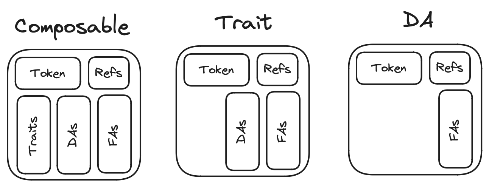
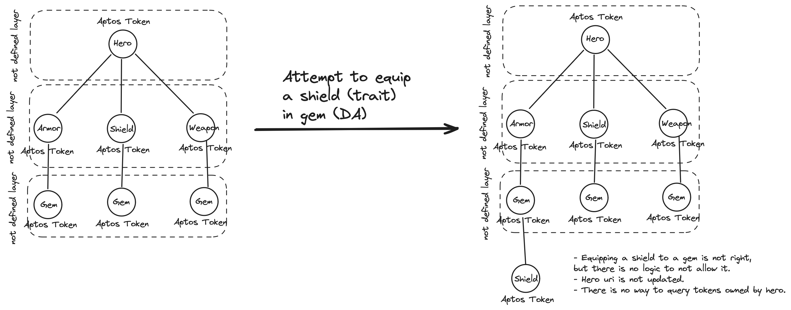
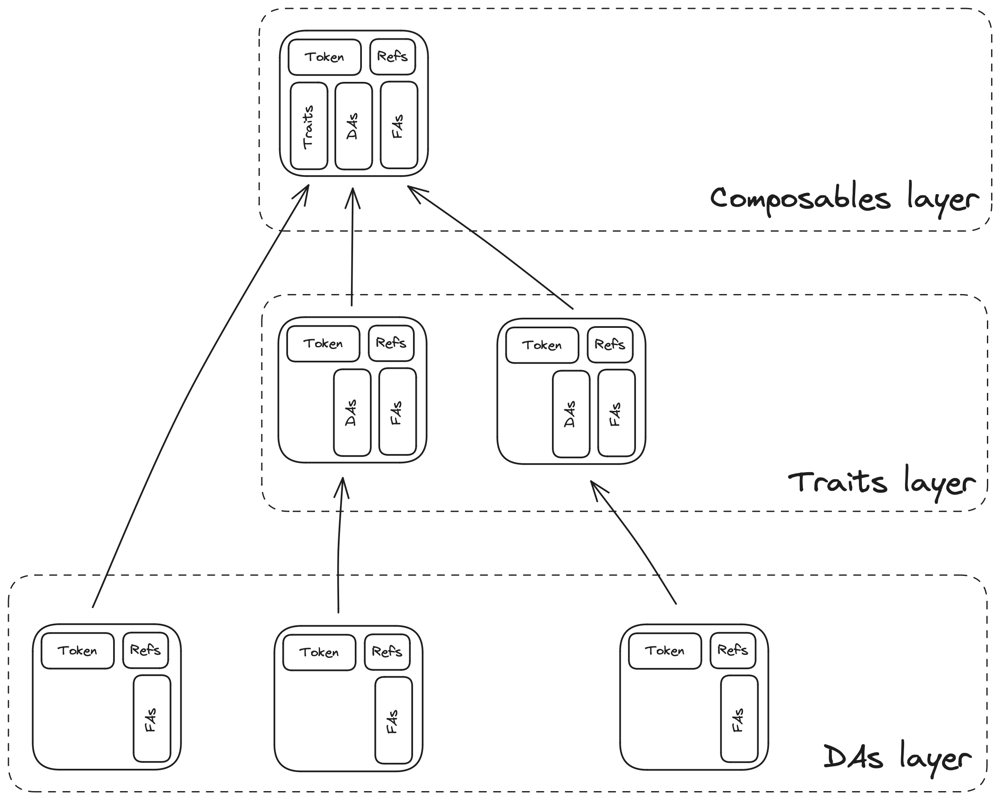
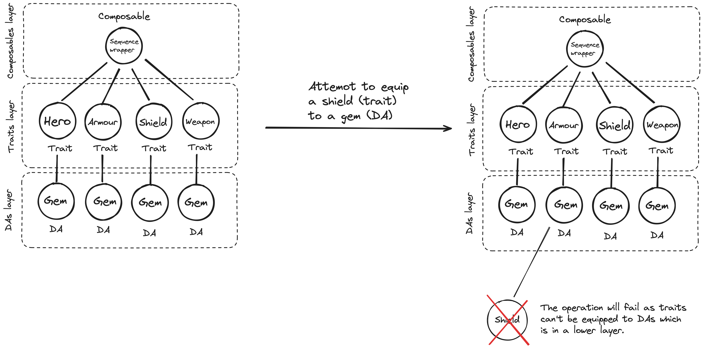
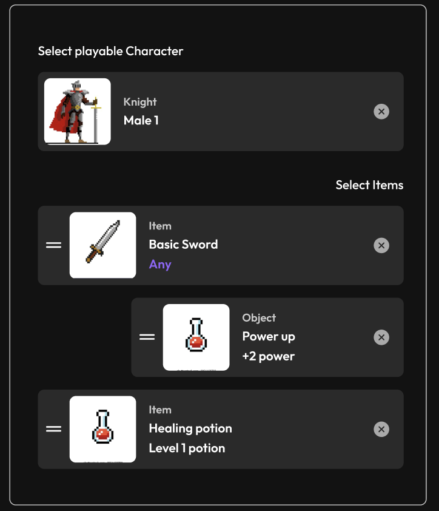

# AIP-X - Composable Digital Assets standard

## Summary

This AIP proposes a purpose-specific, extensible composability framework that allows creators to create NFTs for Dynamic PFP, composable game assets, and other rich applications that require composability. It does this with new business logic, sub-functions, data structures, and APIs, based on the object model from `AIP-11` & `AIP-10` while leveraging the no-code feature from `AIP-22` and the composability freedom with fungible assets in `AIP-21`.

The solution not only addresses this aspect but also introduces supplementary features such as creator management, custom metadata, and embedded migration. Event emission features from `AIP-44` are also included in the framework, thereby offering a comprehensive stack for composable token use cases.

## Motivation

The solution suggests a hierarchical setup for composing digital assets. In this proposal, an NFT or token can own its set of tokens, and each of these tokens can, in turn, own their own set of tokens, following a one-way path. This intentional design is crucial to enforce a specific and designated way of composing tokens of the same type at different levels.

For example, consider a player token that owns a sword token, and the sword token, in turn, possesses a power token. The solution enforces a strict compositional hierarchy, ensuring that the sword token can only be composed with the player token, and the power token can exclusively be composed with either the sword token or the player token.

The hierarchy consists of three layers:

- `Composable`: A wrapper for a `token-object` that acts as the root and can contain traits, digital assets, and fungible assets.
- `Trait`: A wrapper for a `token-object` that serves as the child of the Composable, capable of holding digital assets and fungible assets.
- `DA` (Digital Asset): A wrapper for a `token-object` representing the leaf of the tree and positioned as the child of the Trait. It can hold fungible assets and allow further extensibility in the hierarchy.

 

> ℹ️ Figure 1: *Wrappers illustration*

The solution also embeds the composability mechanism, which entails transferring the token intended for composition to the target token for composition. This action freezes the transfer capability of the former and ultimately updates the uri of the latter.

## Rationale

Composability was introduced in `AIP-10`, allowing objects to have ownership of other objects. However, it wasn't specifically crafted to facilitate hierarchical composition, a feature that is widely present in PFP NFT's NFT-trait relations, and in game assets' character-item relations. This lack of hierarchical composition implies that objects could own other objects without a structured path to clearly define which ones should own others and which ones should not, which could result in the potential corruption of assets from exo-collection objects.

In the realm of tokens, creators willing to implement Composable NFT or cNFT will have to write the code for a defined-path composability mechanism. This might not be an issue for some, but some things need to be considered:

- Extensibility support: The solution should support the addition of new resources post-creation, providing the flexibility to add extra resources to the token. This facilitates customization of metadata via resources.
- cNFT data structure: The structure requires a clear path for composition, so not all tokens can be composed with each other. So a data structure is needed to enforce this.
- Data accessibility: cNFTs need to be able to access the data of the tokens they own, and the tokens owned by their owned tokens. This is to ensure that tokens that are in a composition relation with the parent token have their metadata stored, accessable and should have their transfer capability disabled to not violate the composition rule.
- Updating the `uri`: The `uri` of the parent token should be updated to reflect the composition of the child tokens. This is to ensure that the parent token `uri` reflects the child tokens it owns, while any change within the composition structure should be reflected.

### Existing solutions

#### AIP-22

`aptos-token` introduced in `AIP-22` is aimed at allowing developers to create tokens and collections without writing any Move code. It makes decisions on business logic, data layout, and provides entry functions. It also supports creator management, custom metadata using `PropertyMap` and composability. But it has some limitations:

- No extensibility support: `AptosToken` data structure lacks storage for `ExtendRef` and its upon creation it returns `Object<AptosToken>` instead of the `ConstructorRef`, preventing the addition of new resources after.
- No structure for composability: `aptos-token` does not enforce a clear path for composition, allowing any `AptosToken` to be composed with any `AptosToken`. This could result in unwanted asset corruption from exo-collection objects as mentioned earlier.
- No data accessibility: `aptos-token` does not provide a way for tokens to access the data of the tokens they own, and the tokens inside the owned tokens.
- Updating `uri` previlige: in `aptos-token`, the `uri` of a token can be updated by the creator in some case (if `mutable_token_uri = true`) or it can have the same `uri` forever (if `mutable_token_uri = false`). This is set during collection creation and it cannot be updated after. Updating the `uri` of a token manually can potentially pose a security risk, as it can be used to falsely claim ownership of a different digital assets.

Below is a visual example of how `hero.move` would look like using `aptos-token`:


> ℹ️ Figure 2: *hero.move using `AIP-22`*

#### AIP-21

The introduction of fungible assets in `AIP-21` brings more flexibility and expressiveness compared to the legacy Coin standard. It enables a single object to be represented by numerous distinct but interchangeable units of ownership. However, this improvement doesn't address the need for a hierarchical structure in composing digital assets. Additionally, by allowing any `FungibleAsset` to be combined with any other `FungibleAsset`, albeit offering much freedom in composition, it does not offer a directed path for composition for potential use cases such as PFP and game assets that might require more structure in their composability settings.

---
This AIP takes into account of the features proposed by these previous AIPs, namely:

- The freedom of composing fungible assets instantiated in `AIP-21`.
- The convenience of digital asset no-code solution for creators instantiated in `AIP-22`.
This new AIP intends to leverage these features in a new composability framework while offering directed ways for users to engage in asset composition based on the Move Object proposed in `AIP-10`.

## Specification

### Overview

#### Extensibility support

#### Composability Data Structure

To offer creators and developers defined path for applications such as Dynamic PFP, game assets, and others, the solution introduces a hierarchical setup for composing digital assets, which consists of three layers:

- Layer 1: *Composable* - a token wrapper storing lists of traits, digital assets, and fungible assets it holds.
- Layer 2: *Trait* - a wrapper acting as metadata for composability, storing the list of digital and fungible assets it holds.
- Layer 3: *DA* - a wrapper that serves as metadata for traits and composability, storing the list of fungible assets it holds.

This hierarchical setup is achieved using `AIP-10` and `AIP-11` mainly, and designed based on the tree structure, where the Composable is the root, the Trait is the child of the Composable, and the DA is the child of the Trait. The depth of the tree is set to three by default but can be extended to any level. Additionally, the tree can have multiple branches.

Overall, a visual represenation looks something like this:



> ℹ️ Figure 3: *Hierarchical setup for composing digital assets*

#### Data accessibility

The solution allows for tokens to access the data of the tokens they own, and the tokens owned by their owned tokens. This is to ensure that tokens that are in a composition relation with the parent token have their metadata stored and accessable.

[Refer to the data structure section for more details.](###Data-Structure)

#### Updating the `uri`

The `uri` of the parent token is updated to reflect the composition of the child tokens. This is to ensure that the parent token `uri` reflects the child tokens it owns, while any change within the composition structure should be reflected.

The solution supports the addition of new resources post-creation using `ExtendRef` capability introduced in `AIP-11`, providing the flexibility to add extra resources to the token. This facilitates customization of metadata via resources. `property_map` can then potentially be used to store the static metadata of the token, and resources can be used to store the dynamic metadata of the token. Example: `property_map` can store the sword type: "wooden", and resources can store the sword power: "100".
In addition, the multi-layered structure of the framework hierarchy includes in its Layer 3 support for `DA`, which allows for extensibility for all `aptos-token` and developers to add further layers to the framework.



> ℹ️ Figure 4: *hero.move using the proposed standard*

#### Fungible Assets within Digital Assets

The solution leverages fungible assets into the composability framework, specifically through `primary_fungible_store` from `AIP-21`, where any token (regardless of its layer) possesses a `PrimaryStore`. This means that tokens can hold fungible assets, providing utility for applications involving token ownership of fungible assets, such as in-game currencies, food, gems, and more.

Imagine a scenario where a hero token, having ownership of a backpack token, can store a quantity of food. Here, food serves as a fungible asset accessible within the in-game environment. The process includes transferring food to the backpack token using PrimaryStore, and subsequently, the backpack token can be transferred to another hero token.

Furthermore if needed, the proposed cNFT structure can be extended to incorporate a `SecondaryStore` for more complex use cases.

### Composability lifecycle

Assuming a collection is created, and tokens with the different three sub types are created.

- composing a trait token to a composable token:
  1. An entity calls the equip function.
  2. The trait token is transferred to the composable token using `transfer()` from `AIP-10`.
  3. The trait is disabled from being transferred (`disable_ungated_transfer()` from `AIP-11`).
  4. The trait object is copied to the traits list in the composable.
  5. The composable's uri is updated.
  6. An event is emitted using `AIP-44`.

- decomposing a trait token from a composable token:
  1. An entity calls the unequip function.
  2. The trait object is removed from the traits list in the composable.
  3. The trait is enabled for transfer (`enable_ungated_transfer()` from `AIP-11`).
  4. The trait token is transferred back to the owner using `transfer()` from `AIP-10`.
  5. The composable's uri is updated.
  6. An event is emitted using `AIP-44`.

Same steps apply to the DA and composable tokens.

### Core Logic

The logic consists of the composition mechanism, collections, tokens, and their management.

#### Collections

Collections can have symbols, and support supply tracking.

#### Tokens

There are three subtypes of tokens, and they will serve as layers to the overall token structure.

Each token will have its reference wrapped within the main wrapper to allow for a successful token composition without breaking the rules of the contract.

##### DAs

digital assets are native tokens from the object token standard. Currently, a digital asset can hold fungible assets

##### Traits

traits can hold a list of DAs and fungible assets

##### Composables

Composables can hold a list of traits, a list of digital_assets and fungible assets

#### Composition

The mechanism of composing and decomposing is embedded within the module, so creators won't need to worry about writing the code for that.

A composition will involve transfering the token to compose to the token to-compose-to, disables its transfer ability so it won't violate the composition rule, and ultimately update the `uri` of the token to-compose-to.

#### Example

A creator is creating a gaming NFT collection with composable traits.
This AIP would allow for defining traits like this:

- Composable - Knight.
- Trait - basic sword.
- DA - Healing lotion.



> ℹ️ Figure 5: *Example of a composable trait*

### Data Structure

This standard specifies data strucutes for token subtypes, and collection.

#### Collection Data Structure

```move
#[resource_group_member(group = aptos_framework::object::ObjectGroup)]
    // Storage state for collections
    struct Collection has key {
        // Name of the collection
        name: String,
        // Symbol of the collection
        symbol: String,
        // Supply type of the collection; can be fixed, unlimited or concurrent
        supply_type: String,
        // Used to mutate collection fields
        mutator_ref: Option<collection::MutatorRef>,
        // Used to mutate royalties
        royalty_mutator_ref: Option<royalty::MutatorRef>,
        // Determines if the creator can mutate the collection's description
        mutable_description: bool,
        // Determines if the creator can mutate the collection's uri
        mutable_uri: bool,
        // Determines if the creator can mutate token descriptions
        mutable_token_description: bool,
        // Determines if the creator can mutate token names
        mutable_token_name: bool,
        // Determines if the creator can mutate token properties
        mutable_token_properties: bool,
        // Determines if the creator can mutate token uris
        mutable_token_uri: bool,
        // Determines if the creator can burn tokens
        tokens_burnable_by_creator: bool,
        // Determines if the creator can freeze tokens
        tokens_freezable_by_creator: bool
    }
```

#### DAs Data Structure

```move
#[resource_group_member(group = aptos_framework::object::ObjectGroup)]
// Storage state for digital assets
struct DA has key {
    parent: Option<address>, // address of parent token if equipped
    index: u64, // index of the da in the digital_assets vector from composables or traits
}
```

#### Traits Data Structure

```move
#[resource_group_member(group = aptos_framework::object::ObjectGroup)]
// Storage state for traits
struct Trait has key {
    parent: Option<address>, // address of parent token if equipped
    index: u64, // index of the trait in the traits vector from composables
    digital_assets: vector<Object<DA>> // digital assets that the trait holds
}
```

#### Composables Data Structure

```move
#[resource_group_member(group = aptos_framework::object::ObjectGroup)]
// Storage state for composables; aka, the atom/primary of the token
struct Composable has key {
    traits: vector<Object<Trait>>,
    digital_assets: vector<Object<DA>>
}
```

#### Token subtypes common Data Structure

```move
#[resource_group_member(group = aptos_framework::object::ObjectGroup)]
    // Storage state for token references, sticked to the token object
    struct References has key {
        burn_ref: Option<token::BurnRef>,
        extend_ref: object::ExtendRef,
        mutator_ref: Option<token::MutatorRef>,
        transfer_ref: object::TransferRef,
        property_mutator_ref: property_map::MutatorRef
    }
```

#### Misc Data Structures

```move
// Used to determine the naming style of the token
struct Indexed has key {}
struct Named has key {}

// Used to determine the type of the process
struct Equip has key {}
struct Unequip has key {}
```

### APIs

The standard contains all viable APIs for accessing, transferring, composing, mutating, deleting tokens, and managing collections, and royalties. There are no entry functions as the composability standard leaves that to more specific implementations.

#### Collection APIs

```move
// Create a collection; 
// this will create a collection resource, a collection object, 
// and returns the constructor reference of the collection.
public fun create_collection<SupplyType: key>(
    signer_ref: &signer,
    description: String,
    max_supply: Option<u64>, // if the collection is set to haved a fixed supply.
    name: String,
    symbol: String,
    uri: String,   
    mutable_description: bool,
    mutable_royalty: bool,
    mutable_uri: bool,
    mutable_token_description: bool,
    mutable_token_name: bool,
    mutable_token_properties: bool,
    mutable_token_uri: bool,
    tokens_burnable_by_creator: bool,
    tokens_freezable_by_creator: bool,
    royalty_numerator: Option<u64>,
    royalty_denominator: Option<u64>
): object::ConstructorRef
```

```move
public fun is_mutable_collection_description<T: key>(collection: Object<T>): bool
```

```move
public fun is_mutable_collection_royalty<T: key>(collection: Object<T>): bool
```

```move
public fun is_mutable_collection_uri<T: key>(collection: Object<T>): bool
```

```move
public fun is_mutable_collection_token_description<T: key>(collection: Object<T>): bool
```

```move
public fun is_mutable_collection_token_name<T: key>(collection: Object<T>): bool
```

```move
public fun is_mutable_collection_token_uri<T: key>(collection: Object<T>): bool
```

```move
public fun is_mutable_collection_token_properties<T: key>(collection: Object<T>): bool
```

```move
public fun are_collection_tokens_burnable<T: key>(collection: Object<T>): bool
```

```move
public fun are_collection_tokens_freezable<T: key>(collection: Object<T>): bool
```

```move
public fun get_collection_name(collection_object: Object<Collection>): String
```

```move
public fun get_collection_symbol(collection_object: Object<Collection>): String
```

```move
public fun get_collection_supply_type(collection_object: Object<Collection>): String
```

#### Token APIs

This section contains APIs for tokens regardless of their type (whether they are composable, trait, or digital asset).

```move
// Create a token based on type. Either a trait or a composable;
// this will create a token resource, a token object,
// and returns the constructor reference of the token.
public fun create_token<Type: key, NamingStyle: key>(
    signer_ref: &signer,
    collection: String,
    description: String,
    name: String,
    name_with_index_prefix: String,
    name_with_index_suffix: String,
    uri: String,
    royalty_numerator: Option<u64>,
    royalty_denominator: Option<u64>,
    property_keys: vector<String>,
    property_types: vector<String>,
    property_values: vector<vector<u8>>
): object::ConstructorRef
```

```move
// Composose a digital asset to a composable
        public fun equip_digital_asset(
            signer_ref: &signer,
            composable_object: Object<Composable>,
            da_object: Object<DA>,
            new_uri: String
        )
```

```move
// equip fa; transfer fa to a token; token can be either composable or trait
public fun equip_fa_to_token<FA: key, Token: key>(
    signer_ref: &signer,
    fa: Object<FA>,
    token_obj: Object<Token>,
    amount: u64
)
```

```move
// unequip fa; transfer fa from a token to the owner
    public fun unequip_fa_from_token<FA: key, Token: key>(
        signer_ref: &signer,
        fa: Object<FA>,
        token_obj: Object<Token>,
        amount: u64
    )
```

```move
// transfer digital assets; from user to user.
public fun transfer_token<Token: key>(
    signer_ref: &signer,
    token_addr: address,
    new_owner: address
)
```

```move
// transfer fa from user to user.
public fun transfer_fa<FA: key>(
    signer_ref: &signer,
    recipient: address,
    fa: Object<FA>,
    amount: u64
)
```

```move
public fun burn_token<Type: key>(owner: &signer, token: Object<Type>)
```

```move
public fun freeze_transfer<T: key>(creator: &signer, token: Object<T>)
```

```move
public fun unfreeze_transfer<T: key>(creator: &signer, token: Object<T>)
```

```move
public fun set_description<T: key>(creator: &signer, token: Object<T>, description: String)
```

```move
public fun set_name<T: key>(creator: &signer, token: Object<T>, name: String)
```

```move
public fun set_trait_uri(owner: &signer, trait_obj: Object<Trait>, uri: String)
```

```move
// set token properties
public fun add_property<T: key>(
    owner: &signer,
    token: Object<T>,
    key: String,
    type: String,
    value: vector<u8>
)
```

```move
public fun add_typed_property<T: key, V: drop>(
    owner: &signer,
    token: Object<T>,
    key: String,
    value: V,
)
```

```move
public fun remove_property<T: key>(
    owner: &signer,
    token: Object<T>,
    key: String,
)
```

```move
// update token properties
public fun update_property<T: key>(
    owner: &signer,
    token: Object<T>,
    key: String,
    value: vector<u8>,
)
```

```move
public fun get_parent_token<T: key>(token: Object<T>): address
```

```move
public fun get_index<T: key>(token_obj: Object<T>): u64
```

```move
public fun are_properties_mutable<T: key>(token: Object<T>): bool
```

```move
public fun is_burnable<T: key>(token: Object<T>): bool 
```

```move
public fun is_mutable_description<T: key>(token: Object<T>): bool
```

```move
public fun is_mutable_name<T: key>(token: Object<T>): bool
```

```move
public fun is_mutable_uri<T: key>(token: Object<T>): bool
```

```move
public fun get_token_signer<T: key>(token: Object<T>): signer
```

#### DA APIs

#### Trait APIs

```move
// Compose a digital asset to a trait
public fun equip_digital_asset_to_trait(
    signer_ref: &signer,
    trait_object: Object<Trait>,
    da_object: Object<DA>,
    new_uri: String
)
```

```move
// Decompose a digital asset from a trait
public fun unequip_digital_asset_from_trait(
    signer_ref: &signer,
    trait_object: Object<Trait>,
    da_object: Object<DA>,
    new_uri: String
)
```

#### Composable APIs

```move
// Compose trait to a composable token
public fun equip_trait(
    signer_ref: &signer,
    composable_object: Object<Composable>,
    trait_object: Object<Trait>,
    new_uri: String
)
```

```move
// Decompose a digital asset from a composable
public fun unequip_digital_asset_from_composable(
    signer_ref: &signer,
    composable_object: Object<Composable>,
    da_object: Object<DA>,
    new_uri: String
)
```

```move
// Decompose a trait from a composable token. Tests panic.
public fun unequip_trait(
    signer_ref: &signer,
    composable_object: Object<Composable>,
    trait_object: Object<Trait>,
    new_uri: String
)
```

```move
public fun get_traits_from_composable(composable_object: Object<Composable>): vector<Object<Trait>> 
```

## Reference Implementation

- live branch: `devnet`
- sdk: needs to be updated based on the latest version of the module

## Risks and Drawbacks

- Things can go wrong if updating the uri is done wrongly, then it could result in a scam. but i think we can mitigate this by enforcing that the uri is generated on chain.

- The proposed standard will be added on top of existing standards and without making any changes to them. This means that the proposed standard will not break any existing functionality.

- Although extensibility issues were mentioned in the early phase of the AIP discussions, we have included `DA` support in the framework hierarchy to allow for extensibility beyond the relational definition between `Composable` and `Trait`.

## Future Potential

Enhancing digital asset standards with composability can revolutionize industries like gaming, ticketing, and real estate.
Composable digital assets allow for unique character creation in gaming, streamlined ticketing processes, and fractional ownership in real estate. This potentially offers creators innovative solutions across sectors.

## Suggested implementation timeline

- An exploratory version has lived within **`devnet`** branch in `TowneSpace-contract/examples` since January of 2024.

supposing the AIP passes the gatekeeper’s design review.

...

- On devnet: by February 2024
- On testnet: by March 2024
- On mainnet: by late March 2024
