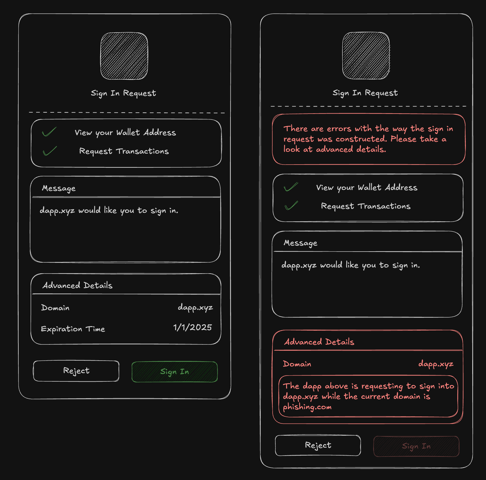

# AIP-X - Sign in with Aptos

## Summary

The "Sign in with Aptos" (SIWA) standard introduces a secure and user-friendly way for users to authenticate to off-chain resources by proving ownership of their blockchain addresses. It simplifies the authentication process by replacing the traditional `connect` + `signMessage` flow in the wallet standard with a streamlined one-click `signIn` method. SIWA leverages decentralized identities to avoid reliance on traditional schemes like SSO while incorporating security measures to combat phishing attacks and improve user visibility.

### Out of scope

The standard relies on public key signature verification. This AIP will not cover specifications or correctness of signature verification.

## High-level Overview

**Decentralized authentication** is a privacy-first solution that empowers individuals to safeguard their information, personalize their experiences, and maintain freedom from censorship.

By authenticating through a wallet, users have full control over their authentication journey. They can decide _what to share_ and _how to log in,_ ensuring a more secure and customizable experience.

For example, a user may choose to use one of the wallet experiences to authenticate into an application:

- **Petra** – _Passwords/Biometric_: - Fully non-custodial. Requires no personal information, ensuring complete privacy and resistance to censorship.
- **Aptos Connect** – _Social Providers_: Fully non-custodial. Shares limited personal information like name and email but may be subject to censorship by social providers.

> 💡 **_Decentralized authentication transforms wallets into decentralized identities._**

However, while this approach offers significant benefits, it also presents several challenges:

1. **Lack of standardization:** Applications on Aptos lack a unified authentication message format, leading to inconsistencies that confuse users.
2. **Unreadable messages:** Authentication messages are displayed in plaintext, making them difficult for users to comprehend.
3. **Limited wallet support:** Without standardization, wallets cannot effectively support authentication UIs.
4. **Security risks:** Malicious websites can deceive users into signing messages intended for legitimate dApps.
5. **Unintuitive processes:** The traditional `connect` + `signMessage` workflow involves two separate steps, creating a clunky and unintuitive user experience.

Addressing these challenges is key to unlocking the full potential of decentralized authentication and delivering a seamless, secure, and user-friendly experience.



The proposed model builds on established standards, including [EIP-4361](https://eips.ethereum.org/EIPS/eip-4361), [CAIP-122](https://chainagnostic.org/CAIPs/caip-122), and [Sign in with Solana](https://phantom.app/learn/developers/sign-in-with-solana). Drawing inspiration from [Sign in with Solana](https://phantom.app/learn/developers/sign-in-with-solana), this standard aims to shift the responsibility of message construction from dApps to wallets, streamlining the authentication process.

With _Sign in with Aptos (SIWA)_, we address key challenges by enabling wallets to interpret standardized message formats, empowering them to flag potentially illegitimate messages. This approach not only improves security but also builds user trust. Additionally, the wallet standard incorporates critical features such as domain binding, message timestamps, resources, and request IDs, ensuring a more robust authentication experience.

## Impact

The introduction of _Sign in with Aptos (SIWA)_ fundamentally enhances user authentication in the Aptos ecosystem by addressing critical usability, security, and standardization challenges. This AIP significantly impacts both developers and end-users:

### For Developers

- **Streamlined Integration:** SIWA provides a standardized framework for authentication, removing the need for custom implementations. This reduces development overhead and ensures compatibility across applications.
- **Enhanced Security:** By enabling wallets to validate and flag potentially malicious messages, SIWA minimizes the risk of phishing attacks and other security vulnerabilities.
- **Future-Proof Standards:** Building on existing specifications like EIP-4361 and CAIP-122, SIWA ensures that developers work with a modern, robust authentication protocol aligned with industry best practices.

### For Users

- **Improved Experience:** Replacing the cumbersome `connect` + `signMessage` flow with a single-step `signIn` method simplifies the login process, making it more intuitive and user-friendly.
- **Transparency and Trust:** The standardized message format ensures that users can easily understand what they are signing fostering trust.

The introduction of Sign in with Aptos is transformative for the ecosystem, as it enables developers to create robust backends tied to secure, blockchain-based authentication. It opens doors for operations that don’t need to be on the blockchain, such as storing profile information, rate limiting, and more.

## Alternative Solutions

> Explain why you submitted this proposal specifically over alternative solutions. Why is this the best possible outcome?

The main alternative is to continue using the `connect` + `signMessage` flow. This flow is not as secure as SIWA, exposing users to the risk of phishing attacks and a poor double prompt user experience.


## Specification and Implementation Details

The new standard introduces new interfaces that conform to CAIP-122. Wallets will be responsible for the construction of the messages. Applications will be responsible for providing signing requests. Three interfaces will be introduced: `AptosSignInInput`, `AptosSignInOutput`, and `AptosSignInMessage`.

### AptosSignInInput

The `AptosSignInInput` interface will be part of the signing request to construct the SIWA message. These fields will be sent from the application to the wallet.

| Name           | Type            | Mandatory | Description                                                                                                                           |
| -------------- | --------------- | --------- | ------------------------------------------------------------------------------------------------------------------------------------- |
| domain         | string          |           | `dnsauthority` that is requesting the signing.                                                                                        |
| address        | string          |           | Blockchain address performing the signing.                                                                                            |
| uri            | string          |           | URI referring to the resource that is the subject of the signing i.e. the subject of the claim.                                       |
| version        | string          |           | Current version of the message.                                                                                                       |
| statement      | string          |           | Human-readable ASCII assertion that the user will sign. It MUST NOT contain `\n`.                                                     |
| nonce          | string          |           | Randomized token to prevent signature replay attacks.                                                                                 |
| chainId        | string          |           | Identifier for the network locating the address listed separately above.                                                              |
| issuedAt       | ISO 8601 string |           | `date-time` that indicates the issuance time.                                                                                         |
| expirationTime | ISO 8601 string |           | `date-time` that indicates when the signed authentication message is no longer valid.                                                 |
| notBefore      | ISO 8601 string |           | `date-time` that indicates when the signed authentication message starts being valid.                                                 |
| requestId      | string          |           | System-specific identifier used to uniquely refer to the authentication request.                                                      |
| resources      | string[]        |           | List of information or references to information the user wishes to have resolved as part of the authentication by the relying party. |

### AptosSignInMessage

Once the fields are provided from the application, the wallet will be responsible for constructing the SIWA message. If the mandatory fields are not provided, they must be populated by the wallet.

| Name                  | Type            | Mandatory | Description                                                                                                                           |
| --------------------- | --------------- | --------- | ------------------------------------------------------------------------------------------------------------------------------------- |
| fields.domain         | string          | ✓         | `dnsauthority` that is requesting the signing                                                                                         |
| fields.address        | string          | ✓         | Blockchain address performing the signing.                                                                                            |
| fields.uri            | string          | ✓         | URI referring to the resource that is the subject of the signing i.e. the subject of the claim.                                       |
| fields.version        | string          | ✓         | Current version of the message.                                                                                                       |
| fields.statement      | string          |           | Human-readable ASCII assertion that the user will sign. It MUST NOT contain `\n`.                                                     |
| fields.chainId        | string          | ✓         | Identifier for the network locating the address listed separately above.                                                              |
| fields.nonce          | string          |           | Randomized token to prevent signature replay attacks.                                                                                 |
| fields.issuedAt       | ISO 8601 string |           | `date-time` that indicates the issuance time.                                                                                         |
| fields.expirationTime | ISO 8601 string |           | `date-time` that indicates when the signed authentication message is no longer valid.                                                 |
| fields.notBefore      | ISO 8601 string |           | `date-time` that indicates when the signed authentication message starts being valid.                                                 |
| fields.requestId      | string          |           | System-specific identifier used to uniquely refer to the authentication request.                                                      |
| fields.resources      | string[]        |           | List of information or references to information the user wishes to have resolved as part of the authentication by the relying party. |
| plainText             | string          | ✓         | The constructed message using the standardized message format.                                                                        |
| signature             | bytes           | ✓         | The signature of the message. This must conform to the domain separated signing algorithm.                                            |
| type                  | string          | ✓         | The public key scheme used to sign the message (e.g. 'ed25519', 'single_key', 'multi_key', 'multi_ed25519', etc.)                     |

### AptosSignInOutput

When the user has approved and signed the message, the wallet will respond with an `AptosSignInOutput` to the application. The application should then use this response to verify if the outputs are valid with the inputs.

| Name              | Type          | Mandatory | Description                                                                                                                        |
| ----------------- | ------------- | --------- | ---------------------------------------------------------------------------------------------------------------------------------- |
| account.address   | string        | ✓         | The address of the user that is signing in.                                                                                        |
| account.publicKey | PublicKey     | ✓         | The public key of the user that is signing in.                                                                                     |
| message           | SignInMessage | ✓         | A SignInMessage object that contains information about the message that was signed, it's signature, and plain text representation. |
| signature         | Signature     | ✓         | The signature of the message.                                                                                                      |

### Message Construction

The proposed plaintext representation will be an adaptation of the standards specified from [EIP-4361](https://eips.ethereum.org/EIPS/eip-4361) and [CAIP-122](https://chainagnostic.org/CAIPs/caip-122). If fields are not present, omit them from the plaintext message.

#### Message Format

```
${domain} wants you to sign in with your Aptos account:
${address}

${statement}

URI: ${uri}
Version: ${version}
Chain ID: ${chain-id}
Nonce: ${nonce}
Issued At: ${issued-at}
Expiration Time: ${expiration-time}
Not Before: ${not-before}
Request ID: ${request-id}
Resources:
- ${resources[0]}
- ${resources[1]}
...
- ${resources[n]}
```

#### Example Messages

_Minimal Example_

```
example.com wants you to sign in with your Aptos account:
0x0000000000000000000000000000000000000000000000000000000000000001

URI: https://example.com
Version: 1
Chain ID: mainnet
```

_Detailed Example_

```
example.com wants you to sign in with your Aptos account:
0x0000000000000000000000000000000000000000000000000000000000000001

Sign in to Example.com

URI: https://example.com
Version: 1
Nonce: abc123
Issued At: 2023-01-01T00:00:00Z
Expiration Time: 2024-01-01T00:00:00Z
Not Before: 2023-01-01T00:00:00Z
Request ID: req123
Chain ID: mainnet
Resources:
- resource1
- resource2
```

### Augment Backus-Naur Form (ABNF) Expression

A constructed SIWA message should conform the the following Augment Backus–Naur Form expression:

```
sign-in-with-aptos =
message-domain %s" wants you to sign in with your Aptos account:" LF
message-address
[ LF LF message-statement ]
[ LF advanced-fields ]

advanced-fields =
[ LF %s"URI: " message-uri ]
[ LF %s"Version: " message-version ]
[ LF %s"Chain ID: " message-chain-id ]
[ LF %s"Nonce: " message-nonce ]
[ LF %s"Issued At: " message-issued-at ]
[ LF %s"Expiration Time: " message-expiration-time ]
[ LF %s"Not Before: " message-not-before ]
[ LF %s"Request ID: " message-request-id ]
[ LF %s"Resources:" message-resources ]

message-domain = authority
message-address = "0x" 64*64HEXDIG
message-statement = 1*( reserved / unreserved / " " )
message-uri = URI
message-version = "1"
message-chain-id = %s"mainnet" / %s"testnet" / %s"devnet" / %s"localnet" / %s"aptos:mainnet" / %s"aptos:testnet" / %s"aptos:devnet" /  %s"aptos:" 1*DIGIT
message-nonce = 8*( ALPHA / DIGIT )
message-issued-at = date-time
message-expiration-time = date-time
message-not-before = date-time
message-request-id = *pchar
message-resources = \\*( LF "- " URI )
```

### Domain Separating Signing Algorithm

A plaintext construction of a SIWA message must be prefixed with a valid SIWA hash before signing to ensure domain separation across other signatures. The messages must conform to the following expression:

```
sha3_256(b"SIGN_IN_WITH_APTOS::") || <siwa_message>
```

### Wallet Standard

The [Wallet Standard](https://github.com/aptos-labs/wallet-standard) is a chain-agnostic set of interfaces and conventions that aim to improve how applications interact with injected wallets.

#### Suggested Features

The features below will be added to the wallet as suggested features. Features will be optional to maintain compatibility with existing wallets.

`aptos:signIn` method to establish a connection and to sign a _Sign in with Aptos_ authentication message.

```ts
// `input: AptosSignInInput` - inputs with fields to construct an authentication message
signIn(input: AptosSignInInput): Promise<UserResponse<AptosSignInOutput>>
```

### Wallet Implementer

To ensure the safety of our users, we want to take a conservative approach when allowing users to sign potentially harmful messages.

#### Bound Fields Verification

The following fields MUST be verified to prevent phishing attacks: `domain` , `address` , `uri` , `version` , and `chainId` . If the fields do not match the signing request, errors must be displayed to the users detailing them out. It is suggested to add additional steps to the approval process, such as an opt-in checkmark field, that confirms the user’s intent if errors are present.

A wallet may also decide to prevent the approval of invalid signing requests.

## Reference Implementation

### Interfaces

#### @aptos-labs/siwa

A new package named `@aptos-labs/siwa` will be created to house the utilities for the _Sign in with Aptos_ standard. These utilities will be responsible for creating messages, verifying messages, and deserializing public key and/or signatures according.

Below are the primary functions that that will be provided as part of the `@aptos-labs/siwa` utilities:

```ts
/**
 * Create a SignIn message text from the input following the ABNF format defined in the Sign in with Aptos
 * specifications.
 *
 * @param input The input to create the SignIn message text from.
 *
 * @returns The SignIn message text.
 */
function createSignInMessageText(input: AptosSignInMessage["fields"]): string;

/**
 * Verifies an input SignIn message against expected fields.
 *
 * @param input The input to verify the message against.
 * @param expected The expected message to verify against the input.
 *
 * @returns The verification result.
 */
function verifySignInMessage(
  input: AptosSignInInput,
  expected: AptosSignInMessage | AptosSignInMessage["fields"] | string
): VerificationResult<AptosSignInMessage["fields"]>;

/**
 * Verifies outputs from a `signIn` method response against input fields.
 *
 * @param input The input to verify the output against.
 * @param output The output to verify against the input.
 *
 * @returns The verification result.
 */
function verifySignIn(
  input: AptosSignInInput,
  output: {
    publicKey: PublicKey;
    signature: Signature;
    message: string;
  }
): VerificationResult<AptosSignInMessage["fields"]>;

/**
 * Generate a signing message using the Sign in with Aptos signing algorithm.
 * sha3_256( sha3_256(b"SIGN_IN_WITH_APTOS::" ) || <message> )
 *
 * @param message The SIWA message to sign.
 
 * @returns The signing message.
 */
function generateSignInSigningMessage(message: string): Uint8Array;
```

#### @aptos-labs/wallet-standard

The following interfaces would be introduced into the `@aptos-labs/wallet-standard` package.

```ts
import { AccountInfo, Signature } from "@aptos-labs/wallet-standard";

export type AptosSignInInput = {
  domain?: string;
  address?: string;
  uri?: string;
  version?: string;
  statement?: string;
  nonce?: string;
  chainId?: string;
  issuedAt?: string;
  expirationTime?: string;
  notBefore?: string;
  requestId?: string;
  resources?: string[];
};

export type AptosSignInMessage = {
  fields: {
    domain: string;
    address: string;
    uri: string;
    version: string;
    statement?: string;
    nonce?: string;
    chainId: string;
    issuedAt?: string;
    expirationTime?: string;
    notBefore?: string;
    requestId?: string;
    resources?: string[];
  };
  plainText: string;
  signature: Uint8Array;
  type: string;
};

export type AptosSignInOutput = {
  account: AccountInfo;
  message: AptosSignInMessage;
  signature: Signature;
};
```

### Wallet Implementation

The wallet is responsible for taking `AptosSignInInput` fields defined by an an application and returning a response object with a signature, plain text representation of the message, and account information.

The wallet must bind the `address`, `chainId` , `domain` , `uri` , and `version` fields if not present. If there is a mismatch between these fields and the ones defined by the application, it is important that it is flagged and shown to the user.

#### Overview

1. The Wallet receives the `signIn` request from the application with fields as defined by the `AptosSignInInput` interface.

```ts
export class MyWalletAccount implements AptosWalletAccount {
  async signIn(
    input: AptosSignInInput
  ): Promise<UserResponse<AptosSignInOutput>> {
    // ...
  }
}
```

2. The Wallet will construct a `AptosSignInMessage` with the input. The `createSignInMessageText` utility from `@aptos-labs/siwa` can be used. Once the plaintext representation of the message has been constructed, we want to generate a signing message using `generateSignInSigningMessage` that conforms to _Sign in with Aptos_’s domain separated signing algorithm. **It is important to bind the following fields: `address`, `chainId` , `domain`, `uri` , and `version`.**

_Example implementation of a utility using createSignInMessageText to create an AptosSignInMessage_

```ts
import { AptosSignInMessage } from "@aptos-labs/wallet-standard";
import {
  createSignInMessageText,
  generateSignInSigningMessage,
} from "@aptos-labs/siwa";

const getBoundFields = () =>
  ({
    address: walletAccount.address,
    chainId: network.chainId,
    domain: new URL(window.location.origin).host,
    uri: window.location.origin,
    version: "1",
  } satisfies AptosSignInMessage["fields"]);

async function constructSignInMessage(input: AptosSignInInput) {
  const fields = {
    ...getBoundFields(),
    ...input,
  } satisfies AptosSignInMessage["fields"];

  const plainText = createSignInMessageText(fields);

  const signingMessage = generateSignInSigningMessage(plainText);

  const signature = await walletAccount.signMessage(plainText);

  return {
    fields,
    plainText,
    signature: signature.toUint8Array(),
    type: getSignInPublicKeyScheme(walletAccount.publicKey),
  } satisfies AptosSignInMessage;
}
```

_Using the constructSignInMessage utility_

```ts
export class MyWalletAccount implements AptosWalletAccount {
  async signIn(
    input: AptosSignInInput
  ): Promise<UserResponse<AptosSignInOutput>> {
    const message = constructSignInMessage(input);

    // ...
  }
}
```

3. Once the `AptosSignInMessage` is constructed, it is should be displayed to the user. Below is an example of how the information should be displayed.

```tsx
export default function SignInPrompt({
  input,
  message,
}: {
  input: AptosSignInInput;
  message: AptosSignInMessage;
}) {
  const approve = () => {
    // ...
  };

  const reject = () => {
    // ...
  };

  return (
    <div>
      <div>
        <h1>Sign in with Aptos</h1>
        <p>{message.plainText}</p>
      </div>

      <div>
        <h2>Advanced Details</h2>
        {Object.entries(message.fields).map(([key, value]) => (
          <div key={key}>
            <h3>{key}</h3>
            <p>{value}</p>
          </div>
        ))}
      </div>

      <div>
        <button onClick={approve}>Approve</button>
        <button onClick={reject}>Reject</button>
      </div>
    </div>
  );
}
```

4. It is important to validate the message against bound fields (`address`, `chainId` , `domain` , `uri`, and `version`). Using the `verifySignInMessage` utility from `@aptos-labs/siwa`, we can compare the constructed message to expected fields to check for any errors.

```tsx
export default function SignInPrompt({
  input,
  message,
}: {
  input: AptosSignInInput;
  message: AptosSignInMessage;
}) {
  // ...

  const verification = useMemo(() => {
    return verifySignInMessage(message, {
      ...input,
      ...getBoundFields(),
    });
  }, [message]);

  return (
    <div>
      <div>
        <h1>Sign in with Aptos</h1>
        <p>{message.plainText}</p>
      </div>
      {!verification.valid && (
        <div>
          <h2>Errors</h2>
          {verification.errors.map((error) => (
            <div key={error.code}>
              <h3>{error.code}</h3>
              <p>{error.message}</p>
            </div>
          ))}
        </div>
      )}
      // ...
    </div>
  );
}
```

5. Once the user approves, the wallet should respond to the application with a `AptosSignInOutput`.

```tsx
export class MyWalletAccount implements AptosWalletAccount {
  async signIn(
    input: AptosSignInInput
  ): Promise<UserResponse<AptosSignInOutput>> {
    // ...

    return {
      status: UserResponseStatus.APPROVED,
      args: {
        account: new AccountInfo({
          address: walletAccount.accountAddress,
          publicKey: walletAccount.publicKey,
        }),
        message,
        signature,
      },
    };
  }
}
```

### Application Implementation

The application will be responsible for sending the `signIn` request with `AptosSignInput` fields to the wallet. The application should typically create the fields in the backend and store them to verified at the end of the flow.

#### Overview

1. The application should provide an endpoint that constructs a `AptosSignInInput`. These fields should be stored so that it can be used to verify the wallet’s response at the end of the flow.

```ts
import { AptosSignInInput } from "@aptos-labs/wallet-standard";
import { generateNonce } from "@aptos-labs/siwa";

app.get("/auth/siwa", (c) => {
  const nonce = generateNonce();

  const input = {
    nonce,
    statement: "Sign into to get access to this demo application",
  } satisfies AptosSignInInput;

  setCookie(c, "siwa-input", JSON.stringify(input), {
    httpOnly: true,
    sameSite: "lax",
  });

  return c.json({ data: input });
});
```

2. On the frontend, the application should call the fields endpoint and send a request to the wallet to _Sign In_.

```tsx
export default function SignInPage() {
  const { signIn } = useWallet();

  const handleSignIn = async () => {
    const input = await fetch("/auth/siwa");

    const response: AptosSignInOutput = await signIn(input);

    // ...
  };

  return (
    <div>
      <button onClick={handleSignIn}>Sign In</button>
    </div>
  );
}
```

3. The application should create an endpoint to verify the `AptosSignInInput` constructed at the beginning of the flow to the response from the wallet. The verification typically requires the following from the response: signature, signature type, plain text message, and account public key. We use the `deserializeSignInPublicKey`, `deserializeSignInSignature`, and `verifySignInMessage` utilities from `@aptos-labs/siwa` to handle the verification logic.

```ts
import {
  deserializeSignInPublicKey,
  deserializeSignInSignature,
  verifySignInMessage,
} from "@aptos-labs/siwa";

const app = new Hono();

app.post("/auth/siwa/verify", (c) => {
  const { type, signature, message, publicKey } = c.req.json();

  const input = JSON.parse(getCookie(c, "siwa-input"));

  const verification = verifySignInMessage(input, {
    publicKey: deserializeSignInPublicKey(type, publicKey),
    signature: deserializeSignInSignature(type, signature),
    message,
  });

  if (!verification.valid) return c.json({ errors: verification.errors }, 400);

  // ... create and store a session for the user

  return c.json({ data: verification });
});
```

4. Once the verification endpoint has been created and the wallet successfully responds to the application, verify the response with the new verification endpoint.

```tsx
export default function SignInPage() {
  const { signIn } = useWallet();

  const handleSignIn = async () => {
    const input = await fetch("/auth/siwa");

    const response: AptosSignInOutput = await signIn(input);

    const verification = await fetch("/auth/siwa/verify", {
      method: "POST",
      body: JSON.stringify({
        type: response.message.type,
        signature: response.signature.bcsToHex().toString(),
        message: response.message,
        publicKey: response.publicKey.bcsToHex().toString(),
      }),
    });

    if (!verification.ok) throw new Error("Failed to verify message");

    // ... the user is signed in, redirect to application
  };

  // ...
}
```

## Testing

The new `@aptos-labs/siwa` package will have its utilities tested to ensure that validation is done correctly. Coverage is most important here. In addition, signature verification methods will be used from the `@aptos-labs/ts-sdk`, it's important that public key verification methods are supported and tested.

## Risks and Drawbacks

The ecosystem is responsible for adopting the new standard as an alternative to the `connect` + `signMessage` flow. If applications/wallets do not properly implement the `signIn` flow, they may suffer vulnerabilities that can lead to potential phishing, replay, or forgery attacks. If vulnerabilities are found within _Aptos Labs_ or ecosystem utilities, it’s important to patch and deprecate them as soon as possible. Applications that accept the `connect` + `signMessage` flow may still be vulnerable to security attacks.

## Security Considerations

It is important that signature verification methods are implemented correctly through the `@aptos-labs/ts-sdk`. If not correct, applications and wallets utilizing these methods will be vulnerable to attacks. Additional utilities provided from the `@aptos-labs/siwa` must be well tested to avoid attacks.

The attack vectors that must be accounted for are the following:

- Phishing attacks — A user must have visibility on signing a message that is for a different application.
- Replay attacks — A hacker must not be able to use a signature outside of its intended usage.
- Forgery attacks — A hacker must not be able to provide a false signature that can bypass verification.

## Future Potential

This AIP formally introduces a standard for authentication via Aptos decentralized identities. In the future, the standard may be extended to provide additional information from the wallet.

With the rise of Keyless on the Aptos Blockchain, wallet connections may want to be extended to provide additional personal information about the user, this would include full names, phone numbers, or emails.

## Timeline

### Suggested implementation timeline

All implementation has been completed for the following packages:

- `@aptos-labs/siwa` (New)
- `@aptos-labs/wallet-standard`
- `@aptos-labs/wallet-adapter-react`
- `@aptos-labs/wallet-adapter-core`

The following applications have been updated to add support for the new standard:

- Petra (Extension)
- Petra (Mobile)
- Aptos Connect
